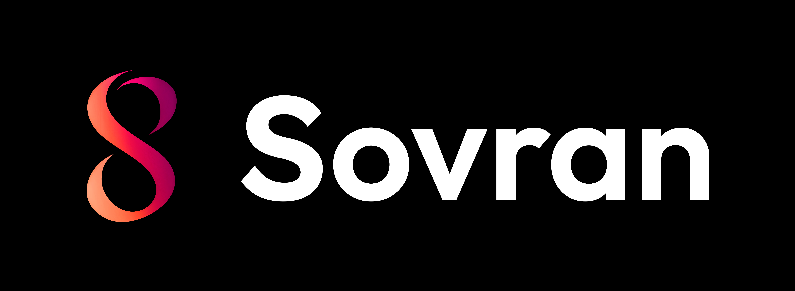

# Sovran

[https://sovran.money](https://sovran.money)

## Features

### Core Wallet Functionality ✅

- **Cashu ecash support** - Send and receive Bitcoin via ecash tokens
- **Lightning Network integration** - Lightning payments and invoices
- **Multi-currency support** - USD, EUR, GBP, and Satoshi units
- **QR code scanning** - Camera-based payment processing
- **NFC support** - Contactless payment capabilities

### Security & Privacy ✅

- **BIP39 mnemonic recovery** - 12-word seed phrase backup
- **NIP-06 key derivation** - Deterministic key generation for nostr profiles
- **Passcode protection** - Device-level security
- **Secure storage** - Encrypted local data storage
- **No data collection** - Privacy-first approach
- **Open source** - Fully auditable codebase

### Nostr Integration ✅

- **Decentralized identity** - Nostr profile management
- **Direct messaging** - Encrypted peer-to-peer communication
- **Contact management** - Nostr-based contact system
- **Profile sharing** - QR code profile sharing

### User Experience ✅

- **Modern UI/UX** - Clean, intuitive interface
- **Theme support** - Multiple visual themes
- **Transaction history** - Comprehensive transaction tracking
- **Mint management** - Add and manage multiple mints
- **Real-time updates** - Live balance and transaction updates

## Current Status

**Version:** 0.0.24 (Build 1)

### Recent Updates

- **Mint Audit Page** - Added comprehensive mint auditing capabilities
- **Mint Messaging** - Direct communication with mints
- **Enhanced Error Handling** - Improved Lightning payment error messages
- **Payment State Tracking** - Real-time transaction status updates
- **Auto-updating Mint Auditor** - Daily mint health checks

## Roadmap

### Phase 1: Foundation Stabilization

- [ ] **Coco Multi-Unit Support** - Full support for multiple currency units
- [ ] **Code Quality** - Zero TypeScript errors and linting issues
- [ ] **Expired Transaction Polish** - Improved handling of expired transactions
- [ ] **Performance Optimization** - Enhanced app responsiveness

### Phase 2: Core Features Restoration

- [ ] **Swap Functionality** - Re-implement token swapping between mints
- [ ] **Advanced Mint Management** - Enhanced mint discovery and management
- [ ] **Transaction Filtering** - Advanced transaction search and filtering
- [ ] **Export Capabilities** - Transaction history export
- [ ] **Restore backup** - Restore cashu tokens for mints that support it

### Phase 3: Enhanced User Experience

- [ ] **Push Notifications** - Real-time payment notifications
- [ ] **Biometric Authentication** - Fingerprint/Face ID support (optional)
- [ ] **Advanced Security** - Hardware wallet integration
- [ ] **Offline Mode** - Limited functionality without internet

### Phase 4: Advanced Features

- [ ] **Lightning Address Support** - Full LNURL-pay integration
- [ ] **Plugin System** - Extensible architecture

## Technical Architecture

### Built With

- **React Native** - Cross-platform mobile development
- **Expo** - Development platform and tools
- **TypeScript** - Type-safe development
- **Redux** - State management
- **Coco-Cashu** - Modular Cashu implementation
- **Nostr** - Decentralized communication protocol

### Protocol Support

- **Cashu NUTs** - [add list of supported nuts]
- **Lightning Network** - BOLT11 invoices and LNURL
- **Nostr** - [add list of supports nips]
- **BIP39/BIP32** - Hierarchical deterministic wallets

## Development Status

Due to migrating to the Coco architecture, several features were temporarily removed to ensure a more reliable foundation. This "one step back, two steps forward" approach ensures long-term stability and maintainability.

### Known Issues

- Some experimental features require manual activation
- Limited multi-unit support in current Coco implementation
- Transaction expiration handling needs refinement

## Contributing

We welcome contributions! Please see our [GitHub repository](https://github.com/SovranBitcoin/Sovran) for:

- Issue reporting
- Feature requests
- Code contributions
- Documentation improvements

## Support

- **GitHub Issues** - Bug reports and feature requests
- **Nostr** - Direct messaging via Nostr protocol
- **Twitter** - [@KevinKelbie](https://x.com/KevinKelbie)
