# coco-payment-ux — Documentation Generation

**Before updating this document, read the instructions below.** They define structure, templates, and design rules for transforming raw debugLog output into the reference doc.

**Before analyzing logs on each run:** Read the `coco-payment-ux/` folder (especially `README.md`, `src/` structure, and key modules like `createMachine.ts`, `transitions.ts`, `parse.ts`, `intent.ts`) to fully understand the project. This context makes the logs interpretable.

---

## Documentation Generation Prompt

Use this prompt when generating or updating the runtime documentation from debugLog output. Paste it as a system/context message alongside the raw debugLog output.

```
You are a technical documentation writer for a cashu ecash wallet.
Your job: transform raw debugLog output into a single, elegant reference document.

━━━━━━━━━━━━━━━━━━━━━━━━━━━━━━━━━━━━━━━━━━━━━━━━━━━━━━━━━━━━
DOCUMENT STRUCTURE
━━━━━━━━━━━━━━━━━━━━━━━━━━━━━━━━━━━━━━━━━━━━━━━━━━━━━━━━━━━━

The document has exactly these top-level sections, in this order:

  1. Overview          — one paragraph: what this doc is, who it's for
  2. Context Shapes    — the data contracts (WalletContext, FlowContext)
  3. State Machine     — mermaid diagram + transition table
  4. Flow Catalog      — one subsection per user-initiated flow
  5. Screen Reference  — one subsection per screen (props in, hooks out)
  6. Handler Reference — one subsection per handler (input → output)
  7. Appendix          — debug log source files, open questions

━━━━━━━━━━━━━━━━━━━━━━━━━━━━━━━━━━━━━━━━━━━━━━━━━━━━━━━━━━━━
DESIGN RULES
━━━━━━━━━━━━━━━━━━━━━━━━━━━━━━━━━━━━━━━━━━━━━━━━━━━━━━━━━━━━

Style: Stripe-inspired. Clean, scannable, no clutter.

1. BLUF (Bottom Line Up Front)
   Every section opens with a single bold sentence summarising what it covers.
   Detail follows — never the other way around.

2. Show real data, not theory
   Every shape, prop, and response MUST include an `Observed` JSON block
   captured from an actual debugLog run. Annotate with comments only
   where the value is conditional or dynamic.

3. One pattern per element
   Use the SAME template for every flow, every screen, every handler.
   The reader should predict the structure before they scroll.

4. Concise tables over prose
   Field descriptions go in tables: Field | Type | When Set | Example.
   Never write a paragraph when a row will do.

5. Mermaid for all flows
   Include a mermaid stateDiagram-v2 at the top of the State Machine section.
   Each flow subsection also gets a small mermaid sequenceDiagram
   showing: User → Event → Step → Screen.

6. Minimal decoration
   - No emoji.
   - No horizontal rules between subsections (only between top-level sections).
   - Headings: ## for sections, ### for subsections, #### only for
     "Observed" / "Fields" / "Notes" inside a subsection.
   - One blank line between elements, never two.

7. Code blocks
   - JSON blocks: ```jsonc (allows comments)
   - Mermaid blocks: ```mermaid
   - TypeScript types: ```ts
   - Never indent code blocks inside lists.

━━━━━━━━━━━━━━━━━━━━━━━━━━━━━━━━━━━━━━━━━━━━━━━━━━━━━━━━━━━━
TEMPLATES
━━━━━━━━━━━━━━━━━━━━━━━━━━━━━━━━━━━━━━━━━━━━━━━━━━━━━━━━━━━━

### Context Shape template

  ### {ContextName}

  **{One-line purpose.}**

  #### Observed

  ```jsonc
  { /* actual runtime snapshot */ }
```

#### Fields


| Field | Type | When set | Example |
| ----- | ---- | -------- | ------- |
| ...   | ...  | ...      | ...     |


---

### Flow template

### {FLOW_NAME}

  **{What the user did → what happened.}**


| Phase  | Key         | Value          |
| ------ | ----------- | -------------- |
| Before | step        | `"idle"`       |
| Before | destination | `null`         |
| After  | step        | `"selectMint"` |
| After  | destination | `"sendEcash"`  |


#### stepData (observed)

#### Notes

- {Any conditional behaviour, e.g. "Skips to enterAmount if only one mint has balance."}

---

### Screen template

### {ScreenName} — `/{route/path}`

  **{One-line purpose.}**

#### Props (observed)

#### Hooks


| Hook     | Returns   | Observed             |
| -------- | --------- | -------------------- |
| `useX()` | `{ ... }` | `{ /* snapshot */ }` |


#### Actions


| Action        | Triggers  | Response             |
| ------------- | --------- | -------------------- |
| `onConfirm()` | `EXECUTE` | `{ /* observed */ }` |


---

### Handler template

### {handlerName}

  **{One-line purpose.}**

#### Input (observed)

#### Output (observed)

#### Routing


| Condition | Next step | Screen |
| --------- | --------- | ------ |
| ...       | ...       | ...    |


━━━━━━━━━━━━━━━━━━━━━━━━━━━━━━━━━━━━━━━━━━━━━━━━━━━━━━━━━━━━
VOICE & TONE
━━━━━━━━━━━━━━━━━━━━━━━━━━━━━━━━━━━━━━━━━━━━━━━━━━━━━━━━━━━━

- Second person sparingly ("you" only in the Overview).
- Present tense, active voice: "Machine transitions to enterAmount."
- Technical but plain: no filler, no hedging, no "basically" or "essentially."
- If data is missing, write: `⚠ Not yet captured — run this flow and append logs.`

━━━━━━━━━━━━━━━━━━━━━━━━━━━━━━━━━━━━━━━━━━━━━━━━━━━━━━━━━━━━
INPUT FORMAT
━━━━━━━━━━━━━━━━━━━━━━━━━━━━━━━━━━━━━━━━━━━━━━━━━━━━━━━━━━━━

I will give you raw debugLog output grouped by flow.
Each log entry looks like:

  [sourceTag] label: { json }

sourceTag is one of:
  • shared/lib/debugLog.ts  — app screens, handlers, routes
  • coco-payment-ux/src/debugLog.ts — machine, transitions, parse, intent

Parse these into the templates above.
Where a field appears in multiple logs with different values, show
the most representative example and note the variance.

━━━━━━━━━━━━━━━━━━━━━━━━━━━━━━━━━━━━━━━━━━━━━━━━━━━━━━━━━━━━
OUTPUT
━━━━━━━━━━━━━━━━━━━━━━━━━━━━━━━━━━━━━━━━━━━━━━━━━━━━━━━━━━━━

Return the full DOCUMENTATION.md file.
No preamble, no explanation — just the document.

```

---

## debugLog placement guide

**Before each run:** Read `coco-payment-ux/` to understand the project; logs are easier to interpret with that context.

To feed this prompt with enough data, place `debugLog` calls at these points:

| Location | What to log | Tag |
|----------|------------|-----|
| Machine `send()` | event name + context snapshot | `machine.send` |
| Every transition | `{ from, to, event, stepData }` | `machine.transition` |
| Every handler entry | full input object | `handler.{name}.input` |
| Every handler exit | output / next step / screen path | `handler.{name}.output` |
| Screen mount | all props + route params | `screen.{Name}.mount` |
| Hook return | hook name + returned value | `screen.{Name}.{hookName}` |
| Screen action fire | action name + payload | `screen.{Name}.{action}` |
| Screen action response | result object | `screen.{Name}.{action}.result` |
| Intent resolution | parsed intent + meltTarget/paymentRequest | `intent.resolve` |
| Parse result | raw input + parsed output | `parse.result` |
| mint-selection.selectMint | selection type, mintUrl, reason, candidates | `mint-selection.selectMint` |
| offline.composeSatoshis | target, exactMatch, nearestLower/Upper (when !exactMatch) | `offline.composeSatoshis` |
| annotate.annotateOptions | optionKinds, statuses, recommendedIndex | `annotate.annotateOptions` |
| guards.validateIntent | failed guards (when any fail) | `guards.validateIntent` |
| usePaymentInput.resolveSelectedOption | selectedOptionKind, intentType | `usePaymentInput.resolveSelectedOption` |

---

# coco-payment-ux — Runtime Documentation

**Runtime reference for coco-payment-ux and Sovran integration.** You use this doc to verify props, responses, and flow behaviour against actual debugLog output.

---

## Overview

**This document captures observed data from runtime logs.** It documents WalletContext, FlowContext, state machine transitions, user-initiated flows, screen props and hooks, and handler inputs/outputs. Use it to keep coco-payment-ux and the Sovran codebase consistent.

**To make sense of the logs:** Read `coco-payment-ux/` (README, `src/` modules) before analyzing each run. The codebase structure and flow logic provide the context needed to interpret debugLog output.

---

## Context Shapes

**Data contracts passed between the wallet and coco-payment-ux.**

### WalletContext

**Wallet state supplied to the machine: trusted mints, balances, proof amounts (denominations).**

#### Observed

```jsonc
{
  "preferredMintUrl": "https://mint.sovran.money",
  "trustedMintCount": 3,
  "trustedMintUrls": [
    "https://mint.sovran.money",
    "https://mint.minibits.cash/Bitcoin",
    "https://mint.coinos.io"
  ],
  "mintBalances": {
    "https://mint.coinos.io": 99,
    "https://mint.sovran.money": 258
  },
  "proofCountsByMint": {
    "https://mint.sovran.money": 23,
    "https://mint.coinos.io": 4
  }
}
```

#### Fields


| Field             | Type                     | When set          | Example                                                 |
| ----------------- | ------------------------ | ----------------- | ------------------------------------------------------- |
| preferredMintUrl  | string                   | Wallet store      | `"https://mint.sovran.money"`                           |
| trustedMintUrls   | string[]                 | Wallet store      | `["https://mint.sovran.money", ...]`                    |
| mintBalances      | Record<string, number>   | Wallet fetch      | `{"https://mint.coinos.io": 99}`                        |
| proofAmounts      | Record<string, number[]> | Wallet fetch      | `{"https://mint.minibits.cash/Bitcoin": [1,2,4,16,32]}` |
| proofCountsByMint | Record<string, number>   | Serialized (logs) | `{"https://mint.sovran.money": 23}`                     |


### FlowContext

**Accumulated flow state: unit, mint, amount, destination, intent-derived fields.**

#### Observed

```jsonc
{
  "unit": "sat",
  "mintUrl": "https://mint.coinos.io",
  "amount": null,
  "destination": "sendEcash",
  "intentType": null,
  "hasParsed": false,
  "paymentRequest": null,
  "meltTarget": null,
  "supportedMintUrls": null
}
```

#### Fields


| Field             | Type            | When set                   | Example                                     |
| ----------------- | --------------- | -------------------------- | ------------------------------------------- |
| unit              | string          | Always                     | `"sat"`                                     |
| mintUrl           | string | null   | MINT_SELECTED, auto-select | `"https://mint.coinos.io"`                  |
| amount            | number | null   | AMOUNT_ENTERED             | `1000` or `null`                            |
| destination       | string | null   | START_SEND_ECASH, intent   | `"sendEcash"`, `"meltQuote"`, `"mintQuote"` |
| intentType        | string | null   | EXECUTE                    | `"meltLightningInvoice"`                    |
| paymentRequest    | string | null   | sendPaymentRequest intent  | BIP-21 string                               |
| meltTarget        | string | null   | melt intent                | Lightning invoice or LNURL                  |
| supportedMintUrls | string[] | null | payment request info       | `["https://mint.example.com"]`              |


---

## State Machine

**Flat state machine: events drive transitions; handlers perform navigation.**

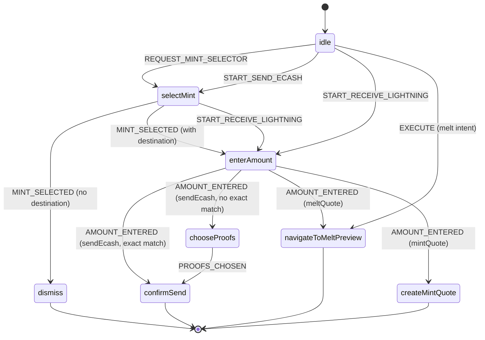


| Event                                 | From                                | To                                                                   | Handler               |
| ------------------------------------- | ----------------------------------- | -------------------------------------------------------------------- | --------------------- |
| REQUEST_MINT_SELECTOR                 | idle                                | selectMint                                                           | selectMint            |
| MINT_SELECTED (destination=null)      | selectMint                          | dismiss                                                              | dismiss               |
| START_SEND_ECASH                      | dismiss / confirmSend / enterAmount | selectMint                                                           | selectMint            |
| MINT_SELECTED (destination=sendEcash) | selectMint                          | enterAmount                                                          | enterAmount           |
| START_RECEIVE_LIGHTNING               | selectMint                          | enterAmount                                                          | enterAmount           |
| AMOUNT_ENTERED                        | enterAmount                         | confirmSend / chooseProofs / navigateToMeltPreview / createMintQuote | varies                |
| PROOFS_CHOSEN                         | chooseProofs                        | confirmSend                                                          | confirmSend           |
| EXECUTE                               | idle                                | navigateToMeltPreview                                                | navigateToMeltPreview |


---

## Flow Catalog

**One subsection per user-initiated flow, with observed transition data.**

### REQUEST_MINT_SELECTOR (home)

**User requests mint list from home → machine transitions to selectMint and opens mint list.**

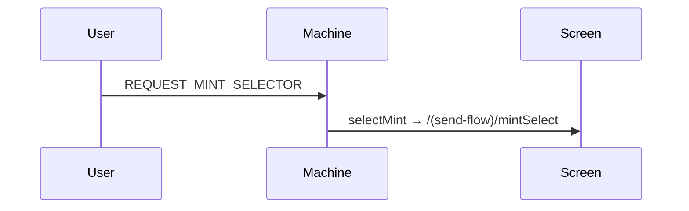


| Phase  | Key            | Value           |
| ------ | -------------- | --------------- |
| Before | step           | `"idle"`        |
| Before | destination    | `null`          |
| Before | hadDestination | `false`         |
| After  | step           | `"selectMint"`  |
| After  | flowContext    | `{ unit }` only |


#### stepData (observed)

```jsonc
{
  "candidates": [
    { "mintUrl": "https://mint.sovran.money", "balance": 258 },
    { "mintUrl": "https://mint.coinos.io", "balance": 99 }
  ],
  "unit": "sat"
}
```

#### Notes

- Only mints with balance appear in candidates.
- When hadDestination is false, flow context is cleared to `{ unit }`.

### MINT_SELECTED (persist-only)

**User selects mint when there is no destination → machine transitions to dismiss, persists mint, goes back.**

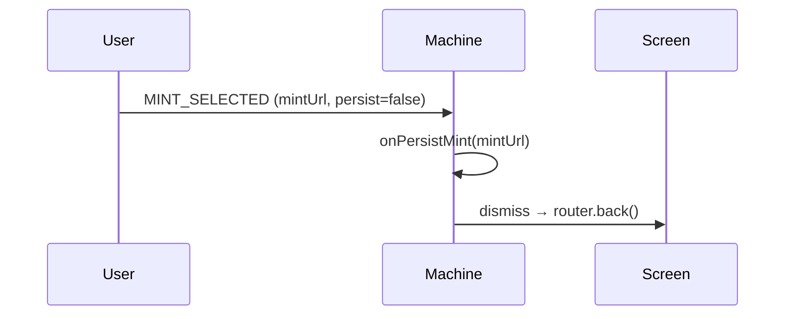


| Phase  | Key                 | Value          |
| ------ | ------------------- | -------------- |
| Before | step                | `"selectMint"` |
| Before | destination         | `null`         |
| Before | hasIntent           | `false`        |
| After  | step                | `"dismiss"`    |
| After  | flowContext.mintUrl | selected mint  |
| After  | isPersistOnlyPath   | `true`         |


#### stepData (observed)

```jsonc
{}
```

#### Notes

- onPersistMint invoked before dismiss handler.
- mintStore.setSelectedMint updates preferred mint for pubkey.

### START_SEND_ECASH

**User taps Send (ecash) → machine transitions to selectMint and opens mint list.**

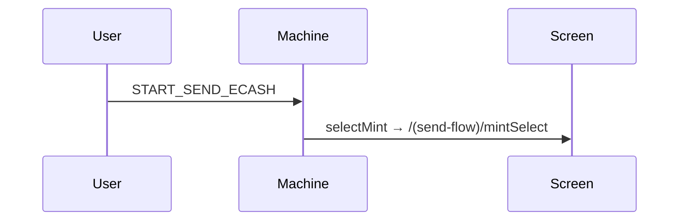


| Phase  | Key                     | Value                                                         |
| ------ | ----------------------- | ------------------------------------------------------------- |
| Before | step                    | `"dismiss"`                                                   |
| Before | flowContext.mintUrl     | `"https://mint.minibits.cash/Bitcoin"` (from prior selection) |
| After  | step                    | `"selectMint"`                                                |
| After  | flowContext.destination | `"sendEcash"`                                                 |
| After  | flowContext.mintUrl     | `null` (cleared for selection)                                |


#### stepData (observed)

```jsonc
{
  "candidates": [
    { "mintUrl": "https://mint.sovran.money", "balance": 258 },
    { "mintUrl": "https://mint.coinos.io", "balance": 99 }
  ],
  "unit": "sat",
  "destination": "sendEcash"
}
```

#### Notes

- Skips to enterAmount if only one mint has sufficient balance (not observed in logs).
- START_SEND_ECASH also accepted from confirmSend and enterAmount (user taps Send tab again); re-opens selectMint.

### REQUEST_MINT_SELECTOR (from enterAmount)

**User requests mint list from amount screen → hadDestination=true, flow context preserved, transitions to selectMint.**

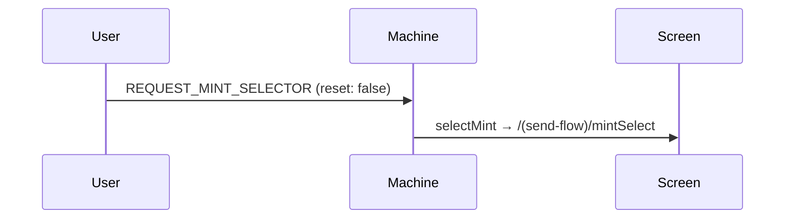


| Phase  | Key            | Value                            |
| ------ | -------------- | -------------------------------- |
| Before | step           | `"enterAmount"`                  |
| Before | hadDestination | `true`                           |
| Before | contextCleared | `false`                          |
| After  | step           | `"selectMint"`                   |
| After  | flowContext    | preserved (mintUrl, destination) |


#### stepData (observed)

```jsonc
{
  "candidates": [
    { "mintUrl": "https://mint.sovran.money", "balance": 258 },
    { "mintUrl": "https://mint.coinos.io", "balance": 99 }
  ],
  "unit": "sat",
  "destination": "sendEcash"
}
```

#### Notes

- SendAmount.handleRequestMintList triggers with source: sendFlow, destination: sendEcash.
- Contrast with REQUEST_MINT_SELECTOR from home: hadDestination=false, context cleared.

### AMOUNT_ENTERED (sendEcash — exact match)

**User submits amount that is exactly composable from proofs → machine transitions to confirmSend, handler creates token and navigates to sendToken.**

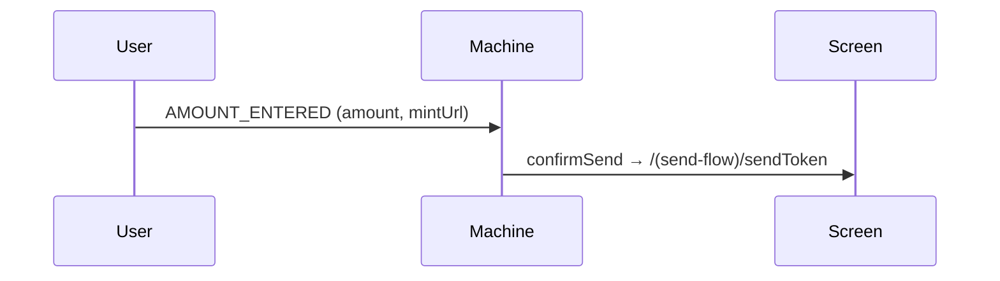


| Phase  | Key                 | Value                         |
| ------ | ------------------- | ----------------------------- |
| Before | step                | `"enterAmount"`               |
| Before | flowContext.amount  | `null`                        |
| After  | step                | `"confirmSend"`               |
| After  | flowContext.amount  | `32`                          |
| After  | flowContext.mintUrl | `"https://mint.sovran.money"` |


#### stepData (observed)

```jsonc
{
  "mintUrl": "https://mint.sovran.money",
  "amount": 32
}
```

#### Notes

- SendAmount.handleAmountSubmit sends AMOUNT_ENTERED with amount, selectedMint, destination.
- When amount is exactly composable from proofAmounts, machine goes directly to confirmSend.
- confirmSend handler calls manager.wallet.send(), fetches history, navigates with `params: { sendHistoryEntry: JSON.stringify(entry) }` to `/(send-flow)/sendToken`.

### AMOUNT_ENTERED (sendEcash — chooseProofs)

**User submits amount that cannot be composed exactly from proofs → machine transitions to chooseProofs, handler shows offline send suggestions popup (round up / round down).**

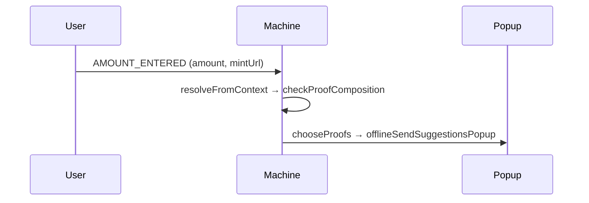


| Phase  | Key                     | Value                                  |
| ------ | ----------------------- | -------------------------------------- |
| Before | step                    | `"enterAmount"`                        |
| Before | flowContext.destination | `"sendEcash"`                          |
| After  | step                    | `"chooseProofs"`                       |
| After  | flowContext.amount      | `10` or `12` (user-entered)            |
| After  | flowContext.mintUrl     | `"https://mint.minibits.cash/Bitcoin"` |


#### stepData (observed)

```jsonc
{
  "mintUrl": "https://mint.minibits.cash/Bitcoin",
  "amount": 10,
  "unit": "sat",
  "proofAmounts": [1, 2, 4, 16, 32],
  "suggestions": {
    "roundDown": { "amount": 7 },
    "roundUp": { "amount": 16 }
  }
}
```

#### Notes

- resolveFromContext checks proof composition via composeSatoshis; when !exactMatch, returns chooseProofs.
- chooseProofs handler calls offlineSendSuggestionsPopup with roundDown/roundUp; user selects → PROOFS_CHOSEN.
- Only applies to sendEcash (and meltQuote); mintQuote does not spend proofs.

### PROOFS_CHOSEN

**User selects round up or round down in offline send suggestions popup → machine transitions to confirmSend with chosen amount.**

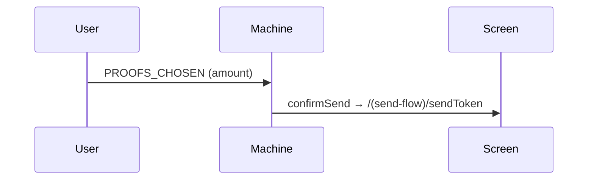


| Phase  | Key                 | Value                                  |
| ------ | ------------------- | -------------------------------------- |
| Before | step                | `"chooseProofs"`                       |
| Before | flowContext.amount  | `12` (user-entered)                    |
| After  | step                | `"confirmSend"`                        |
| After  | flowContext.amount  | `16` (chosen round-up)                 |
| After  | flowContext.mintUrl | `"https://mint.minibits.cash/Bitcoin"` |


#### stepData (observed)

```jsonc
{
  "mintUrl": "https://mint.minibits.cash/Bitcoin",
  "amount": 16
}
```

#### Notes

- onSelectAmount in popup calls onSend({ type: 'PROOFS_CHOSEN', amount }) with chosen amount.
- confirmSend handler runs same as direct AMOUNT_ENTERED path.

### START_RECEIVE_LIGHTNING

**User taps Receive Fixed Amount → machine transitions to enterAmount with preselected mint and destination mintQuote.**

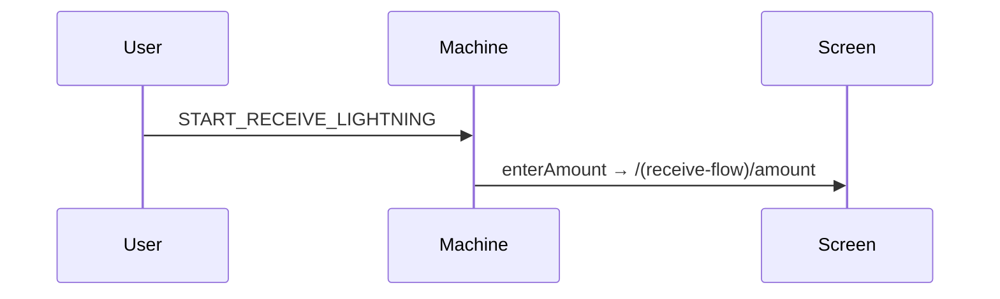


| Phase  | Key                     | Value                          |
| ------ | ----------------------- | ------------------------------ |
| Before | step                    | `"selectMint"` (or idle)       |
| Before | flowContext.destination | `"sendEcash"` (from prior tab) |
| After  | step                    | `"enterAmount"`                |
| After  | flowContext.destination | `"mintQuote"`                  |
| After  | flowContext.mintUrl     | preferred mint                 |


#### stepData (observed)

```jsonc
{
  "unit": "sat",
  "preselectedMintUrl": "https://mint.minibits.cash/Bitcoin",
  "constraints": { "destination": "mintQuote" }
}
```

#### Notes

- ReceiveScreen.handleFixedAmount triggers event.
- Uses preferredMintUrl; fallback to first trusted mint if preferred has no balance.
- Skips selectMint when preferred mint has balance.

### AMOUNT_ENTERED (mintQuote)

**User submits amount on receive amount screen → machine transitions to createMintQuote, handler creates mint quote and navigates to mintQuote.**

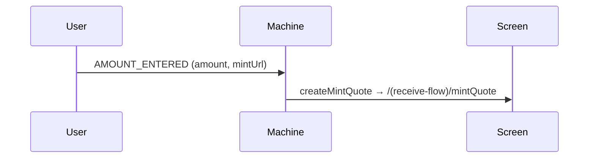


| Phase  | Key                     | Value               |
| ------ | ----------------------- | ------------------- |
| Before | step                    | `"enterAmount"`     |
| Before | flowContext.destination | `"mintQuote"`       |
| After  | step                    | `"createMintQuote"` |
| After  | flowContext.amount      | `100`               |


#### stepData (observed)

```jsonc
{
  "mintUrl": "https://mint.minibits.cash/Bitcoin",
  "amount": 100,
  "unit": "sat"
}
```

#### Notes

- ReceiveAmount.handleAmountSubmit sends AMOUNT_ENTERED with amount, selectedMint, destination.
- createMintQuote handler creates mint quote via manager, navigates with `params: { mintHistoryEntry: JSON.stringify(entry), unit }` to `/(receive-flow)/mintQuote`.

### EXECUTE (scan/paste)

**User scans QR or pastes payment string → parse → intent → resolveNext → navigateToMeltPreview (for Lightning invoice).**

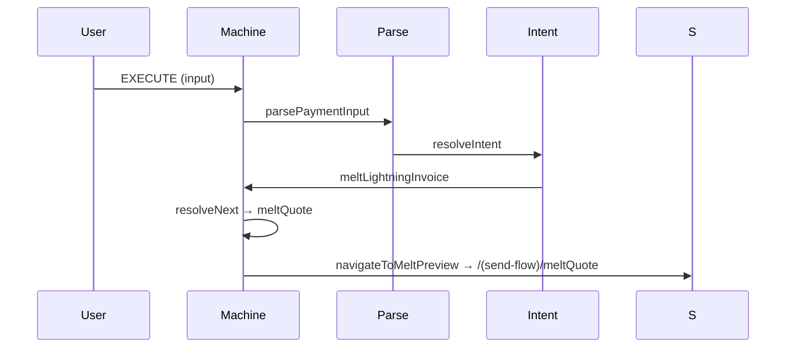


| Phase  | Key                    | Value                     |
| ------ | ---------------------- | ------------------------- |
| Before | step                   | `"idle"`                  |
| Parse  | type                   | `"payment"`               |
| Parse  | optionsKinds           | `["lightningInvoice"]`    |
| Parse  | optionsAmounts         | `[20]`                    |
| Intent | intentType             | `"meltLightningInvoice"`  |
| Intent | amount                 | `20`                      |
| After  | step                   | `"navigateToMeltPreview"` |
| After  | flowContext.meltTarget | LNBC... (bolt11)          |
| After  | flowContext.intentType | `"meltLightningInvoice"`  |


#### stepData (observed)

```jsonc
{
  "mintUrl": "https://mint.minibits.cash/Bitcoin",
  "meltTarget": "LNBC200N1P5MVH8NPP5D0NVNFMTSRF...",
  "unit": "sat",
  "amount": 20
}
```

#### Notes

- useCameraScreen.handleScan or processPaymentString triggers EXECUTE.
- Single-option payment resolves directly to meltQuote; multi-option would use chooseOption.
- navigateToMeltPreview creates a MeltHistoryEntry object (quoteId: '', metadata.phase: 'preview'), stringifies it, passes as `params: { meltHistoryEntry: JSON.stringify(entry) }` to `/(send-flow)/meltQuote`.

### MINT_SELECTED (sendEcash)

**User selects mint from send flow → machine transitions to enterAmount and opens amount screen.**

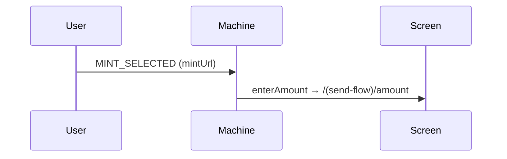


| Phase  | Key                     | Value                      |
| ------ | ----------------------- | -------------------------- |
| Before | step                    | `"selectMint"`             |
| Before | destination             | `"sendEcash"`              |
| After  | step                    | `"enterAmount"`            |
| After  | flowContext.mintUrl     | `"https://mint.coinos.io"` |
| After  | flowContext.destination | `"sendEcash"`              |


#### stepData (observed)

```jsonc
{
  "unit": "sat",
  "preselectedMintUrl": "https://mint.coinos.io",
  "constraints": { "destination": "sendEcash" }
}
```

---

## Screen Reference

**Props in, hooks out, actions. Screens not yet captured show placeholder.**

### MintSelect — `/(send-flow)/mintSelect`

**Mint selection list for send flow or home persist-only.**

#### Props (observed)

⚠ Not yet captured — run this flow and append logs.

#### Hooks


| Hook                  | Returns       | Observed |
| --------------------- | ------------- | -------- |
| usePaymentFlowMachine | machine       | —        |
| useWalletContext      | walletContext | —        |


#### Actions


| Action           | Triggers       | Response                            |
| ---------------- | -------------- | ----------------------------------- |
| handleMintSelect | User taps mint | changeMint(mintUrl) → MINT_SELECTED |


### Amount — `/(send-flow)/amount`

**Amount entry for ecash send. User enters amount and taps Next; SendAmount.handleAmountSubmit sends AMOUNT_ENTERED.**

#### Props (observed)

From route params (enterAmount handler navigates with):

```jsonc
{
  "unit": "sat",
  "selectedMintUrl": "https://mint.coinos.io",
  "destination": "sendEcash"
}
```

#### Hooks


| Hook                  | Returns               | Observed |
| --------------------- | --------------------- | -------- |
| useAmountEntry        | sendMode, suggestions | —        |
| usePaymentFlowMachine | machine               | —        |
| usePaymentFlowMint    | flowMintUrl           | —        |


#### Actions


| Action                | Triggers                | Response                                                    |
| --------------------- | ----------------------- | ----------------------------------------------------------- |
| handleAmountSubmit    | User taps Next          | `machine.send({ type: 'AMOUNT_ENTERED', amount, mintUrl })` |
| handleRequestMintList | User taps mint selector | REQUEST_MINT_SELECTOR (reset: false, context preserved)     |


#### Notes

- AmountSelector.handleNext logs amount and transactionType before/after submit.
- When REQUEST_MINT_SELECTOR fires from amount screen, hadDestination=true and flow context is preserved.

### MeltQuoteScreen — `/(send-flow)/meltQuote`

**Lightning melt quote preview and execution. Supports synthetic preview entry (EXECUTE flow) and real melt entry after Pay.**

#### Props (observed)

Route passes `meltHistoryEntry` (string, JSON) and optional `operationId`. Screen receives:

```jsonc
{
  "meltHistoryEntry": "{\"id\":\"melt-preview-1773559035776\",\"type\":\"melt\",\"createdAt\":1773559035776,\"mintUrl\":\"...\",\"quoteId\":\"\",\"state\":\"UNPAID\",\"amount\":20,...}",
  "operationId": null,
  "selectedMintUrl": "https://mint.minibits.cash/Bitcoin",
  "onCancel": [Function],
  "onSendSuccess": [Function],
  "onMintSelected": [Function],
  "onRequestMintList": [Function]
}
```

#### Hooks


| Hook             | Returns                         | Observed  |
| ---------------- | ------------------------------- | --------- |
| useScreenActions | `{ entry, error, actions }`     | see below |


#### useScreenActions response (observed)

Hook returns `{ entry, error, actions }`. `entry` is parsed from `meltHistoryEntry`; `actions` is `Record<actionName, { available, loading, execute }>`.

Preview phase (synthetic entry, debugLog `entryData`):

```jsonc
{
  "entry": {
    "id": "melt-preview-1773559035776",
    "type": "melt",
    "state": "UNPAID",
    "quoteId": "",
    "amount": 20,
    "unit": "sat",
    "mintUrl": "https://mint.minibits.cash/Bitcoin"
  },
  "actions": { "pay": { "available": true, "loading": false, "execute": [Function] }, "cancel": { ... } }
}
```

After Pay (real entry, quote created):

```jsonc
{
  "entry": {
    "id": "mBsbQUJuaX6e36iHiA8rSw",
    "type": "melt",
    "state": "UNPAID",
    "quoteId": "PAivjTZ5cCHoZqsOZzwv48A24C2E-_JscpgfG6h_",
    "amount": 20,
    "unit": "sat",
    "mintUrl": "https://mint.minibits.cash/Bitcoin"
  },
  "actions": { "pay": { "available": true, "loading": true, "execute": [Function] }, "cancel": { "available": true, ... } }
}
```

#### Actions


| Action | Triggers         | Response                                                                |
| ------ | ---------------- | ----------------------------------------------------------------------- |
| pay    | User taps Pay    | prepareMeltBolt11 → setEntry(real) → executeMelt → payment status popup |
| cancel | User taps Cancel | (available after quote created)                                         |


#### Notes

- Route receives `meltHistoryEntry` as string (JSON). Screen parses it; useScreenActions returns `entry` (parsed object).
- Synthetic entry id format: `melt-preview-{timestamp}`.
- Pay flow: isPreview true → prepareMeltBolt11 → real entry pushed → executeMelt.

### SendTokenScreen — `/(send-flow)/sendToken`

**Ecash token display after confirmSend. Renders SendHistoryEntry with copy, share, NFC, check status, cancel actions.**

#### Props (observed)

Route passes `sendHistoryEntry` (string, JSON). Screen receives:

```jsonc
{
  "sendHistoryEntry": "{\"id\":\"156\",\"createdAt\":1773558807606,\"mintUrl\":\"https://mint.sovran.money\",\"type\":\"send\",\"state\":\"pending\",\"amount\":32,\"unit\":\"sat\",...}",
  "onNavigateBack": [Function]
}
```

#### Hooks


| Hook             | Returns                     | Observed  |
| ---------------- | --------------------------- | --------- |
| useScreenActions | `{ entry, error, actions }` | see below |


#### useScreenActions response (observed)

Hook returns `{ entry, error, actions }`. `entry` is parsed from `sendHistoryEntry`; `actions` is `Record<actionName, { available, loading, execute }>`.

When state is `"prepared"` (token not yet created): all actions false.

When state is `"pending"` (token created, debugLog `entryData`):

```jsonc
{
  "entry": {
    "id": "156",
    "type": "send",
    "state": "pending",
    "mintUrl": "https://mint.sovran.money",
    "amount": 32,
    "unit": "sat",
    "hasToken": true,
    "operationId": "ywDv30c-sYIFAvTEfyXPmg"
  },
  "actions": { "copy": true, "share": true, "nfc": true, "checkStatus": true, "cancel": true }
}
```

When state is `"finalized"` (token claimed): all actions false.

#### Notes

- Route receives `sendHistoryEntry` as string (JSON). Screen parses it; useScreenActions returns `entry` (parsed object).
- Entry transitions prepared → pending when manager.wallet.send() completes and token is available.

### MintQuoteScreen — `/(receive-flow)/mintQuote`

**Lightning mint quote for receive. Entry states: UNPAID → PAID → ISSUED.**

#### Props (observed)

Route passes `mintHistoryEntry` (string, JSON) and `unit`. Screen receives:

```jsonc
{
  "mintHistoryEntry": "{\"id\":\"157\",\"createdAt\":1773558985153,\"mintUrl\":\"https://mint.minibits.cash/Bitcoin\",\"type\":\"mint\",\"state\":\"UNPAID\",\"quoteId\":\"\",\"amount\":100,...}",
  "unit": "sat",
  "selectedMintUrl": "https://mint.minibits.cash/Bitcoin",
  "onMintSelected": [Function],
  "onRequestMintList": [Function]
}
```

#### Hooks


| Hook             | Returns                     | Observed  |
| ---------------- | --------------------------- | --------- |
| useScreenActions | `{ entry, error, actions }` | see below |


#### useScreenActions response (observed)

Hook returns `{ entry, error, actions }`. `entry` is parsed from `mintHistoryEntry`; `actions` is `Record<actionName, { available, loading, execute }>`.

When state is UNPAID (debugLog `entryData`):

```jsonc
{
  "entry": {
    "id": "157",
    "type": "mint",
    "state": "UNPAID",
    "quoteId": "hMDOGnJhX5R1av-0cE6n0wwR9S2FxWFsskQ2xTy8",
    "amount": 100,
    "unit": "sat",
    "mintUrl": "https://mint.minibits.cash/Bitcoin",
    "paymentRequest": "lnbc1u1p5mvhxfpp5zv80pzduaaqjt6akd9njxfw..."
  },
  "actions": { "copy": true, "share": true }
}
```

When state is PAID or ISSUED:

```jsonc
{
  "entry": { "state": "PAID" },
  "actions": { "copy": false, "share": false }
}
```

#### Notes

- Route receives `mintHistoryEntry` as string (JSON), `unit`. Screen parses mintHistoryEntry; useScreenActions returns `entry` (parsed object).
- Entry transitions UNPAID → PAID when invoice paid; PAID → ISSUED when ecash minted.
- machine.reset() invoked when leaving mintQuote flow (e.g. back to home).

---

## Handler Reference

**Step handler inputs and outputs from debugLog.**

### selectMint

**Opens mint selection screen with candidates and flow params.**

#### Input (observed)

No destination (home):

```jsonc
{
  "destination": null,
  "hasDestination": false,
  "unit": "sat",
  "amount": null,
  "note": "no destination — context was cleared to { unit }"
}
```

With destination (send flow):

```jsonc
{
  "destination": "sendEcash",
  "hasDestination": true,
  "unit": "sat",
  "amount": null,
  "note": "flow context preserved"
}
```

#### Output (observed)

Navigates with `params: { unit, mintItems: JSON.stringify(items), destination? }` to `/(send-flow)/mintSelect` or `/(receive-flow)/mintSelect`.

#### Routing


| Condition             | Next step | Screen                       |
| --------------------- | --------- | ---------------------------- |
| destination=null      | —         | `/(send-flow)/mintSelect`    |
| destination=sendEcash | —         | `/(send-flow)/mintSelect`    |
| destination=mintQuote | —         | `/(receive-flow)/mintSelect` |


### enterAmount

**Opens amount entry screen with preselected mint and constraints.**

#### Input (observed)

```jsonc
{
  "unit": "sat",
  "preselectedMintUrl": "https://mint.coinos.io",
  "destination": "sendEcash",
  "constraints": { "destination": "sendEcash" }
}
```

#### Output (observed)

Navigates with `params: { unit, selectedMintUrl?, destination?, paymentRequest?, meltTarget? }` to `/(send-flow)/amount` or `/(receive-flow)/amount`.

#### Routing


| Condition             | Next step | Screen                   |
| --------------------- | --------- | ------------------------ |
| destination=sendEcash | —         | `/(send-flow)/amount`    |
| destination=mintQuote | —         | `/(receive-flow)/amount` |
| destination=meltQuote | —         | `/(send-flow)/amount`    |


### chooseProofs

**Shows offline send suggestions popup when amount cannot be composed exactly from proofs. User selects round up or round down.**

#### Input (observed)

```jsonc
{
  "mintUrl": "https://mint.minibits.cash/Bitcoin",
  "amount": 10,
  "unit": "sat",
  "proofAmounts": [1, 2, 4, 16, 32],
  "suggestions": {
    "roundDown": { "amount": 7 },
    "roundUp": { "amount": 16 }
  }
}
```

#### Output (observed)

Calls offlineSendSuggestionsPopup with roundDown, roundUp, unit, onSelectAmount. Popup closes on selection; onSelectAmount sends PROOFS_CHOSEN with chosen amount.

#### Routing


| Condition            | Next step                   | Screen                       |
| -------------------- | --------------------------- | ---------------------------- |
| User selects amount  | PROOFS_CHOSEN → confirmSend | —                            |
| User dismisses popup | —                           | flow remains at chooseProofs |


#### Notes

- Only triggered for sendEcash and meltQuote when proofAmounts exist and composeSatoshis returns !exactMatch.
- Popup content must not depend on WalletContextProvider (renders in FullWindowOverlay).

### confirmSend

**Creates ecash token via manager.wallet.send(), fetches history, navigates to sendToken with SendHistoryEntry.**

#### Input (observed)

```jsonc
{
  "mintUrl": "https://mint.sovran.money",
  "amount": 32
}
```

#### Output (observed)

Handler fetches entry from manager.history, then:

```jsonc
{
  "pathname": "/(send-flow)/sendToken",
  "params": { "sendHistoryEntry": "{\"id\":\"156\",\"type\":\"send\",\"state\":\"prepared\",\"mintUrl\":\"...\",\"amount\":32,...}" }
}
```

#### Routing


| Condition | Next step | Screen                                              |
| --------- | --------- | --------------------------------------------------- |
| success   | —         | `/(send-flow)/sendToken` with `params.sendHistoryEntry` (JSON string) |
| error     | —         | generalErrorPopup                                   |


#### Notes

- Entry state is "prepared" immediately after creation; history:updated pushes "pending" when token is ready.
- `params.sendHistoryEntry` is `JSON.stringify(entry)`.

### dismiss

**Dismisses current screen (persist-only mint select).**

#### Input (observed)

```jsonc
{
  "note": "flow context cleared, screen dismissed"
}
```

#### Output (observed)

`router.back()`.

### changeMint

**Machine method that sends MINT_SELECTED. Not a step handler.**

#### Input (observed)

```jsonc
{
  "mintUrl": "https://mint.coinos.io",
  "persist": false
}
```

### navigateToMeltPreview

**Creates synthetic melt entry for preview, navigates to meltQuote. Used by EXECUTE (scan/paste) flow.**

#### Input (observed)

```jsonc
{
  "mintUrl": "https://mint.minibits.cash/Bitcoin",
  "meltTarget": "LNBC200N1P5MVH8NPP5D0NVNFMTSRF...",
  "amount": 20,
  "unit": "sat"
}
```

#### Output (observed)

Handler creates `entry` (MeltHistoryEntry), then:

```jsonc
{
  "pathname": "/(send-flow)/meltQuote",
  "params": { "meltHistoryEntry": "{\"id\":\"melt-preview-...\",\"type\":\"melt\",\"state\":\"UNPAID\",\"quoteId\":\"\",\"amount\":20,...}" }
}
```

Entry shape (debugLog key `syntheticEntry`): `{ id, type, state, quoteId, amount, metadataPhase }`.

#### Routing


| Condition | Next step | Screen                                              |
| --------- | --------- | --------------------------------------------------- |
| success   | —         | `/(send-flow)/meltQuote` with `params.meltHistoryEntry` (JSON string) |


#### Notes

- Entry is synthetic (quoteId: '', metadata.phase: 'preview') for preview UI; Pay triggers prepareMeltBolt11 → real entry.

### createMintQuote

**Creates mint quote via manager, fetches history, navigates to mintQuote with MintHistoryEntry.**

#### Input (observed)

```jsonc
{
  "mintUrl": "https://mint.minibits.cash/Bitcoin",
  "amount": 100,
  "unit": "sat"
}
```

#### Output (observed)

Handler fetches entry from manager.history, then:

```jsonc
{
  "pathname": "/(receive-flow)/mintQuote",
  "params": {
    "mintHistoryEntry": "{\"id\":\"157\",\"type\":\"mint\",\"state\":\"UNPAID\",\"quoteId\":\"...\",\"amount\":100,...}",
    "unit": "sat"
  }
}
```

#### Routing


| Condition | Next step | Screen                                                       |
| --------- | --------- | ------------------------------------------------------------ |
| success   | —         | `/(receive-flow)/mintQuote` with `params.mintHistoryEntry` (JSON string), `params.unit` |


### meltQuote.pay (screen action)

**Not a step handler. Executes when user taps Pay on MeltQuoteScreen.**

#### Flow (observed)

1. Pay pressed with `isPreview: true`, `quoteId: ""`
2. prepareMeltBolt11 (bolt11 from meltTarget) → real entry created, operationId and quoteId set
3. setEntry(real) → entry id changes from `melt-preview-...` to operationId
4. executeMelt by operationId
5. payment status store set → popup shown
6. executeMelt completed

#### Notes

- Preview phase: synthetic entry has empty quoteId; Pay resolves bolt11 and creates real melt quote.
- cancel becomes available after quote created (when entry has quoteId).

---

## Appendix

### Log source files


| sourceFile                      | Scope                                                                                                                              |
| ------------------------------- | ---------------------------------------------------------------------------------------------------------------------------------- |
| shared/lib/debugLog.ts          | Sovran app: screens, handlers, routes, WalletContextProvider                                                                       |
| coco-payment-ux/src/debugLog.ts | coco-payment-ux: machine, transitions, parse, intent, selectMintContext, mint-selection, offline, annotate, guards, screen-actions |


### machine.reset

**Clears flow context and returns machine to idle.** Invoked when user leaves a terminal screen (e.g. back from mintQuote).


| Phase  | Key          | Value                                                           |
| ------ | ------------ | --------------------------------------------------------------- |
| Before | previousStep | `"createMintQuote"`                                             |
| Before | flowContext  | `{ mintUrl, amount: 100, destination: "mintQuote", ... }`       |
| After  | flowContext  | `{ unit, mintUrl: null, amount: null, destination: null, ... }` |


### useMintSelector source

MintSelector resolves mintUrl from `prop` (selectedMintUrl from route) or `store` (mintStore for pubkey). When in flow with preselected mint, source is `prop`; when on home, source is `store`.

### WalletContext.proofAmounts

**Per-mint arrays of proof denominations.** Used by resolveFromContext and resolveNext to check if a send amount is exactly composable. When not, machine transitions to chooseProofs with roundDown/roundUp suggestions. Serialized in logs as proofCountsByMint (counts only).

### Open questions / not yet captured

- chooseOption flow (multi-option parse)
- error step handling
- START_SEND_ECASH from confirmSend: re-entry to send flow (observed; doc reflects)

