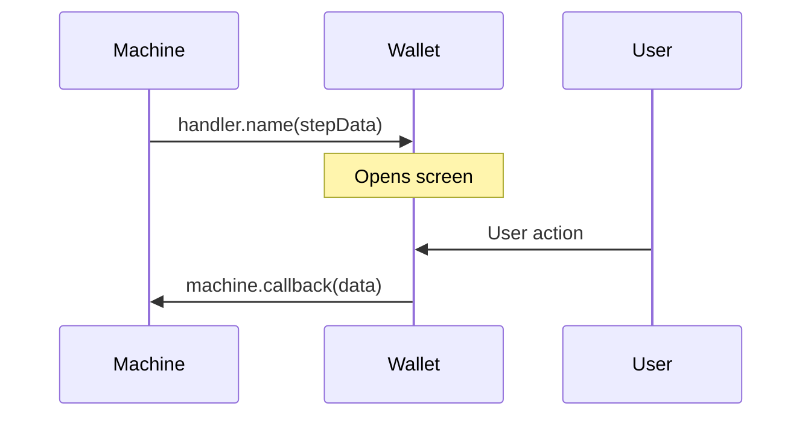

# Doc Conventions

Rules and reusable patterns for writing `coco-payment-ux` flow documentation.

## Code disambiguation

Machine calls, handler callbacks, and operations share method names. Always make the owner clear.

**In prose**, prefix with the owner:

- `handler.enterAmount()` — the machine calls this; the wallet implements it on the [provider](/guide/getting-started#provider)
- `machine.enterAmount()` — the screen calls this; the machine consumes it
- `operations.executeSend()` — async operation the wallet provides on the [provider](/guide/getting-started#provider)

**In section headings**, handler sections use `### handler.name()`.

**In code blocks**, show the provider context:

```tsx
<CocoPaymentUXProvider
  handlers={(machine, refs) => ({
    // ...
    enterAmount: (stepData) => {
      router.push({ ... });
    },
    // ...
  })}
/>
```

Machine calls are always on a screen, always via the `machine` variable:

```tsx
const machine = usePaymentFlowMachine({ walletContext, unit });
machine.enterAmount(amount, mintUrl, 'sendEcash');
```

Operations and actions follow the same provider pattern:

```tsx
<CocoPaymentUXProvider
  engine={{
    operations: {
      // ...
      executeSend: async (mintUrl, amount) => { ... },
      // ...
    },
  }}
  callbacks={{
    actions: {
      sendToken: {
        copy: async (ctx) => { ... },
        // ...
      },
    },
  }}
/>
```

## Page structure

Every flow page follows this layout:

1. **Title + one-line summary**
2. **Flow diagram** — top-level mermaid flowchart with collapsible legend
3. **Entry point** — `machine.startX()` call and bullet points for each branch
4. **Handler sections** — one per handler, in flow order
5. **Execution** — the operation that runs after all steps resolve
6. **Screen section** — post-flow screen using `useScreenActions`

## Handler section

Every handler follows this structure. No sub-headings — connect elements with natural prose transitions.

| Order | Element                                                                                    | Include when                                   |
| ----- | ------------------------------------------------------------------------------------------ | ---------------------------------------------- |
| 1     | Heading: `### handler.name()`                                                              | Always                                         |
| 2     | Description: when it fires, what it means (1-3 sentences)                                  | Always                                         |
| 3     | Conditions: bullet points — **bold label** → outcome                                       | When there's branching                         |
| 4     | Interaction diagram: sequence diagram                                                      | When the screen calls back to the machine      |
| 5     | Step data: code block with the full shape                                                  | Always                                         |
| 6     | Field table: \| Field \| What it means \|                                                  | Always                                         |
| 7     | Handler declaration: inside `<CocoPaymentUXProvider handlers={...} />`                     | Always                                         |
| 8     | Machine callback: what the screen calls back                                               | When not already visible in a screen component |
| 9     | Screen component: proof-of-concept (default RN elements). Inline or link to dedicated page | When this flow page owns the screen            |
| 10    | UI tips: `::: info` box with bullet list                                                   | Always                                         |

## Screen section

Post-flow screens (send token, receive, etc.):

| Order | Element                                                           | Include when |
| ----- | ----------------------------------------------------------------- | ------------ |
| 1     | Heading: `## Screen Name`                                         | Always       |
| 2     | Description: what data is available, entry point                  | Always       |
| 3     | Component: proof-of-concept using `useScreenActions`              | Always       |
| 4     | UI tips: `::: info` box                                           | Always       |
| 5     | Actions table: \| Action \| Available when \| What it does \|     | Always       |
| 6     | Action handlers: inside `<CocoPaymentUXProvider callbacks={{ actions: ... }} />` | Always       |

## Diagrams

### Top-level flow

Every flow page opens with a flowchart. Use these node classes consistently across all pages:

```
classDef method fill:none,stroke:#818cf8,stroke-width:2px,color:#818cf8
classDef handler fill:none,stroke:#38bdf8,stroke-width:2px,color:#38bdf8
classDef operation fill:none,stroke:#a78bfa,stroke-width:2px,stroke-dasharray:6 3,color:#a78bfa
classDef decision fill:none,stroke:#fbbf24,stroke-width:2px,color:#fbbf24
classDef user fill:none,stroke:#4ade80,stroke-width:2px,stroke-dasharray:4 2,color:#4ade80
classDef error fill:none,stroke:#f87171,stroke-width:2px,stroke-dasharray:6 3,color:#f87171
```

Follow the diagram with a `::: details Diagram legend` block mapping colors to roles.

### Interaction diagrams

Small sequence diagrams for handler sections where the screen calls back to the machine. Three participants, consistent naming:



Skip for one-shot handlers (e.g., `sendComplete`) that navigate without expecting a machine callback.

## Info boxes

- `::: info` — UI implementation tips (always bullet lists, never paragraphs)
- `::: tip` — general advice, optional context
- `::: warning` — gotchas, common mistakes

## Links

Every inline code reference links to its definition — either an anchor on the current page or another page.

## Proof-of-concept screens

Screen components use only default React Native elements (`View`, `Text`, `Pressable`, `ScrollView`, `ActivityIndicator`). No styles, no custom components. The goal is to show data flow, not UI design.
