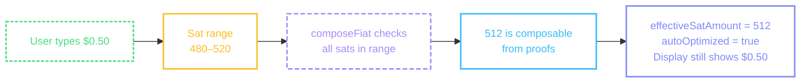

# Amount Selection

Amount entry screen: numeric keyboard with sat/fiat toggling, offline sendability checks, and quick send suggestions.

## Screen

The entry from [`useScreenActions`](/guide/architecture#thin-screens) carries the resolved amount state — current input, effective sat amount, display conversions, and offline sendability. The machine instance from [`usePaymentFlowMachine`](/guide/architecture#machine) handles the final submission.

```tsx
import { View, Text, TextInput, Pressable, ScrollView, ActivityIndicator } from 'react-native';

function AmountScreen({ amountEntry }) {
  const { entry, error, actions, suggestions } = useScreenActions('amountEntry', amountEntry);
  const machine = usePaymentFlowMachine({ walletContext, unit: 'sat' });

  if (error) return <Text>{error}</Text>;
  if (!entry) return <ActivityIndicator />;

  return (
    <ScrollView>
      <TextInput
        value={entry.rawInput}
        keyboardType="numeric"
        onChangeText={(input) => actions.setInput.execute({ input })}
      />

      <Text>{entry.keyboardUnit}</Text>

      {entry.secondaryDisplay && <Text>{entry.secondaryDisplay}</Text>}

      {actions.toggle.available && (
        <Pressable onPress={() => actions.toggle.execute()}>
          <Text>Toggle {entry.inputMode === 'sat' ? 'Fiat' : 'Sats'}</Text>
        </Pressable>
      )}

      {entry.canSendOffline === true && <Text>Available offline</Text>}
      {entry.canSendOffline === false && <Text>Online required</Text>}

      {suggestions.length > 0 && (
        <View>
          {suggestions.map((s) => (
            <Pressable
              key={s.label}
              onPress={() => actions.setInput.execute({ input: s.inputValue, mode: s.inputMode })}>
              <Text>{s.label}</Text>
            </Pressable>
          ))}
        </View>
      )}

      <View>
        {actions.paste.available && (
          <Pressable onPress={() => actions.paste.execute()}>
            {actions.paste.loading ? <ActivityIndicator /> : <Text>Paste</Text>}
          </Pressable>
        )}

        {actions.scanQr.available && (
          <Pressable onPress={() => actions.scanQr.execute()}>
            <Text>Scan QR</Text>
          </Pressable>
        )}

        {actions.next.available && (
          <Pressable onPress={() => actions.next.execute()}>
            {actions.next.loading ? <ActivityIndicator /> : <Text>Next</Text>}
          </Pressable>
        )}
      </View>
    </ScrollView>
  );
}
```

::: info Amount screen UI

- Numeric keyboard for entering an amount — large, easy-to-tap buttons
- Toggle button to switch between sat and fiat input modes — only available when fiat currency and BTC price are configured
- The primary amount display should be large and bold (the active input mode). The secondary converted amount should be smaller, e.g., "≈ $0.42" when entering sats or "≈ 4,200 sats" when entering fiat
- When entering in fiat mode, the library auto-optimizes the sat amount — if the user enters "$1" and multiple sat values round to the same price, the library picks one that's composable offline. Show the effective sat amount so the user sees exactly what will be sent
- Offline sendability indicator — shows whether the current amount can be composed from available proofs without internet. Use a subtle icon (e.g., airplane or wifi-off) that turns green when composable
- Quick send suggestion pills for offline-composable amounts (send flows only) — display as tappable chips/pills below the amount. These let the user pick a known-good amount without guessing
- Paste and Scan QR buttons for send ecash flows — these trigger [`machine.scan()`](/flows/scanning) which can route to a different flow. See [Navigation Patterns](/guide/navigation-patterns) for how this enables intent-based routing
- Preferred mint name and balance so the user knows what they're sending from
- The Next/Continue button should be disabled when the amount is zero or exceeds the available balance
  :::

## Actions

| Action     | Available when                       | What it does                                                                                     |
| ---------- | ------------------------------------ | ------------------------------------------------------------------------------------------------ |
| `setInput` | Always                               | Update raw input string — synchronous, no loading                                                |
| `toggle`   | Fiat currency + BTC price configured | Toggle between sat and fiat input mode — synchronous                                             |
| `next`     | `numericValue > 0`                   | Submit amount to machine via `machine.enterAmount(effectiveSatAmount, mintUrl, { destination })` |
| `paste`    | `destination === 'sendEcash'`        | [`machine.scan(undefined, { source: 'clipboard' })`](/flows/scanning)                            |
| `scanQr`   | `destination === 'sendEcash'`        | Navigate to camera                                                                               |

`setInput` and `toggle` are **synchronous** — no loading state, no per-keystroke async. `next`, `paste`, and `scanQr` are async with `loading`.

## Action handlers

```tsx
<CocoPaymentUXProvider
  callbacks={{
    actions: {
      amountEntry: {
        next: async (ctx) => {
          const { effectiveSatAmount, selectedMintUrl, destination } = ctx.entry;
          if (effectiveSatAmount <= 0 || !destination) return;
          await ctx.paymentMachine?.enterAmount?.(effectiveSatAmount, selectedMintUrl, {
            destination,
          });
        },
        paste: async (ctx) => {
          await ctx.paymentMachine?.scan?.(undefined, { source: 'clipboard' });
        },
        scanQr: async (ctx) => {
          router.push('/camera');
        },
      },
    },
  }}
/>
```

## Entry shape

The entry returned from `useScreenActions` carries the resolved amount state:

```ts
{
  inputMode: 'sat',
  rawInput: '1000',
  numericValue: 1000,

  effectiveSatAmount: 1000,
  displaySats: 1000,
  displayFiat: 0.42,
  canSendOffline: true,
  autoOptimized: false,

  unit: 'sat',
  keyboardUnit: 'sat',
  secondaryDisplay: '≈ $0.42',
  fiatSymbol: '$',

  destination: 'sendEcash',
  selectedMintUrl: 'https://mint.example.com',
}
```

| Field                | What it means                                                                                                                             |
| -------------------- | ----------------------------------------------------------------------------------------------------------------------------------------- |
| `inputMode`          | Current input mode — `'sat'` or `'fiat'`                                                                                                  |
| `rawInput`           | The raw text the user typed                                                                                                               |
| `numericValue`       | Parsed numeric value from `rawInput`                                                                                                      |
| `effectiveSatAmount` | The sat amount submitted to the machine — may differ from `numericValue` in fiat mode due to [auto-optimization](#fiat-auto-optimization) |
| `displaySats`        | Sat amount for display                                                                                                                    |
| `displayFiat`        | Fiat amount for display, `null` when BTC price unavailable                                                                                |
| `canSendOffline`     | Whether the current amount can be composed from available proofs, `null` for receive flows                                                |
| `autoOptimized`      | `true` when fiat mode found an offline-compatible sat amount within the rounding window                                                   |
| `keyboardUnit`       | `'sat'` in sat mode, fiat code (e.g., `'USD'`) in fiat mode                                                                               |
| `secondaryDisplay`   | Formatted converted amount string (e.g., "≈ $0.42")                                                                                       |
| `destination`        | Which flow this amount entry is for                                                                                                       |
| `selectedMintUrl`    | The mint selected for this flow                                                                                                           |

## Suggestions

`suggestions` is a `QuickSendSuggestion[]` — offline-composable amounts the user can tap to fill:

```ts
[
  { label: '$1', inputValue: '1', inputMode: 'fiat', satoshis: 992 },
  { label: '$5', inputValue: '5', inputMode: 'fiat', satoshis: 4960 },
  { label: '1,000 sats', inputValue: '1000', inputMode: 'sat', satoshis: 1000 },
  { label: '5,000 sats', inputValue: '5000', inputMode: 'sat', satoshis: 5000 },
];
```

Every suggestion is **guaranteed offline-composable** — tapping one and hitting send will succeed without a mint swap. Suggestions are empty for receive flows (`destination: 'mintQuote'`) — they only apply to ecash sends where offline proof composition matters.

::: info Suggestion computation
The library tries a broad range of common amounts ($0.10–$100 fiat, 21–100,000 sats), runs composition checks against the current mint's proofs, collects all achievable amounts, and picks an evenly distributed subset (default 3 per category) so the suggestions span the available range.
:::

## Fiat auto-optimization

When the user types a fiat amount and offline optimization is enabled, the library automatically selects the best sat amount within the fiat rounding window:



The `autoOptimized` flag is `true` when the effective sat amount differs from the naive center of the fiat range. The send succeeds offline without the user needing to adjust anything.
