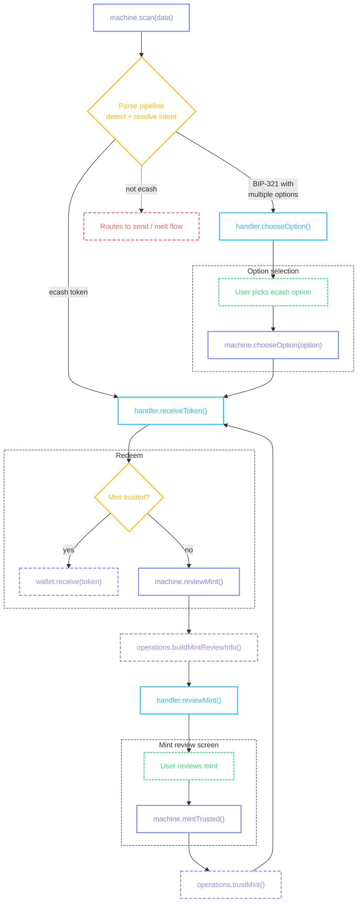
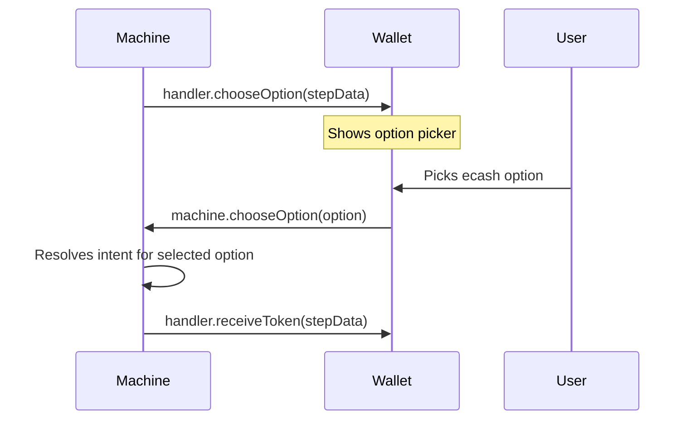
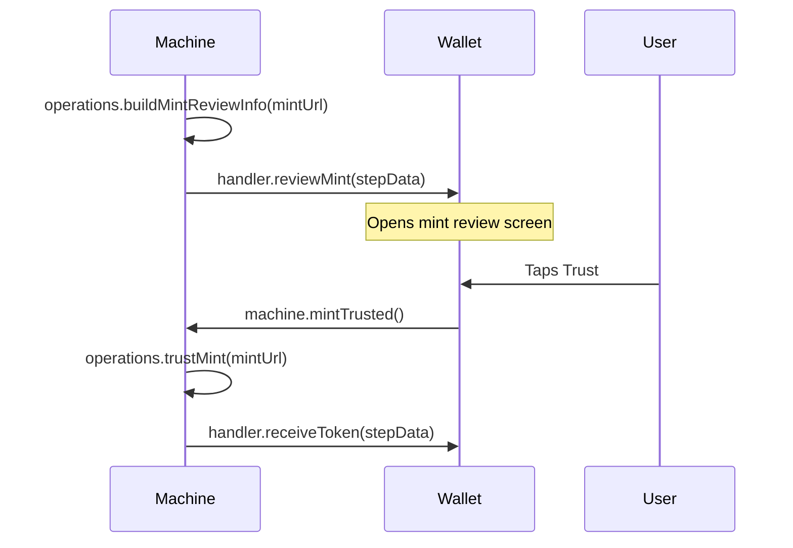

# Cashu Receive

Receiving ecash: user scans or pastes a token, the machine detects it, and the wallet redeems it into the user's balance.

## Flow



::: details Diagram legend

- **Purple** — `machine.method()` — wallet calls these to drive the flow
- **Blue** — `handler.method()` — machine calls these; wallet implements them on the [provider](/guide/getting-started#provider)
- **Purple dashed** — `operations.method()` — async operations on the [provider](/guide/getting-started#provider)
- **Yellow** — internal machine decisions
- **Green dashed** — user actions on screen
- **Red dashed** — error / notification states
  :::

### Scanning input

The wallet triggers a scan with data from a QR code, the clipboard, or a gallery image. The machine runs it through the [parse pipeline](/pipeline/overview), detects the ecash token, and resolves the intent. See [Scanning](/flows/scanning) for the full `machine.scan()` API and source configuration.

If the parsed input is an ecash token, the machine calls [`handler.receiveToken()`](#handler-receivetoken). If it's a `bitcoin:` URI with multiple options, the machine calls [`handler.chooseOption()`](#handler-chooseoption) first.

### handler.receiveToken()

Called when the machine detects an ecash token in the parsed input. This is a terminal handler — no further machine steps are needed. The handler navigates to the [Receive Token Screen](#receive-token-screen) where the user can redeem.

The machine passes this step data to the handler:

```ts
{
  token: 'cashuBpGF0aHR0cHM6Ly9taW50LmV4YW1wbGUuY29tYXVjc2F0...',
}
```

| Field   | What it means                                    |
| ------- | ------------------------------------------------ |
| `token` | The raw cashu token string detected in the input |

```tsx
<CocoPaymentUXProvider
  handlers={(machine, refs) => ({
    // ...
    receiveToken: ({ token }) => {
      router.navigate({
        pathname: '/(receive-flow)/receiveToken',
        params: { receiveHistoryEntry: JSON.stringify(buildReceiveHistoryEntry(token)) },
      });
    },
    // ...
  })}
/>
```

::: info Receive token navigation

- The handler builds a placeholder history entry from the token before navigating — the real entry is created after redemption
- `buildReceiveHistoryEntry()` is a wallet helper that extracts amount, mint URL, and unit from the token for display
  :::

### handler.chooseOption()

When the input is a `bitcoin:` URI containing both a cashu token and a lightning invoice, the machine calls this handler. The user picks which payment method to use, and the machine routes to the appropriate flow.



The machine passes this step data to the handler:

```ts
{
  parsed: { ... },
  options: [
    {
      option: { kind: 'ecashToken', value: 'cashuBpGF0...', source: 'bip321', paramKey: 'cashu' },
      status: 'recommended',
      reason: { code: 'PAYABLE_ECASH', message: 'Payable with Cashu — no fees' },
    },
    {
      option: { kind: 'lightningInvoice', value: 'lnbc1...', source: 'bip321', paramKey: 'lightning' },
      status: 'available',
      reason: null,
    },
  ],
  unit: 'sat',
}
```

| Field                   | What it means                                                                                                                               |
| ----------------------- | ------------------------------------------------------------------------------------------------------------------------------------------- |
| `parsed`                | The full [`ParsedPaymentInput`](/pipeline/parse) from the parse pipeline                                                                    |
| `options`               | [`AnnotatedOption[]`](/pipeline/annotate) — each option has a `status` (`'recommended'`, `'available'`, `'disabled'`) and optional `reason` |
| `options[].option.kind` | The payment type — `'ecashToken'` for receive, `'lightningInvoice'` / `'lightningAddress'` / `'lnurlp'` for send                            |
| `unit`                  | The unit for this flow                                                                                                                      |

```tsx
<CocoPaymentUXProvider
  handlers={(machine, refs) => ({
    // ...
    chooseOption: (stepData) => {
      paymentOptionsPopup({ ...stepData, machine, onDismiss: refs.getOptionDismiss() });
    },
    // ...
  })}
/>
```

When the user picks an option, the screen calls:

```tsx
machine.chooseOption(selectedOption.option);
```

The machine re-resolves the intent for just the selected option. If the user picks the ecash token, the flow continues to [`handler.receiveToken()`](#handler-receivetoken). If they pick the lightning invoice, the flow routes to the [lightning send](/flows/lightning-send) flow instead.

::: info Option selection UI

- Present as a popup or bottom sheet — this is a quick choice, not a full screen
- Highlight the `'recommended'` option (ecash is fee-free)
- Show the `reason` string when present (e.g., "Payable with Cashu — no fees")
- Grey out `'disabled'` options
- Each option should show its kind label (e.g., "Ecash", "Lightning") and amount if known
- See [Annotate](/pipeline/annotate) for how statuses are determined
  :::

## Receive Token Screen

The entry from [`useScreenActions`](/guide/architecture#thin-screens) contains the token, amount, mint URL, unit, and state. Before redemption, the entry is a placeholder built from the token. After redemption, it's replaced with the real history entry.

String and timestamp fields on the entry are [`FormattedString`](/methods/formatting#formattedstring) and [`FormattedTimestamp`](/methods/formatting#formattedtimestamp) instances.

```tsx
import { View, Text, Pressable, ScrollView, ActivityIndicator } from 'react-native';

function ReceiveTokenScreen({ receiveHistoryEntry }) {
  const { entry, error, actions } = useScreenActions('receiveToken', receiveHistoryEntry);

  if (error) return <Text>{error}</Text>;
  if (!entry) return <ActivityIndicator />;

  return (
    <ScrollView>
      <Text>
        {entry.amount} {entry.unit}
      </Text>
      <Text>{entry.mintUrl.truncate(20, 'middle')}</Text>
      <Text>{entry.createdAt.relative}</Text>

      {actions.redeem.available && (
        <Pressable onPress={() => actions.redeem.execute()}>
          {actions.redeem.loading ? <ActivityIndicator /> : <Text>Redeem</Text>}
        </Pressable>
      )}
    </ScrollView>
  );
}
```

::: info Receive token screen UI

- Show the token amount large and bold, centered — this is the first thing the user sees
- Display the mint name and unit below the amount so the user knows where the ecash comes from
- The redeem button is the primary action — make it visually dominant
- Show a loading state while redeeming (the wallet validates the token, checks mint trust, and calls `wallet.receive()`)
- If the mint is untrusted, show a trust confirmation prompt before receiving — present the mint name, URL, and a "Trust this mint" / "Auto-swap to default mint" choice. Auto-swap routes the ecash through Lightning to the user's preferred mint (note: this involves fees). See the Bitcoin Design Guide's [auto-swap pattern](/guide/getting-started#auto-swap)
- If the token's mint is unknown, display it with a warning indicator and the mint URL so the user can verify before trusting
- After successful redemption, transition to a success state — show a checkmark animation with the amount received. See [Success Feedback](/guide/success-feedback#in-place-transition)
- Consider haptic feedback on successful redemption
  :::

### Actions

| Action   | Available when                    | What it does                                               |
| -------- | --------------------------------- | ---------------------------------------------------------- |
| `redeem` | Token exists and not yet redeemed | Validate unit, check mint trust, receive token into wallet |

### Action handlers

The redeem handler validates the token, checks mint trust, and receives:

```tsx
<CocoPaymentUXProvider
  handlers={(machine) => ({
    reviewMint: ({ mintUrl, token, mintInfo }) => {
      router.navigate({
        pathname: '/mint-info',
        params: { mintUrl, token, mintInfo: JSON.stringify(mintInfo) },
      });
    },
    receiveToken: ({ token }) => {
      router.navigate({ pathname: '/receive-token', params: { token } });
    },
  })}
  callbacks={{
    actions: {
      receiveToken: {
        redeem: async (ctx) => {
          const tokenString = ctx.manager.wallet.encodeToken(ctx.entry.token);

          if (decodedUnit !== 'sat') {
            unsupportedTokenUnitPopup({ unit: decodedUnit });
            return;
          }

          const isTrusted = await ctx.manager.mint.isTrustedMint(ctx.entry.mintUrl);
          if (!isTrusted) {
            await ctx.paymentMachine.reviewMint(ctx.entry.mintUrl, tokenString);
            return;
          }

          await ctx.manager.wallet.receive(tokenString);
        },
      },
    },
  }}
/>
```

The redeem handler calls `machine.reviewMint(mintUrl, token)` when the mint is untrusted. The machine loads mint metadata via `operations.buildMintReviewInfo(mintUrl)` before dispatching [`handler.reviewMint()`](#handler-reviewmint) — the wallet never navigates directly.

### handler.reviewMint()

Called when a received token comes from an untrusted mint. The machine loads detailed mint info (audit scores, trust status, NUT-06 metadata) via `operations.buildMintReviewInfo()` before dispatching this handler — the wallet receives everything pre-loaded in step data.



The machine passes this step data to the handler:

```ts
{
  mintUrl: 'https://untrusted-mint.example.com',
  token: 'cashuBpGF0aHR0cHM6Ly91bnRydXN0ZWQt...',
  mintInfo: {
    mintUrl: 'https://untrusted-mint.example.com',
    displayName: 'Untrusted Mint',
    description: 'A Cashu mint',
    balance: 0,
    unit: 'sat',
    isPreferred: false,
    isTrusted: false,
    auditScore: 3.8,
    auditState: 'OK',
    // ...
  },
}
```

| Field      | What it means                                                               |
| ---------- | --------------------------------------------------------------------------- |
| `mintUrl`  | The untrusted mint URL                                                      |
| `token`    | The encoded token being reviewed (held in flow context for re-entry)        |
| `mintInfo` | Pre-loaded [`MintReviewInfo`](#mintreviewinfo) — populated when `operations.buildMintReviewInfo` is provided |

```tsx
<CocoPaymentUXProvider
  handlers={(machine) => ({
    // ...
    reviewMint: ({ mintUrl, token, mintInfo }) => {
      router.navigate({
        pathname: '/mint-info',
        params: { mintUrl, token, mintInfo: JSON.stringify(mintInfo) },
      });
    },
    // ...
  })}
/>
```

::: info Mint review UI
- Show the mint display name, description, and `motd` (message of the day) when present
- Display audit scores visually (star rating, percentage bar) — `auditScore` is a 0-5 scale, `successRate` is a 0-1 ratio
- Show KYM score (`kymScore`) as a community trust indicator when available
- List contact methods from the `contact` array (email, Nostr, etc.)
- Display supported NUTs as feature labels (translate NUT numbers — e.g., "Offline sends" for NUT-11)
- The Trust button is the primary action — make it visually prominent with a confirmation feel
- Show a Reject/Cancel secondary action that navigates back without trusting
- Warn that trusting an unknown mint means your funds are held by that mint operator
:::

## Mint Review Screen

The screen uses [`useScreenActions`](/guide/architecture#thin-screens) with the `'mintInfo'` screen type. All data comes from the pre-loaded entry — no data-fetching hooks needed.

String fields on the entry are [`FormattedString`](/methods/formatting#formattedstring) instances — `mintUrl` uses `middle` truncation, `contact[].info` is also formatted.

```tsx
import { View, Text, Pressable, ScrollView, ActivityIndicator } from 'react-native';

function MintReviewScreen({ mintInfoEntry }) {
  const { entry, actions } = useScreenActions('mintInfo', mintInfoEntry);

  if (!entry) return <ActivityIndicator />;

  return (
    <ScrollView>
      <Text>{entry.displayName}</Text>
      {entry.description && <Text>{entry.description}</Text>}
      {entry.motd && <Text>Message: {entry.motd}</Text>}
      {entry.mintUrl && <Text>{entry.mintUrl.truncate(20, 'middle')}</Text>}

      {entry.contact?.map((c) => (
        <Text key={c.method}>
          {c.method}: {c.info.truncate(30, 'middle')}
        </Text>
      ))}

      <Pressable onPress={() => router.back()}>
        <Text>Reject</Text>
      </Pressable>
      {actions.trust.available && (
        <Pressable onPress={() => actions.trust.execute()}>
          {actions.trust.loading ? <ActivityIndicator /> : <Text>Accept</Text>}
        </Pressable>
      )}
    </ScrollView>
  );
}
```

::: info Mint review screen UI
- Show the mint name large and bold at the top — this is the identity the user is deciding to trust
- Display `motd` as a highlighted banner when present — mints use this for announcements
- Show audit/KYM scores as visual indicators (stars, bars, badges) rather than raw numbers
- Display success rates and average swap times when available (`successRate`, `avgTimeMs`)
- List contact methods so the user can verify the operator's identity
- Trust is the primary CTA — Reject is secondary. Consider a confirmation dialog for Trust since it's a significant decision
- After trusting, the handler dismisses this screen — the receive token screen is already open underneath, and the next redeem attempt succeeds since the mint is now trusted
:::

### Actions

| Action    | Available when | What it does                                     |
| --------- | -------------- | ------------------------------------------------ |
| `trust`   | Has mint URL   | Add mint as trusted and dismiss the review screen |
| `copy` *  | Has mint URL   | Copy the mint URL to clipboard                   |
| `share` * | Has mint URL   | Platform share sheet with the mint URL           |

\* Built-in — works automatically when `platform.writeClipboard` / `platform.shareContent` are provided on the provider. No handler needed.

### Action handlers

The `trustMint` and `buildMintReviewInfo` operations are provided via `MachineOperations`:

```tsx
<CocoPaymentUXProvider
  engine={{
    operations: {
      executeSend: ...,
      executeMintQuote: ...,
      buildMintListItems: ...,
      trustMint: async (mintUrl) => {
        await walletManager.mint.addMint(mintUrl, { trusted: true });
      },
      buildMintReviewInfo: async (mintUrl) => {
        const [mintInfo, auditData, balances, isTrusted] = await Promise.all([
          fetchMintInfo(mintUrl),
          auditMint(mintUrl),
          walletManager.wallet.getBalances(),
          walletManager.mint.isTrustedMint(mintUrl),
        ]);
        return {
          mintUrl,
          displayName: mintInfo?.name ?? mintUrl,
          description: mintInfo?.description,
          contact: mintInfo?.contact,
          balance: balances[mintUrl] ?? 0,
          unit: 'sat',
          isPreferred: false,
          isTrusted,
          auditScore: auditData?.score,
          auditState: auditData?.state,
          successRate: auditData?.successRate,
          avgTimeMs: auditData?.avgTimeMs,
          totalMints: auditData?.totalMints,
          totalMelts: auditData?.totalMelts,
        };
      },
    },
  }}
  platform={{
    writeClipboard: (text) => Clipboard.setStringAsync(text),
    shareContent: (content) => Share.share({ message: content.message, url: content.url }),
  }}
  callbacks={{
    actions: {
      mintInfo: {
        trust: async (ctx) => {
          await ctx.manager.mint.addMint(ctx.entry.mintUrl, { trusted: true });
          if (ctx.entry.fromAccepter) {
            router.dismiss();
          } else {
            router.back();
          }
        },
        // copy and share are built-in — no handler needed
      },
    },
  }}
/>
```

### MintReviewInfo

```ts
interface MintReviewInfo {
  mintUrl: string;
  displayName: string;
  iconUrl?: string;
  description?: string;
  longDescription?: string;
  motd?: string;
  contact?: Array<{ method: string; info: string }>;
  nuts?: number[];
  balance: number;
  unit: string;
  isPreferred: boolean;
  isTrusted: boolean;
  kymScore?: number;
  auditScore?: number;
  auditState?: string;
  successRate?: number;
  avgTimeMs?: number;
  swapSuccess?: number;
  swapTotal?: number;
  totalMints?: number;
  totalMelts?: number;
}
```

| Field             | What it means                                                      |
| ----------------- | ------------------------------------------------------------------ |
| `mintUrl`         | The mint's URL                                                     |
| `displayName`     | Human-readable name from NUT-06 metadata                           |
| `iconUrl`         | Optional avatar/icon URL                                           |
| `description`     | Short description from NUT-06                                      |
| `longDescription` | Extended description from NUT-06                                   |
| `motd`            | Message of the day — announcements from the mint operator          |
| `contact`         | Operator contact methods (email, Nostr, etc.)                      |
| `nuts`            | Supported NUT numbers                                              |
| `balance`         | User's balance on this mint (0 for untrusted mints)                |
| `unit`            | The unit for this flow                                             |
| `isPreferred`     | Whether this is the user's preferred mint                          |
| `isTrusted`       | Whether the user has trusted this mint                             |
| `kymScore`        | Community trust score from Nostr events                            |
| `auditScore`      | Auditor swap success score (0-5 scale)                             |
| `auditState`      | Auditor state string (e.g., `'OK'`, `'ERROR'`)                     |
| `successRate`     | Swap success ratio (0-1)                                           |
| `avgTimeMs`       | Average swap time in milliseconds                                  |
| `swapSuccess`     | Number of successful swaps observed                                |
| `swapTotal`       | Total swaps observed                                               |
| `totalMints`      | Total mint (receive) operations observed                           |
| `totalMelts`      | Total melt (send) operations observed                              |

### handler.openMint()

Uses the same pattern as `handler.reviewMint()`. When the machine enters the `openMint` step (e.g., user taps a mint URL in a chat message), it loads `operations.buildMintReviewInfo(url)` before dispatching the handler. The wallet receives pre-loaded `mintInfo` in step data.

```ts
{
  url: string;
  mintInfo?: MintReviewInfo;
}
```

| Field      | What it means                                                                       |
| ---------- | ----------------------------------------------------------------------------------- |
| `url`      | The mint URL to open                                                                |
| `mintInfo` | Pre-loaded [`MintReviewInfo`](#mintreviewinfo) — populated when the operation exists |

```tsx
<CocoPaymentUXProvider
  handlers={(machine) => ({
    // ...
    openMint: ({ url, mintInfo }) => {
      router.navigate({
        pathname: '/(mint-flow)/info',
        params: { mintInfoEntry: JSON.stringify(mintInfo ?? { mintUrl: url }) },
      });
    },
    // ...
  })}
/>
```

### Live updates

The mint info entry updates reactively when audit or review data arrives after the page loads. The wallet subscribes to audit and KYM store changes via [`screenActionsBridge.onEntryUpdate`](/guide/architecture#live-updates) for the `mintInfo` screen type. When scores change, the entry is enriched with the latest `kymScore`, `auditScore`, `auditState`, success rates, and swap counts — the same fields from [`MintReviewInfo`](#mintreviewinfo). The screen re-renders automatically with fresh data, no polling needed.

## Quick Receive

Some wallets show a landing screen before any token arrives — displaying the user's NPC Lightning address and P2PK key so others can send to them. From this screen, paste and scan actions trigger `machine.scan()` which routes to the Cashu Receive flow (or other flows depending on the input).

See [Quick Receive](/flows/quick-receive) for the full entry point, NPC/P2PK details, screen, and actions.
