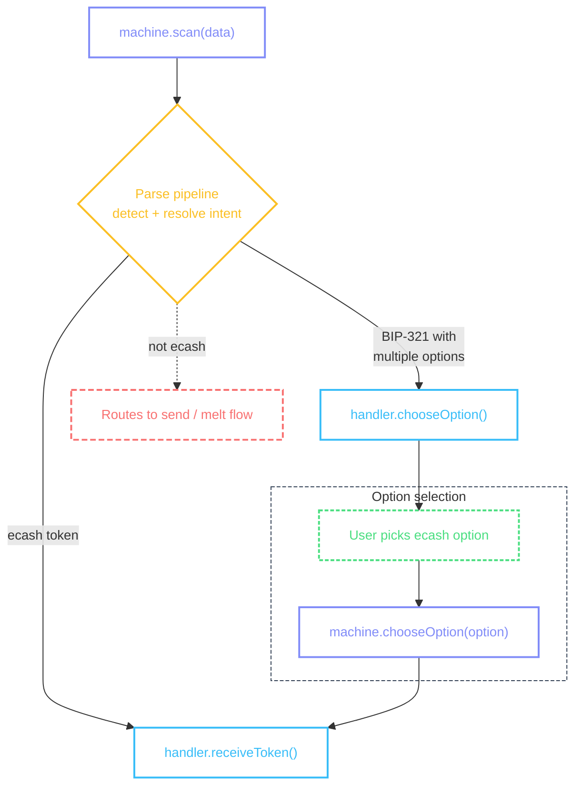
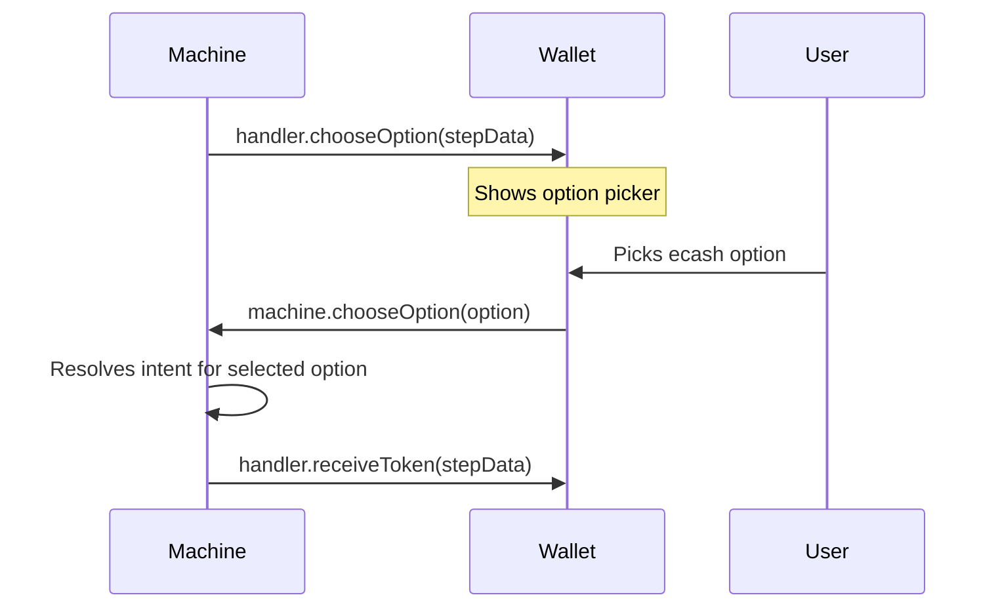

# Cashu Receive

Receiving ecash: user scans or pastes a token, the machine detects it, and the wallet redeems it into the user's balance.

## Flow



::: details Diagram legend

- **Purple** — `machine.method()` — wallet calls these to drive the flow
- **Blue** — `handler.method()` — machine calls these; wallet implements them on the [provider](/guide/getting-started#provider)
- **Purple dashed** — `operations.method()` — async operations on the [provider](/guide/getting-started#provider)
- **Yellow** — internal machine decisions
- **Green dashed** — user actions on screen
- **Red dashed** — error / notification states
  :::

### Scanning input

The wallet triggers a scan with data from a QR code, the clipboard, or a gallery image. The machine runs it through the [parse pipeline](/pipeline/overview), detects the ecash token, and resolves the intent. See [Scanning](/flows/scanning) for the full `machine.scan()` API and source configuration.

If the parsed input is an ecash token, the machine calls [`handler.receiveToken()`](#handler-receivetoken). If it's a `bitcoin:` URI with multiple options, the machine calls [`handler.chooseOption()`](#handler-chooseoption) first.

### handler.receiveToken()

Called when the machine detects an ecash token in the parsed input. This is a terminal handler — no further machine steps are needed. The handler navigates to the [Receive Token Screen](#receive-token-screen) where the user can redeem.

The machine passes this step data to the handler:

```ts
{
  token: 'cashuBpGF0aHR0cHM6Ly9taW50LmV4YW1wbGUuY29tYXVjc2F0...',
}
```

| Field   | What it means                                    |
| ------- | ------------------------------------------------ |
| `token` | The raw cashu token string detected in the input |

```tsx
<CocoPaymentUXProvider
  handlers={(machine, refs) => ({
    // ...
    receiveToken: ({ token }) => {
      router.navigate({
        pathname: '/(receive-flow)/receiveToken',
        params: { receiveHistoryEntry: JSON.stringify(buildReceiveHistoryEntry(token)) },
      });
    },
    // ...
  })}
/>
```

::: info Receive token navigation

- The handler builds a placeholder history entry from the token before navigating — the real entry is created after redemption
- `buildReceiveHistoryEntry()` is a wallet helper that extracts amount, mint URL, and unit from the token for display
  :::

### handler.chooseOption()

When the input is a `bitcoin:` URI containing both a cashu token and a lightning invoice, the machine calls this handler. The user picks which payment method to use, and the machine routes to the appropriate flow.



The machine passes this step data to the handler:

```ts
{
  parsed: { ... },
  options: [
    {
      option: { kind: 'ecashToken', value: 'cashuBpGF0...', source: 'bip321', paramKey: 'cashu' },
      status: 'recommended',
      reason: { code: 'PAYABLE_ECASH', message: 'Payable with Cashu — no fees' },
    },
    {
      option: { kind: 'lightningInvoice', value: 'lnbc1...', source: 'bip321', paramKey: 'lightning' },
      status: 'available',
      reason: null,
    },
  ],
  unit: 'sat',
}
```

| Field                   | What it means                                                                                                                               |
| ----------------------- | ------------------------------------------------------------------------------------------------------------------------------------------- |
| `parsed`                | The full [`ParsedPaymentInput`](/pipeline/parse) from the parse pipeline                                                                    |
| `options`               | [`AnnotatedOption[]`](/pipeline/annotate) — each option has a `status` (`'recommended'`, `'available'`, `'disabled'`) and optional `reason` |
| `options[].option.kind` | The payment type — `'ecashToken'` for receive, `'lightningInvoice'` / `'lightningAddress'` / `'lnurlp'` for send                            |
| `unit`                  | The unit for this flow                                                                                                                      |

```tsx
<CocoPaymentUXProvider
  handlers={(machine, refs) => ({
    // ...
    chooseOption: (stepData) => {
      paymentOptionsPopup({ ...stepData, machine, onDismiss: refs.getOptionDismiss() });
    },
    // ...
  })}
/>
```

When the user picks an option, the screen calls:

```tsx
machine.chooseOption(selectedOption.option);
```

The machine re-resolves the intent for just the selected option. If the user picks the ecash token, the flow continues to [`handler.receiveToken()`](#handler-receivetoken). If they pick the lightning invoice, the flow routes to the [lightning send](/flows/lightning-send) flow instead.

::: info Option selection UI

- Present as a popup or bottom sheet — this is a quick choice, not a full screen
- Highlight the `'recommended'` option (ecash is fee-free)
- Show the `reason` string when present (e.g., "Payable with Cashu — no fees")
- Grey out `'disabled'` options
- Each option should show its kind label (e.g., "Ecash", "Lightning") and amount if known
- See [Annotate](/pipeline/annotate) for how statuses are determined
  :::

## Receive Token Screen

The entry from [`useScreenActions`](/guide/architecture#thin-screens) contains the token, amount, mint URL, unit, and state. Before redemption, the entry is a placeholder built from the token. After redemption, it's replaced with the real history entry.

String and timestamp fields on the entry are [`FormattedString`](/methods/formatting#formattedstring) and [`FormattedTimestamp`](/methods/formatting#formattedtimestamp) instances.

```tsx
import { View, Text, Pressable, ScrollView, ActivityIndicator } from 'react-native';

function ReceiveTokenScreen({ receiveHistoryEntry }) {
  const { entry, error, actions } = useScreenActions('receiveToken', receiveHistoryEntry);

  if (error) return <Text>{error}</Text>;
  if (!entry) return <ActivityIndicator />;

  return (
    <ScrollView>
      <Text>
        {entry.amount} {entry.unit}
      </Text>
      <Text>{entry.mintUrl.truncate(20, 'middle')}</Text>
      <Text>{entry.createdAt.relative}</Text>

      {actions.redeem.available && (
        <Pressable onPress={() => actions.redeem.execute()}>
          {actions.redeem.loading ? <ActivityIndicator /> : <Text>Redeem</Text>}
        </Pressable>
      )}
    </ScrollView>
  );
}
```

::: info Receive token screen UI

- Show the token amount large and bold, centered — this is the first thing the user sees
- Display the mint name and unit below the amount so the user knows where the ecash comes from
- The redeem button is the primary action — make it visually dominant
- Show a loading state while redeeming (the wallet validates the token, checks mint trust, and calls `wallet.receive()`)
- If the mint is untrusted, show a trust confirmation prompt before receiving — present the mint name, URL, and a "Trust this mint" / "Auto-swap to default mint" choice. Auto-swap routes the ecash through Lightning to the user's preferred mint (note: this involves fees). See the Bitcoin Design Guide's [auto-swap pattern](/guide/getting-started#auto-swap)
- If the token's mint is unknown, display it with a warning indicator and the mint URL so the user can verify before trusting
- After successful redemption, transition to a success state — show a checkmark animation with the amount received. See [Success Feedback](/guide/success-feedback#in-place-transition)
- Consider haptic feedback on successful redemption
  :::

### Actions

| Action   | Available when                    | What it does                                               |
| -------- | --------------------------------- | ---------------------------------------------------------- |
| `redeem` | Token exists and not yet redeemed | Validate unit, check mint trust, receive token into wallet |

### Action handlers

The redeem handler validates the token, checks mint trust, and receives:

```tsx
<CocoPaymentUXProvider
  actions={{
    receiveToken: {
      redeem: async (ctx) => {
        const tokenString = ctx.manager.wallet.encodeToken(ctx.entry.token);

        if (decodedUnit !== 'sat') {
          unsupportedTokenUnitPopup({ unit: decodedUnit });
          return;
        }

        const isTrusted = await ctx.manager.mint.isTrustedMint(ctx.entry.mintUrl);
        if (!isTrusted) {
          router.navigate({
            pathname: '/(mint-flow)/info',
            params: { mintUrl: ctx.entry.mintUrl, fromAccepter: '1', token: tokenString },
          });
          return;
        }

        await ctx.manager.wallet.receive(tokenString);
      },
    },
  }}
/>
```

::: tip Trust check
When the mint is untrusted, the handler navigates to a mint info screen instead of receiving immediately. The user can review the mint and choose to trust it. After trusting, they return to the receive screen and tap redeem again.
:::

## Quick Receive

Some wallets show a landing screen before any token arrives — displaying the user's NPC Lightning address and P2PK key so others can send to them. From this screen, paste and scan actions trigger `machine.scan()` which routes to the Cashu Receive flow (or other flows depending on the input).

See [Quick Receive](/flows/quick-receive) for the full entry point, NPC/P2PK details, screen, and actions.
