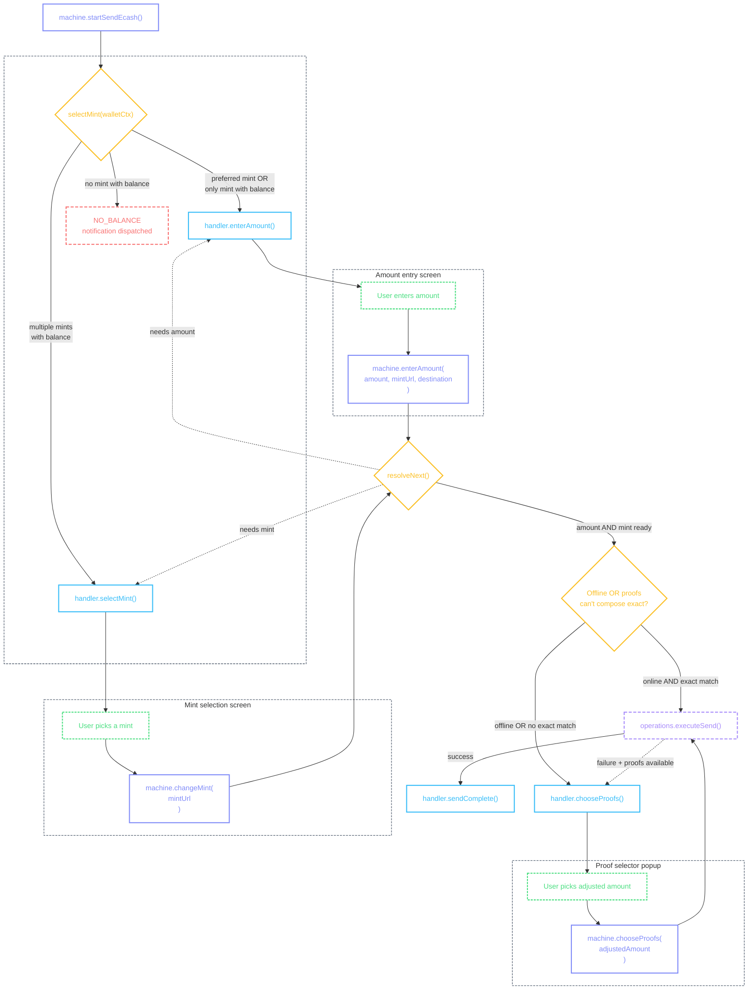
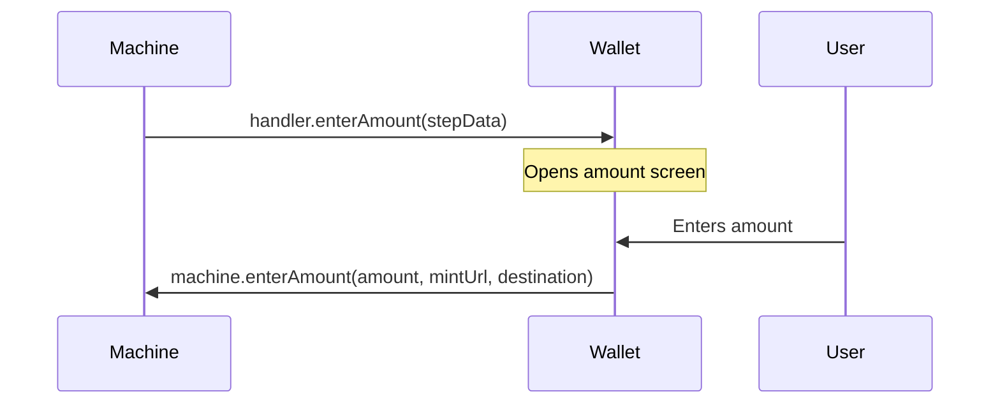
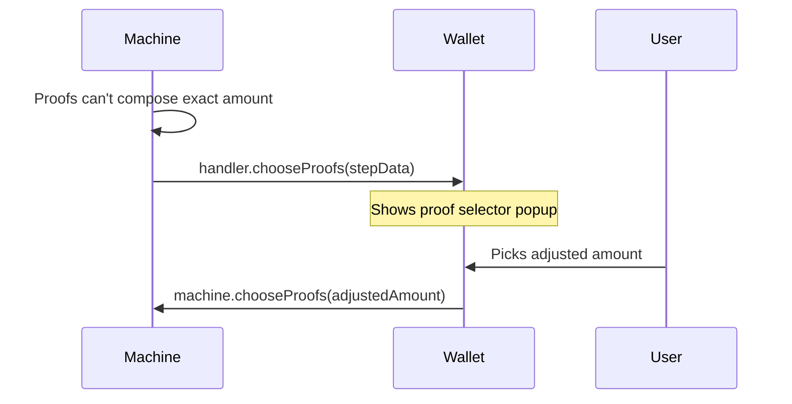

# Cashu Send

Sending ecash: user enters an amount, machine selects a mint, proofs are composed, and a token is created.

## Flow



::: details Diagram legend

- **Purple** — `machine.method()` — wallet calls these to drive the flow
- **Blue** — `handler.method()` — machine calls these; wallet implements them on the [provider](/guide/getting-started#provider)
- **Purple dashed** — `operations.method()` — async operations on the [provider](/guide/getting-started#provider)
- **Yellow** — internal machine decisions
- **Green dashed** — user actions on screen
- **Red dashed** — error / notification states
  :::

### Starting the flow

```tsx
const machine = usePaymentFlowMachine({ walletContext, unit });

const handleCashuSend = async () => {
  await machine.startSendEcash();
};

// From outside a flow (e.g., home screen button) — clear stale state first:
await machine.startSendEcash({ reset: true });
```

When [`machine.startSendEcash()`](#starting-the-flow) is called, the machine:

- Resets all flow context (clears any previous amount, mint, intent) — pass `{ reset: true }` when calling from outside a flow to ensure stale state is cleared
- Checks which trusted mints have balance using the highest-balance strategy
- **Preferred mint has balance** → auto-selects it, calls [`handler.enterAmount()`](#handler-enteramount)
- **Only one mint has balance** → auto-selects it, calls [`handler.enterAmount()`](#handler-enteramount)
- **Multiple mints have balance** → calls [`handler.selectMint()`](#handler-selectmint) with the candidate list
- **No mints have balance** → dispatches [`NO_BALANCE`](/methods/localization#errors) notification, flow ends

### handler.enterAmount()

Called when a mint has been selected (auto-selected or user-picked) and the flow needs an amount. The handler receives the selected mint, unit, and constraints that describe the flow context.



The machine passes this step data to the handler:

```ts
{
  unit: 'sat',
  preselectedMintUrl: 'https://mint.example.com',
  constraints: {
    destination: 'sendEcash',
    supportedMintUrls: undefined,
    paymentRequest: undefined,
    meltTarget: undefined,
  },
}
```

| Field                           | What it means                                                                                                                                                                      |
| ------------------------------- | ---------------------------------------------------------------------------------------------------------------------------------------------------------------------------------- |
| `unit`                          | The unit for this flow (`'sat'`)                                                                                                                                                   |
| `preselectedMintUrl`            | The mint auto-selected by [`machine.startSendEcash()`](#starting-the-flow), or the mint the user picked from [`handler.selectMint()`](#handler-selectmint)                         |
| `constraints.destination`       | Which flow this amount entry is for — [`'sendEcash'`](/flows/cashu-send), [`'meltQuote'`](/flows/lightning-send), [`'mintQuote'`](/flows/lightning-receive), or `'paymentRequest'` |
| `constraints.supportedMintUrls` | Set when a payment request restricts which mints can be used                                                                                                                       |
| `constraints.paymentRequest`    | Set for NUT-18 payment requests                                                                                                                                                    |
| `constraints.meltTarget`        | Set for lightning sends (bolt11 invoice or lnurl)                                                                                                                                  |

```tsx
<CocoPaymentUXProvider
  handlers={(machine, refs) => ({
    // ...
    enterAmount: ({ unit, preselectedMintUrl, constraints }) => {
      router.push({
        pathname: '/(send-flow)/amount',
        params: { unit, selectedMintUrl: preselectedMintUrl, destination: constraints.destination },
      });
    },
    // ...
  })}
/>
```

After the user enters an amount, the screen submits it to the machine:

```tsx
machine.enterAmount(amount, mintUrl, 'sendEcash');
```

::: info Amount screen UI

- Numeric keyboard for entering an amount
- Toggle button to switch between sat and fiat input modes
- Secondary display showing the converted amount (e.g., "≈ $0.42" when entering sats)
- Preferred mint name and balance so the user knows what they're sending from
- Quick send suggestion pills for send flows — offline-composable amounts returned from [`useScreenActions`](/guide/architecture#thin-screens)
- Paste and QR scan buttons for destinations that support them

See [Amount Selection](/flows/amount-selection) for the full implementation pattern.
:::

### Amount → Mint → Execute

After the user enters an amount (see [Amount Selection](/flows/amount-selection)), the machine checks mint availability:

- **One valid mint** → auto-select, skip picker
- **Preferred mint valid** → auto-select
- **Multiple valid mints** → call [`handler.selectMint()`](#handler-selectmint) with pre-computed [`MintListItem[]`](#handler-selectmint)

### handler.selectMint()

When multiple mints have sufficient balance, the machine calls this handler with a pre-built list of all trusted mints. See [Mint Selector](/flows/mint-selector) for the full handler section, [`MintListItem`](/flows/mint-selector#mintlistitem) shape, and UI implementation.

For cashu sends, `destination` is `'sendEcash'` — mints need balance to cover the send amount.

### handler.chooseProofs()

The proof selector only appears for **ecash sends** — never for lightning melts or payment requests, which always attempt the exact amount because the mint handles the swap server-side.

The machine checks whether the selected mint's proofs can compose the exact amount:

- **Online AND exact match** → send proceeds directly via `operations.executeSend()`, user sees nothing extra
- **Offline** → always shows the proof selector, even if proofs compose exactly, because the mint swap endpoint is unreachable
- **Online but no exact match** → shows the proof selector with round-down/round-up suggestions
- **Online send fails** → falls back to the proof selector if proofs are available, otherwise shows an error

Most sends go through without the user noticing. The handler only fires when proofs genuinely can't compose the exact amount without a mint swap, or when the device is offline.



The machine passes this step data to the handler:

```ts
{
  mintUrl: 'https://mint.example.com',
  amount: 150,
  unit: 'sat',
  proofAmounts: [1, 2, 4, 8, 16, 64, 128, 256, 512],
  suggestions: {
    roundDown: { amount: 128 },
    roundUp: { amount: 256 },
  },
}
```

| Field                   | What it means                                                                                         |
| ----------------------- | ----------------------------------------------------------------------------------------------------- |
| `amount`                | The original amount the user wanted to send                                                           |
| `proofAmounts`          | Raw proof denominations available on this mint — for advanced wallets that want a custom proof picker |
| `suggestions.roundDown` | Nearest composable amount below the target, or `null` if none exists                                  |
| `suggestions.roundUp`   | Nearest composable amount above the target, or `null` if none exists                                  |

```tsx
<CocoPaymentUXProvider
  handlers={(machine, refs) => ({
    // ...
    chooseProofs: (stepData) => {
      proofSelectorPopup(stepData);
    },
    // ...
  })}
/>
```

```tsx
import { View, Text, Pressable, ActivityIndicator } from 'react-native';

function ProofSelectorPopup({ stepData, machine }) {
  const { isExecuting } = useExecutionState(machine);

  return (
    <View>
      <Text>
        Can't send exactly {stepData.amount} {stepData.unit} offline
      </Text>

      {stepData.suggestions?.roundDown && (
        <Pressable
          onPress={() => machine.chooseProofs(stepData.suggestions.roundDown.amount)}
          disabled={isExecuting}>
          <Text>
            Send {stepData.suggestions.roundDown.amount} {stepData.unit} instead
          </Text>
        </Pressable>
      )}

      {stepData.suggestions?.roundUp && (
        <Pressable
          onPress={() => machine.chooseProofs(stepData.suggestions.roundUp.amount)}
          disabled={isExecuting}>
          <Text>
            Send {stepData.suggestions.roundUp.amount} {stepData.unit} instead
          </Text>
        </Pressable>
      )}

      <Pressable onPress={() => machine.requestMintSelector()} disabled={isExecuting}>
        <Text>Change Mint</Text>
      </Pressable>
    </View>
  );
}
```

::: info Proof selector UI

- Present as a bottom sheet or popup overlay, not a full screen — this is a quick decision, not a new flow step
- Show the original amount the user wanted prominently (e.g., "Can't send exactly 150 sats offline")
- Two clearly labeled options: "Send 128 sats" (round down) and "Send 256 sats" (round up) — show the difference from the original so the user understands the trade-off
- Either suggestion can be `null` — hide the button when it is
- "Change Mint" as a tertiary option — a different mint might have proofs that compose the exact amount (the mint list shows [`worksOffline`](#handler-selectmint) per mint so the user can see at a glance which mints would work)
- Disable all buttons while [`isExecuting`](/guide/architecture#execution-state) is true to prevent double-taps
- When the user enters a fiat amount, the library automatically checks all sat values that round to the same displayed price — if any of them are composable, the send succeeds without showing this popup
- See [Proof Selection](/flows/proof-selection) for the full pattern
  :::

### Execution

Once amount and mint are resolved (and proofs compose if offline), the machine runs [`operations.executeSend()`](/guide/getting-started#handlers-operations-notifications):

```tsx
<CocoPaymentUXProvider
  engine={{
    operations: {
      // ...
      executeSend: async (mintUrl, amount) => {
        await manager.wallet.send(mintUrl, amount);
        const entry = await findLatestSendEntry(mintUrl);
        return { historyEntry: JSON.stringify(entry) };
      },
      // ...
    },
  }}
/>
```

On success, the machine calls [`handler.sendComplete()`](#execution) with the history entry. The handler navigates to the [Send Cashu Screen](#send-cashu-screen):

```tsx
<CocoPaymentUXProvider
  handlers={(machine, refs) => ({
    // ...
    sendComplete: ({ historyEntry }) => {
      router.navigate({ pathname: '/sendToken', params: { sendHistoryEntry: historyEntry } });
    },
    // ...
  })}
/>
```

## Send Cashu Screen

The entry from [`useScreenActions`](/guide/architecture#thin-screens) contains the amount, mint, token string, state, and creation timestamp. The `source` indicates how the send was initiated — `'QR Code'`, `'NFC'`, `'Clipboard'`, or `'Deep Link'`.

String and timestamp fields on the entry are [`FormattedString`](/methods/formatting#formattedstring) and [`FormattedTimestamp`](/methods/formatting#formattedtimestamp) instances — they render as normal strings/numbers but expose formatting methods like [`.truncate()`](/methods/formatting#truncation) and [`.relative`](/methods/formatting#getters).

```tsx
import { View, Text, Pressable, ScrollView, ActivityIndicator } from 'react-native';

function SendCashuScreen({ sendHistoryEntry }) {
  const { entry, error, actions, source } = useScreenActions('sendToken', sendHistoryEntry);

  if (error) return <Text>{error}</Text>;
  if (!entry) return <ActivityIndicator />;

  return (
    <ScrollView>
      <Text>
        {entry.amount} {entry.unit}
      </Text>
      <Text>{entry.mintUrl.truncate(20, 'middle')}</Text>
      <Text>Status: {entry.state}</Text>

      {source && <Text>Via: {source}</Text>}
      <Text>{entry.createdAt.relative}</Text>

      {entry.state === 'pending' && (
        <Text selectable numberOfLines={3}>
          {entry.tokenString.truncate(6, 'middle')}
        </Text>
      )}

      <View>
        {actions.copy.available && (
          <Pressable onPress={() => actions.copy.execute()}>
            {actions.copy.loading ? <ActivityIndicator /> : <Text>Copy Token</Text>}
          </Pressable>
        )}

        {actions.share.available && (
          <Pressable onPress={() => actions.share.execute()}>
            <Text>Share</Text>
          </Pressable>
        )}

        {actions.nfc.available && (
          <Pressable onPress={() => actions.nfc.execute()}>
            <Text>Send via NFC</Text>
          </Pressable>
        )}

        {actions.copyAsEmoji.available && (
          <Pressable onPress={() => actions.copyAsEmoji.execute()}>
            <Text>Copy as Emoji</Text>
          </Pressable>
        )}

        {actions.checkStatus.available && (
          <Pressable onPress={() => actions.checkStatus.execute()}>
            {actions.checkStatus.loading ? <ActivityIndicator /> : <Text>Check Status</Text>}
          </Pressable>
        )}

        {actions.cancel.available && (
          <Pressable onPress={() => actions.cancel.execute()}>
            {actions.cancel.loading ? <ActivityIndicator /> : <Text>Cancel</Text>}
          </Pressable>
        )}
      </View>
    </ScrollView>
  );
}
```

::: info Send cashu screen UI

- This is the end of the send flow — the token has been created and the user needs to deliver it
- The token is a bearer asset — the QR code _is_ the money. Display the sat amount large and bold above the QR code, with fiat equivalent below when configured
- Show the token as a QR code (centered, maximum width) — see [QR Display](/guide/qr-display#ecash-tokens) for layout patterns
- Wrap the QR and truncated token string in a tappable area — tapping copies the full encoded token
- If the token is too large for a static QR, fall back to [animated QR (NUT-16)](/guide/qr-display#animated-qr-nut-16) with a frame counter, or show Copy/Share as primary actions with a "Token too large for QR" message
- Show the amount, mint, and creation date below the QR
- Copy (primary) and Share (outlined) buttons below the QR — these are the main delivery methods
- NFC is useful for in-person sends
- Check Status verifies if the recipient has redeemed — when spent, replace the QR with a success animation and "Token claimed" confirmation
- Cancel should be visually distinct (destructive styling) since it rolls back the operation and destroys the proofs
- Prevent back-navigation on this screen — the token already exists, and a back gesture could make the user think it was canceled. Provide an explicit "Done" or "Back to home" button instead. See [Success Feedback](/guide/success-feedback#prevent-back-navigation)
- Track unclaimed tokens as "Pending" in the payment history with a clock/amber indicator — allow the user to tap a pending entry to re-display the token for re-sharing
  :::

### Actions

| Action        | Available when                            | What it does                           |
| ------------- | ----------------------------------------- | -------------------------------------- |
| `copy` *      | Token exists and not finalized/rolledBack | Encode token V4, copy to clipboard     |
| `share` *     | Same as copy                              | Platform share sheet with token string |
| `nfc`         | Same as copy                              | Write token to NFC tag                 |
| `copyAsEmoji` | Same as copy                              | Encode token as emoji representation   |
| `checkStatus` | State is `pending`                        | Check if token has been redeemed       |
| `cancel`      | Has `operationId` and not finalized       | Rollback operation, destroy proofs     |

\* Built-in — works automatically when `platform.writeClipboard` / `platform.shareContent` are provided on the provider. No handler needed.

### Action handlers

Both `copy` and `share` are **built-in** — when `platform.writeClipboard` and `platform.shareContent` are provided on the provider, they work automatically for all screen types. The library extracts the correct text per screen type (encoded token V4 for `sendToken`, payment request for `mintQuote`, address for `receive`, mint URL for `mintInfo`). Tokens are shared with a `cashu://` URL for deep link support.

```tsx
<CocoPaymentUXProvider
  platform={{
    writeClipboard: (text) => Clipboard.setStringAsync(text),
    shareContent: (content) => Share.share({ message: content.message, url: content.url }),
  }}
  callbacks={{
    notifications: {
      onCopied: (target) => toast.success(`Copied ${target}`),
      onShared: (target) => toast.success(`Shared ${target}`),
    },
    actions: {
      sendToken: {
        // copy and share are built-in — no handlers needed
        nfc: async (ctx) => {
          await writeTokenToNFC(ctx.entry);
        },
        cancel: async (ctx) => {
          await ctx.manager.wallet.rollback(ctx.entry.operationId);
          router.back();
        },
      },
    },
  }}
/>
```

Custom action handlers receive `notify(event, ...args)` in their context, which dispatches to the wallet's `callbacks.notifications` handlers. Use this instead of inline popups:

```tsx
callbacks={{
  actions: {
    sendToken: {
      nfc: async (ctx) => {
        await writeTokenToNFC(ctx.entry);
        ctx.notify('onShared', 'token', ctx.entry.tokenString);
      },
    },
  },
}}
```
