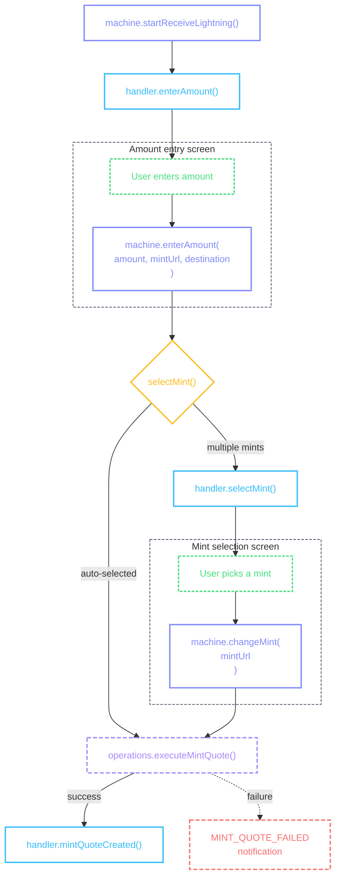
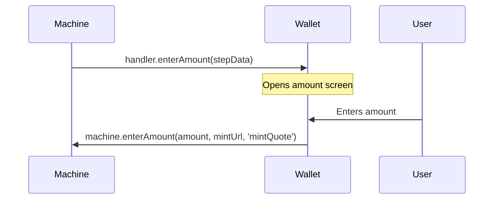

# Lightning Receive

Receiving via Lightning: user enters an amount, the wallet creates a Lightning invoice through a mint, and waits for payment.

## Flow



::: details Diagram legend

- **Purple** — `machine.method()` — wallet calls these to drive the flow
- **Blue** — `handler.method()` — machine calls these; wallet implements them on the [provider](/guide/getting-started#provider)
- **Purple dashed** — `operations.method()` — async operations on the [provider](/guide/getting-started#provider)
- **Yellow** — internal machine decisions
- **Green dashed** — user actions on screen
- **Red dashed** — error / notification states
  :::

### Starting the flow

```tsx
const machine = usePaymentFlowMachine({ walletContext, unit });

const handleReceiveLightning = async () => {
  await machine.startReceiveLightning();
};
```

Or from the [Receive Hub](/flows/cashu-receive#receive-hub) "Fixed Amount" action:

```tsx
const { actions } = useScreenActions('receive', receiveEntry);
await actions.fixedAmount.execute();
```

When [`machine.startReceiveLightning()`](#starting-the-flow) is called, the machine:

- Resets all flow context
- Sets `destination: 'mintQuote'`
- Auto-selects the preferred mint (any trusted mint works — no balance requirement)
- Calls [`handler.enterAmount()`](#handler-enteramount)

### handler.enterAmount()

Called with `mintQuote` destination. Unlike send flows, the amount screen doesn't show balance constraints — the user can enter any amount since they're requesting a payment, not spending.



The machine passes this step data to the handler:

```ts
{
  unit: 'sat',
  preselectedMintUrl: 'https://mint.example.com',
  constraints: {
    destination: 'mintQuote',
    supportedMintUrls: undefined,
    paymentRequest: undefined,
    meltTarget: undefined,
  },
}
```

| Field                     | What it means                                       |
| ------------------------- | --------------------------------------------------- |
| `unit`                    | The unit for this flow                              |
| `preselectedMintUrl`      | The auto-selected mint (any trusted mint qualifies) |
| `constraints.destination` | Always `'mintQuote'` for lightning receives         |

```tsx
<CocoPaymentUXProvider
  handlers={(machine, refs) => ({
    // ...
    enterAmount: ({ unit, preselectedMintUrl, constraints }) => {
      router.push({
        pathname: '/(receive-flow)/amount',
        params: { unit, selectedMintUrl: preselectedMintUrl, destination: constraints.destination },
      });
    },
    // ...
  })}
/>
```

After the user enters an amount:

```tsx
machine.enterAmount(amount, mintUrl, 'mintQuote');
```

::: info Amount screen UI

- Same amount screen layout as [Cashu Send](/flows/cashu-send#handler-enteramount) — numeric keyboard, fiat toggle, converted amount display
- No balance indicator needed — this is a receive flow
- No quick send suggestions — those are for send flows only
- Show the mint name so the user knows which mint will create the invoice
- See [Amount Selection](/flows/amount-selection) for the full implementation pattern
  :::

### handler.selectMint()

When multiple trusted mints exist, the machine calls this handler. See [Mint Selector](/flows/mint-selector) for the full handler section.

For lightning receives, `destination` is `'mintQuote'` — **all trusted mints are available** regardless of balance. The [availability rule](/flows/mint-selector#availability-per-destination) is simpler: no mint is disabled for insufficient balance since the user isn't spending.

### Execution

After amount and mint are resolved, the machine runs [`operations.executeMintQuote()`](/guide/getting-started#handlers-operations-notifications):

```tsx
<CocoPaymentUXProvider
  operations={{
    // ...
    executeMintQuote: async (mintUrl, amount, unit) => {
      const quote = await manager.quotes.createMintQuote(mintUrl, amount);
      const entry = await findMintEntryByQuoteId(quote.quote);
      return { historyEntry: JSON.stringify(entry) };
    },
    // ...
  }}
/>
```

On success, the machine calls [`handler.mintQuoteCreated()`](#handler-mintquotecreated). On failure, it dispatches a [`MINT_QUOTE_FAILED`](/methods/localization#errors) notification.

### handler.mintQuoteCreated()

Called when the mint quote is created successfully. This is the terminal handler — the Lightning invoice is ready. The handler navigates to the [Mint Quote Screen](#mint-quote-screen).

The machine passes this step data to the handler:

```ts
{
  historyEntry: '{"id":"...","paymentRequest":"lnbc...","state":"UNPAID",...}',
  unit: 'sat',
}
```

| Field          | What it means                                                                           |
| -------------- | --------------------------------------------------------------------------------------- |
| `historyEntry` | JSON-serialized history entry containing the Lightning invoice, amount, mint, and state |
| `unit`         | The unit for this flow                                                                  |

```tsx
<CocoPaymentUXProvider
  handlers={(machine, refs) => ({
    // ...
    mintQuoteCreated: ({ historyEntry, unit }) => {
      router.navigate({
        pathname: '/(receive-flow)/mintQuote',
        params: { mintHistoryEntry: historyEntry },
      });
    },
    // ...
  })}
/>
```

::: info Mint quote navigation

- The `historyEntry` contains the full history entry as a JSON string — parse it on the target screen
- The entry's `paymentRequest` field is the Lightning invoice (BOLT11) that the payer needs
  :::

## Mint Quote Screen

The entry from [`useScreenActions`](/guide/architecture#thin-screens) contains the Lightning invoice, amount, mint, and payment state. The screen updates reactively as the payer pays the invoice.

String and timestamp fields on the entry are [`FormattedString`](/methods/formatting#formattedstring) and [`FormattedTimestamp`](/methods/formatting#formattedtimestamp) instances.

```tsx
import { View, Text, Pressable, ScrollView, ActivityIndicator } from 'react-native';

function MintQuoteScreen({ mintHistoryEntry }) {
  const { entry, error, actions } = useScreenActions('mintQuote', mintHistoryEntry);

  if (error) return <Text>{error}</Text>;
  if (!entry) return <ActivityIndicator />;

  return (
    <ScrollView>
      <Text>
        {entry.amount} {entry.unit}
      </Text>
      <Text>{entry.mintUrl.truncate(20, 'middle')}</Text>
      <Text>Status: {entry.state}</Text>

      {entry.state === 'UNPAID' && <Text selectable>{entry.paymentRequest}</Text>}

      <View>
        {actions.copy.available && (
          <Pressable onPress={() => actions.copy.execute()}>
            {actions.copy.loading ? <ActivityIndicator /> : <Text>Copy Invoice</Text>}
          </Pressable>
        )}

        {actions.share.available && (
          <Pressable onPress={() => actions.share.execute()}>
            <Text>Share</Text>
          </Pressable>
        )}
      </View>
    </ScrollView>
  );
}
```

::: info Mint quote screen UI

- Show the Lightning invoice as a QR code so the payer can scan it — see [QR Display](/guide/qr-display#lightning-invoices) for layout patterns
- Wrap the QR code and truncated invoice string in a single tappable area — tapping copies the full invoice
- Show a white border around the QR code for scannability on dark backgrounds
- Below the QR, show the invoice string truncated with `middle` mode via [`FormattedString`](/methods/formatting#formattedstring), with a copy icon that swaps to a checkmark on copy
- Display the amount and mint name above the QR code
- Show a "Waiting for payment..." label with a spinner below the QR code
- Copy and Share are the primary actions — make these visually dominant
- State transitions happen reactively — `UNPAID` → `PAID` → `ISSUED` — update the UI without navigation
- When the state changes to `PAID` or `ISSUED`, replace the QR code and spinner with a success visual (checkmark animation, amount confirmed) — see [Success Feedback](/guide/success-feedback#in-place-transition)
- Consider haptic feedback when the state transitions to `PAID` — a single medium vibration signals completion
- If the invoice has an expiry, show a countdown timer — warn the user when under 60 seconds remaining
  :::

### Actions

| Action    | Available when                  | What it does                                     |
| --------- | ------------------------------- | ------------------------------------------------ |
| `copy` *  | State is not `ISSUED` or `PAID` | Copy the Lightning invoice (BOLT11) to clipboard |
| `share` * | Same as copy                    | Platform share sheet with the invoice string     |

\* Built-in — works automatically when `writeClipboard` / `shareContent` are provided on the provider. No handler needed.

### Action handlers

Both `copy` and `share` are **built-in** — when `writeClipboard` and `shareContent` are provided on the provider, they work automatically. The `onCopied` / `onShared` notification fires with `target` set to `'paymentRequest'`.

```tsx
<CocoPaymentUXProvider
  writeClipboard={(text) => Clipboard.setStringAsync(text)}
  shareContent={(content) => Share.share({ message: content.message, url: content.url })}
  // No mintQuote action handlers needed — copy and share are built-in
/>
```

### Live updates

The screen subscribes to quote state changes via [`screenActionsBridge.onEntryUpdate`](/guide/architecture#live-updates). When the payer pays the invoice, the entry updates reactively — `state` changes from `UNPAID` to `PAID` to `ISSUED`, and action availability recomputes automatically.

```tsx
<CocoPaymentUXProvider
  screenActionsBridge={{
    onEntryUpdate: (screenType, callback) => {
      const unsub = manager.on('history:updated', ({ entry }) => {
        callback(entry);
      });
      return () => unsub();
    },
  }}
/>
```

::: tip State transitions
The mint quote goes through three states:

- **`UNPAID`** — invoice created, waiting for payment. Copy and Share are available.
- **`PAID`** — payer has paid the invoice. The mint is processing. Actions become unavailable.
- **`ISSUED`** — ecash has been minted and added to the user's balance. Final state.

The transition from `PAID` to `ISSUED` happens automatically — the wallet's history listener picks up the mint's state update and pushes it to the screen via `onEntryUpdate`.
:::
