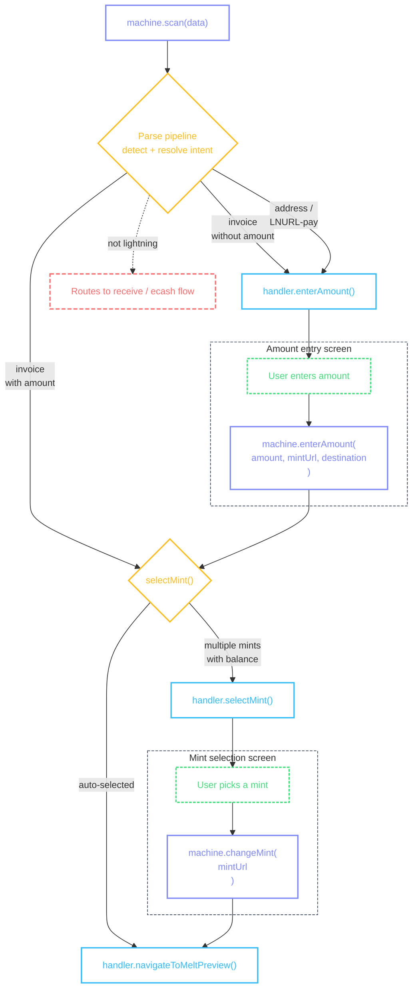
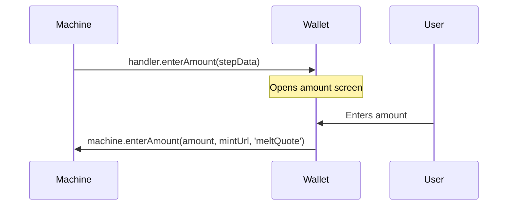
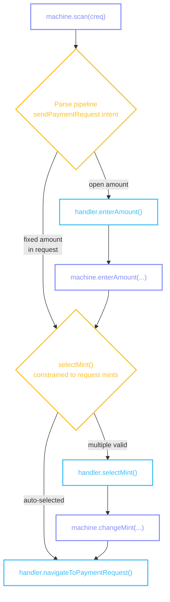

# Lightning Send

Sending via Lightning: user scans a Lightning invoice or enters an address, the wallet creates a melt quote through a mint, and pays it.

## Flow



::: details Diagram legend

- **Purple** — `machine.method()` — wallet calls these to drive the flow
- **Blue** — `handler.method()` — machine calls these; wallet implements them on the [provider](/guide/getting-started#provider)
- **Yellow** — internal machine decisions
- **Green dashed** — user actions on screen
- **Red dashed** — error / notification states
  :::

### Scanning input

The flow starts when the user scans or pastes a Lightning invoice, address, or LNURL-pay link. See [Scanning](/flows/scanning) for the full `machine.scan()` API.

The machine resolves one of three intent types from the parsed input:

| Intent                 | Input                             | Amount entry                           |
| ---------------------- | --------------------------------- | -------------------------------------- |
| `meltLightningInvoice` | Bolt11 invoice (`lnbc...`)        | Skipped if invoice has embedded amount |
| `meltLightningAddress` | Lightning address (`user@domain`) | Always required                        |
| `meltLnurlp`           | LNURL-pay link                    | Always required                        |

Lightning invoices with an embedded amount skip `handler.enterAmount()` and go directly to mint selection. Addresses and LNURL-pay always require amount entry.

### handler.enterAmount()

Called when the flow needs an amount — addresses, LNURL-pay, or invoices without an embedded amount. The handler receives a `meltQuote` destination and the melt target (invoice or address string) in constraints.



The machine passes this step data to the handler:

```ts
{
  unit: 'sat',
  preselectedMintUrl: 'https://mint.example.com',
  constraints: {
    destination: 'meltQuote',
    supportedMintUrls: undefined,
    paymentRequest: undefined,
    meltTarget: 'lnbc10u1pj...',
  },
}
```

| Field                     | What it means                                                                                  |
| ------------------------- | ---------------------------------------------------------------------------------------------- |
| `unit`                    | The unit for this flow                                                                         |
| `preselectedMintUrl`      | The auto-selected mint, or `undefined` if none qualified                                       |
| `constraints.destination` | Always `'meltQuote'` for lightning sends                                                       |
| `constraints.meltTarget`  | The Lightning invoice or address string — pass through, used by the machine for quote creation |

```tsx
<CocoPaymentUXProvider
  handlers={(machine, refs) => ({
    // ...
    enterAmount: ({ unit, preselectedMintUrl, constraints }) => {
      router.push({
        pathname: '/(send-flow)/amount',
        params: { unit, selectedMintUrl: preselectedMintUrl, destination: constraints.destination },
      });
    },
    // ...
  })}
/>
```

After the user enters an amount, the screen submits it to the machine:

```tsx
machine.enterAmount(amount, mintUrl, 'meltQuote');
```

::: info Amount screen UI

- Same amount screen as [Cashu Send](/flows/cashu-send#handler-enteramount) — numeric keyboard, fiat toggle, converted amount display
- For lightning sends, the paste and scan buttons are not shown (a destination already exists)
- Show the destination (truncated invoice or address) so the user knows what they're paying
- See [Amount Selection](/flows/amount-selection) for the full implementation pattern
  :::

### handler.selectMint()

When multiple mints have sufficient balance, the machine calls this handler. See [Mint Selector](/flows/mint-selector) for the full handler section, [`MintListItem`](/flows/mint-selector#mintlistitem) shape, and UI implementation.

For lightning sends, `destination` is `'meltQuote'` — mints need balance to cover the send amount plus potential Lightning routing fees.

### handler.navigateToMeltPreview()

Called when amount and mint are resolved. This is the terminal handler — the machine has all the data it needs. The handler builds a preview entry and navigates to the [Melt Quote Screen](#melt-quote-screen).

The machine passes this step data to the handler:

```ts
{
  mintUrl: 'https://mint.example.com',
  meltTarget: 'lnbc10u1pj...',
  unit: 'sat',
  amount: 1000,
}
```

| Field        | What it means                                       |
| ------------ | --------------------------------------------------- |
| `mintUrl`    | The selected mint that will execute the melt        |
| `meltTarget` | The Lightning invoice or resolved LNURL-pay invoice |
| `unit`       | The unit for this flow                              |
| `amount`     | The amount to send (in the flow's unit)             |

```tsx
<CocoPaymentUXProvider
  handlers={(machine, refs) => ({
    // ...
    navigateToMeltPreview: ({ mintUrl, meltTarget, amount, unit }) => {
      const entry = buildMeltPreviewEntry(mintUrl, meltTarget, amount, unit);
      router.navigate({
        pathname: '/(send-flow)/meltQuote',
        params: { meltHistoryEntry: JSON.stringify(entry) },
      });
    },
    // ...
  })}
/>
```

::: info Melt preview navigation

- `buildMeltPreviewEntry()` is a wallet helper that creates a placeholder history entry with `state: 'UNPAID'` and no `quoteId`
- The entry is a preview — the actual melt quote is created when the user taps Pay on the [Melt Quote Screen](#melt-quote-screen)
  :::

## Melt Quote Screen

The entry from [`useScreenActions`](/guide/architecture#thin-screens) contains the melt target, amount, mint, state, and quote details. The screen has a two-phase pay action: first tap creates the quote, second tap executes the melt.

String and timestamp fields on the entry are [`FormattedString`](/methods/formatting#formattedstring) and [`FormattedTimestamp`](/methods/formatting#formattedtimestamp) instances.

```tsx
import { View, Text, Pressable, ScrollView, ActivityIndicator } from 'react-native';

function MeltQuoteScreen({ meltHistoryEntry }) {
  const { entry, error, actions, source } = useScreenActions('meltQuote', meltHistoryEntry);

  if (error) return <Text>{error}</Text>;
  if (!entry) return <ActivityIndicator />;

  return (
    <ScrollView>
      <Text>
        {entry.amount} {entry.unit}
      </Text>
      <Text>{entry.mintUrl.truncate(20, 'middle')}</Text>
      <Text>{entry.meltTarget.truncate(12, 'middle')}</Text>

      {entry.fee != null && (
        <Text>
          Fee: {entry.fee} {entry.unit}
        </Text>
      )}
      {source && <Text>Via: {source}</Text>}

      <View>
        {actions.pay.available && (
          <Pressable onPress={() => actions.pay.execute()}>
            {actions.pay.loading ? (
              <ActivityIndicator />
            ) : (
              <Text>{entry.quoteId ? 'Pay' : 'Get Quote'}</Text>
            )}
          </Pressable>
        )}

        {actions.cancel.available && (
          <Pressable onPress={() => actions.cancel.execute()}>
            {actions.cancel.loading ? <ActivityIndicator /> : <Text>Cancel</Text>}
          </Pressable>
        )}
      </View>
    </ScrollView>
  );
}
```

::: info Melt quote screen UI

- Two-phase pay flow: the first tap creates the melt quote (reveals the fee), the second tap executes the payment — this progressive disclosure lets the user back out after seeing the real cost
- Label the primary button "Get Quote" before the quote exists, "Pay" after — the `quoteId` field indicates which phase
- Consider a swipe-to-confirm gesture for the "Pay" phase — this prevents accidental taps on an irreversible operation
- Show the fee prominently after quoting — this is the Lightning routing fee the mint charges
- Display a payment overview before executing: amount, destination (truncated invoice or address), fee, total including fee, and balance after transaction — see [Success Feedback](/guide/success-feedback#confirmation-before-execution)
- Show the balance-after-transaction range when fees are variable: e.g., "Balance after: 1,200 to 1,450 sats"
- The entry updates reactively via [`screenActionsBridge.onEntryUpdate`](/guide/architecture#live-updates) as the quote is created and payment progresses
- Cancel should be visually distinct (destructive styling, outlined or secondary) — it rolls back the operation
- Cancel is only available after the quote is created (not during preview phase)
- On successful payment, show a fee breakdown: amount sent, network fee, total deducted, change returned (if overpaid proofs via NUT-08) — see [Success Feedback](/guide/success-feedback#fee-breakdown-on-success)
  :::

### Actions

| Action   | Available when                                        | What it does                                                                                                                           |
| -------- | ----------------------------------------------------- | -------------------------------------------------------------------------------------------------------------------------------------- |
| `pay`    | State is `UNPAID` and not pending                     | **Preview phase** (no `quoteId`): create melt quote via `prepareMeltBolt11`. **Ready phase** (has `quoteId`): execute the melt payment |
| `cancel` | Not preview phase, and state is `UNPAID` or `PENDING` | Rollback the melt operation                                                                                                            |

### Action handlers

```tsx
<CocoPaymentUXProvider
  actions={{
    meltQuote: {
      pay: async (ctx) => {
        if (!ctx.entry.quoteId) {
          await ctx.manager.wallet.prepareMeltBolt11(ctx.entry.mintUrl, ctx.entry.meltTarget);
          return;
        }
        await ctx.manager.wallet.executeMelt(ctx.entry);
      },
      cancel: async (ctx) => {
        await ctx.manager.wallet.rollbackMelt(ctx.entry);
        router.back();
      },
    },
  }}
/>
```

::: tip Two-phase pay
The two-phase approach lets the user see the Lightning routing fee before committing. During preview, only the amount and destination are known. After quoting, the fee is revealed and the user can decide whether to proceed or cancel.
:::

## Payment Requests

When a Cashu payment request (`creq`) is scanned, it follows a similar flow but with constrained mint selection and transport-based delivery.



### handler.navigateToPaymentRequest()

Called when amount and mint are resolved for a payment request. This is the terminal handler. The handler navigates to the [Payment Request Screen](#payment-request-screen).

The machine passes this step data to the handler:

```ts
{
  mintUrl: 'https://mint.example.com',
  paymentRequest: 'creqAp1...',
  amount: 1000,
  unit: 'sat',
}
```

| Field            | What it means                                                     |
| ---------------- | ----------------------------------------------------------------- |
| `mintUrl`        | The selected mint (must be in the payment request's allowed list) |
| `paymentRequest` | The raw cashu payment request string                              |
| `amount`         | The send amount (from the request or user-entered)                |
| `unit`           | The unit for this flow                                            |

```tsx
<CocoPaymentUXProvider
  handlers={(machine, refs) => ({
    // ...
    navigateToPaymentRequest: ({ mintUrl, paymentRequest, amount, unit }) => {
      const entry = buildPaymentRequestEntry(mintUrl, paymentRequest, amount, unit);
      router.navigate({
        pathname: '/(send-flow)/paymentRequest',
        params: { paymentRequestEntry: JSON.stringify(entry) },
      });
    },
    // ...
  })}
/>
```

::: info Payment request constraints

- Fixed amount in the request → `handler.enterAmount()` is skipped
- The request's `mints` array constrains which mints appear in [`handler.selectMint()`](/flows/mint-selector) — mints not in the list get `status: 'disabled'` with reason [`NOT_IN_PAYMENT_REQUEST`](/methods/localization#mint-availability)
- Transport determines how the token is delivered: HTTP POST, Nostr DM, or in-band
  :::

### Payment Request Screen

The entry from [`useScreenActions`](/guide/architecture#thin-screens) contains the payment request info, amount, mint, and delivery phase.

```tsx
import { View, Text, Pressable, ScrollView, ActivityIndicator } from 'react-native';

function PaymentRequestScreen({ paymentRequestEntry }) {
  const { entry, error, actions, source } = useScreenActions('paymentRequest', paymentRequestEntry);

  if (error) return <Text>{error}</Text>;
  if (!entry) return <ActivityIndicator />;

  return (
    <ScrollView>
      <Text>
        {entry.amount} {entry.unit}
      </Text>
      <Text>{entry.mintUrl.truncate(20, 'middle')}</Text>

      <View>
        {actions.confirm.available && (
          <Pressable onPress={() => actions.confirm.execute()}>
            {actions.confirm.loading ? <ActivityIndicator /> : <Text>Confirm & Send</Text>}
          </Pressable>
        )}

        {actions.cancel.available && (
          <Pressable onPress={() => actions.cancel.execute()}>
            <Text>Cancel</Text>
          </Pressable>
        )}
      </View>
    </ScrollView>
  );
}
```

::: info Payment request screen UI

- Show the amount, mint, and transport type (Nostr, HTTP POST, etc.)
- Confirm is the primary action — creates the token and delivers it via the specified transport
- After delivery, update the screen to show confirmed/delivered state
  :::

### Payment request actions

| Action    | Available when           | What it does                                                      |
| --------- | ------------------------ | ----------------------------------------------------------------- |
| `confirm` | Phase is `preview`       | Create token, detect transport, deliver via Nostr DM or HTTP POST |
| `cancel`  | Phase is not `delivered` | Dismiss the payment request                                       |

### Payment request action handlers

```tsx
<CocoPaymentUXProvider
  actions={{
    paymentRequest: {
      confirm: async (ctx) => {
        const info = ctx.entry.paymentRequestInfo;
        const transport = info.transports?.find((t) => t.type === 'post') ?? info.transports?.[0];

        const token = await ctx.manager.wallet.preparePaymentRequestTransaction(ctx.entry);

        if (transport?.type === 'nostr') {
          await ctx.sendDirectMessage(transport.target, token);
        } else if (transport?.type === 'post') {
          await fetch(transport.target, { method: 'POST', body: token });
        }
      },
      cancel: async (ctx) => {
        router.back();
      },
    },
  }}
/>
```
