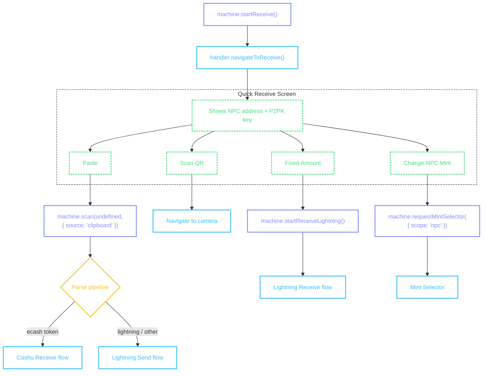

# Quick Receive

Landing screen for receiving payments — displays the user's NPC Lightning address and P2PK public key, and provides actions to start a receive flow via paste, scan, or fixed amount.

Not all wallets implement Quick Receive. Some go directly to the [Cashu Receive](/flows/cashu-receive) flow when the user taps "Receive". Quick Receive is an optional entry point that gives the user a persistent address to share before any token arrives.

## Flow



::: details Diagram legend

- **Purple** — `machine.method()` — wallet calls these to drive the flow
- **Blue** — `handler.method()` — machine calls these; wallet implements them on the [provider](/guide/getting-started#provider)
- **Yellow** — internal machine decisions
- **Green dashed** — user actions on screen
  :::

## Entry point

```tsx
const machine = usePaymentFlowMachine({ walletContext, unit });

const handleReceive = async () => {
  await machine.startReceive();
};

// From outside a flow (e.g., home screen button) — clear stale state first:
await machine.startReceive({ reset: true });
```

The wallet calls `machine.startReceive()` from any screen (typically a home screen "Receive" button). Pass `{ reset: true }` when calling from outside a flow to ensure stale state is cleared. The machine emits a single step — `handler.navigateToReceive()` — with the current unit.

## NPC and P2PK

Quick Receive displays two types of receive address. The wallet builds both from its own state in [`handler.navigateToReceive()`](#handler-navigatetoreceive) and passes them on the entry.

### NPC (Nostr Payment Conduit)

A Lightning address in the form `npub1...@npub.cash`. When someone pays this address, a Lightning-to-ecash bridge receives the Lightning payment and delivers ecash to the user via Nostr DM. The address is tied to a specific mint — the NPC mint determines which mint issues the ecash.

- **Displaying** — show the address with a QR code so others can pay it from any Lightning wallet
- **Changing the mint** — the `changeNpcMint` action opens the [Mint Selector](/flows/mint-selector) with `scope: 'npc'`, which updates the mint that the NPC address routes to
- **Availability** — only shown when the user has a Nostr identity and the unit is `sat`

### P2PK (Pay-to-Public-Key)

A Cashu public key that allows others to lock ecash tokens to the user. The sender creates a P2PK-locked token using this key; only the holder of the corresponding private key can redeem it.

- **Displaying** — show the hex public key with a QR code, copyable
- **Availability** — shown when the wallet has generated a P2PK keypair (may be gated by a setting like `quickAccessP2PK`)

::: tip When to show tabs
If the wallet supports both NPC and P2PK, present them as tabs (e.g. "Lightning" / "P2PK"). If only one is available, show it without tabs.
:::

## handler.navigateToReceive()

Called when the wallet wants to show the Quick Receive screen. The machine only passes `{ unit }` — the handler builds the full entry from wallet state (NPC address, P2PK key, selected mint) and navigates.

The machine passes this step data to the handler:

```ts
{
  unit: 'sat',
}
```

| Field  | What it means          |
| ------ | ---------------------- |
| `unit` | The unit for this flow |

```tsx
<CocoPaymentUXProvider
  handlers={(machine, refs) => ({
    // ...
    navigateToReceive: async ({ unit }) => {
      const npub = getNpub?.();
      const selectedMintUrl = npcMintStore.getActiveMintUrl();
      const keypair = await manager.keyring.getLatestKeyPair();

      const entry = {
        type: 'receive',
        id: 'receive-hub',
        createdAt: Date.now(),
        mintUrl: selectedMintUrl ?? '',
        npcAddress: npub ? `${npub}@npub.cash` : undefined,
        p2pkKey: keypair?.publicKeyHex,
        selectedMintUrl,
        unit,
      };

      router.navigate({
        pathname: '/(receive-flow)/receive',
        params: { receiveEntry: JSON.stringify(entry), unit },
      });
    },
    // ...
  })}
/>
```

::: info Quick Receive entry

- `id: 'receive-hub'` is a sentinel value that the screen actions system uses to determine hub-specific action availability
- `npcAddress` is built from the user's Nostr npub — `undefined` when the user has no Nostr identity
- `p2pkKey` is the latest P2PK public key hex — `undefined` when no keypair exists
- `selectedMintUrl` determines which mint the NPC address routes to, and is used to override wallet context on the screen
  :::

## Quick Receive Screen

The screen uses [`useScreenActions`](/guide/architecture#thin-screens) and binds the machine so hub actions like paste and scan can trigger the payment flow.

```tsx
import { View, Text, Pressable, ScrollView, ActivityIndicator } from 'react-native';

function QuickReceiveScreen({ receiveEntry, unit }) {
  const { entry, error, actions } = useScreenActions('receive', receiveEntry);

  const walletContext = useWalletContextWithOverride(entry?.selectedMintUrl);
  usePaymentFlowMachine({ walletContext, unit });

  if (error) return <Text>{error}</Text>;
  if (!entry) return <ActivityIndicator />;

  return (
    <ScrollView>
      {entry.npcAddress && (
        <View>
          <Text selectable>{entry.npcAddress}</Text>
          <Pressable onPress={() => actions.copy.execute({ source: 'npc' })}>
            <Text>Copy Address</Text>
          </Pressable>
          {actions.share.available && (
            <Pressable onPress={() => actions.share.execute({ source: 'npc' })}>
              <Text>Share</Text>
            </Pressable>
          )}
        </View>
      )}

      {entry.p2pkKey && (
        <View>
          <Text selectable>{entry.p2pkKey}</Text>
          <Pressable onPress={() => actions.copy.execute({ source: 'p2pk' })}>
            <Text>Copy Key</Text>
          </Pressable>
          {actions.share.available && (
            <Pressable onPress={() => actions.share.execute({ source: 'p2pk' })}>
              <Text>Share</Text>
            </Pressable>
          )}
        </View>
      )}

      <View>
        {actions.paste.available && (
          <Pressable onPress={() => actions.paste.execute()}>
            <Text>Paste</Text>
          </Pressable>
        )}

        {actions.fixedAmount.available && (
          <Pressable onPress={() => actions.fixedAmount.execute()}>
            <Text>Fixed Amount</Text>
          </Pressable>
        )}

        {actions.scanQr.available && (
          <Pressable onPress={() => actions.scanQr.execute()}>
            <Text>Scan QR</Text>
          </Pressable>
        )}

        {actions.changeNpcMint.available && (
          <Pressable onPress={() => actions.changeNpcMint.execute()}>
            <Text>Change Mint</Text>
          </Pressable>
        )}
      </View>
    </ScrollView>
  );
}
```

::: info Quick Receive screen UI

- Display the NPC Lightning address or P2PK key as a QR code — see [QR Display](/guide/qr-display#receive-addresses-npc--p2pk) for layout patterns
- Show the address type label above the QR (e.g., "Lightning Address" or "Cashu Public Key")
- Truncate the NPC address with `beforeAt` mode (shows `...@npub.cash`) and P2PK keys with `middle` mode via [`FormattedString`](/methods/formatting#formattedstring)
- Wrap the QR code and truncated string in a tappable area — tapping copies the full address
- Show a white border around the QR code for scannability on dark backgrounds
- Show NPC and P2PK as separate tabs or a segmented control when both are available — each tab has its own QR code
- Copy should use `{ source: 'npc' }` or `{ source: 'p2pk' }` depending on which tab is active
- Paste and Scan QR are the primary receive actions — these trigger [`machine.scan()`](/flows/scanning) which routes through the parse pipeline to the appropriate flow
- Fixed Amount starts a [Lightning Receive](/flows/lightning-receive) flow for requesting a specific amount via mint quote
- Change Mint opens the [Mint Selector](/flows/mint-selector) with `scope: 'npc'` — changing the NPC mint updates which mint the Lightning address routes payments to
- The machine must be bound via `usePaymentFlowMachine` on this screen so that paste/scan actions can trigger payment flows
  :::

### Actions

| Action          | Available when                             | What it does                                                                                                                   |
| --------------- | ------------------------------------------ | ------------------------------------------------------------------------------------------------------------------------------ |
| `copy` *        | NPC address or P2PK key exists             | Copy to clipboard — pass `{ source: 'npc' }` or `{ source: 'p2pk' }`                                                           |
| `share` *       | NPC address or P2PK key exists             | Platform share sheet with the address or key                                                                                    |
| `paste`         | Hub loaded                                 | [`machine.scan(undefined, { source: 'clipboard' })`](/flows/scanning) — parse clipboard contents and route to appropriate flow |
| `fixedAmount`   | Hub loaded                                 | [`machine.startReceiveLightning()`](/flows/lightning-receive) — starts a lightning receive flow for a specific amount          |
| `scanQr`        | Hub loaded                                 | Navigate to camera for QR scanning                                                                                             |
| `changeNpcMint` | Hub loaded, has NPC address, unit is `sat` | [`machine.requestMintSelector({ scope: 'npc' })`](/flows/mint-selector) — change the NPC mint                                  |

\* Built-in — works automatically when `writeClipboard` / `shareContent` are provided on the provider. No handler needed.

### Action handlers

Both `copy` and `share` are **built-in** — when `writeClipboard` and `shareContent` are provided on the provider, they automatically extract the NPC address or P2PK key from the entry (based on the `source` param). The `onCopied` / `onShared` notification fires with `target` set to `'address'` or `'p2pk'`.

```tsx
<CocoPaymentUXProvider
  writeClipboard={(text) => Clipboard.setStringAsync(text)}
  shareContent={(content) => Share.share({ message: content.message, url: content.url })}
  actions={{
    receive: {
      // copy and share are built-in — no handlers needed
      paste: async (ctx) => {
        await ctx.paymentMachine?.scan?.(undefined, { source: 'clipboard' });
      },
      fixedAmount: async (ctx) => {
        await ctx.paymentMachine?.startReceiveLightning?.();
      },
      scanQr: async (ctx) => {
        router.push('/(receive-flow)/camera');
      },
      changeNpcMint: async (ctx) => {
        await ctx.paymentMachine?.requestMintSelector?.({ scope: 'npc' });
      },
    },
  }}
/>
```
