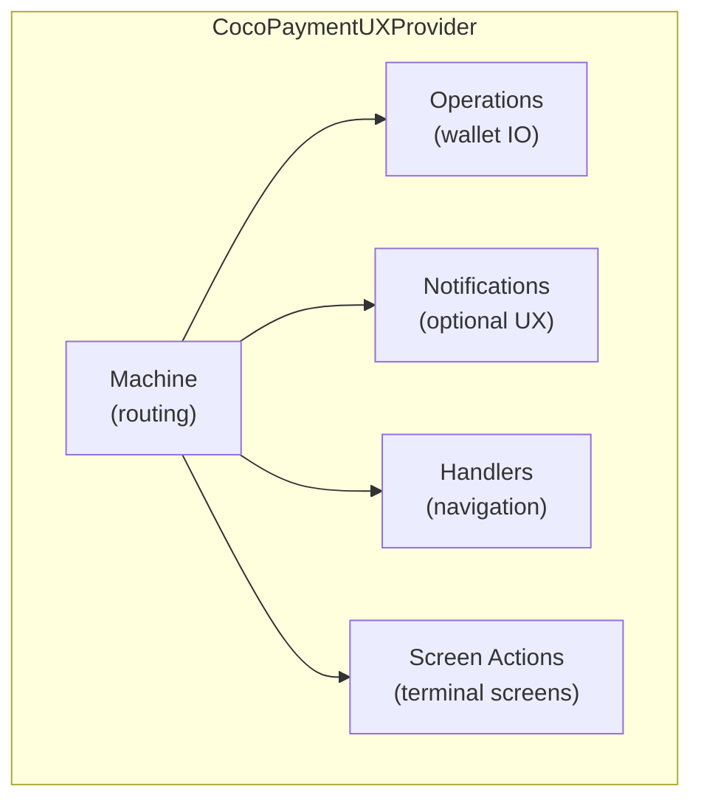

# Architecture

## Separation of Concerns



The **machine** drives multi-step flows (scan → amount → mint → execute). Once the flow lands on a terminal screen, **screen actions** take over — discrete buttons with per-action availability and loading.

These two systems are intentionally separate. A terminal screen doesn't need to know about the flow that created its entry. The flow machine doesn't need to know what buttons a detail screen shows.

## Thin Screens

A screen's job is to call one hook and render:

```tsx
// Correct: screen is rendering + action binding
function MeltQuoteScreen({ meltHistoryEntry }) {
  const { entry, error, actions, mintUrl, source } = useScreenActions('meltQuote', meltHistoryEntry);

  if (error) return <ErrorState message={error} />;
  if (!entry) return <LoadingState />;

  return (
    <>
      <MeltDetails entry={entry} />
      <Button
        title="Pay"
        onPress={() => actions.pay.execute()}
        disabled={!actions.pay.available}
        loading={actions.pay.loading}
      />
      <Button title="Cancel" onPress={() => actions.cancel.execute()} />
    </>
  );
}
```

Availability rules live in `src/screen-actions/availability.ts`. Loading state is tracked per-action inside the manager. The screen never computes "can I pay?" — it reads `actions.pay.available`.

The `mintUrl` field is derived from the raw entry (`entry.mintUrl` or `entry.selectedMintUrl`) before decoration converts strings to [`FormattedString`](/methods/formatting#formattedstring). Use this when you need the raw mint URL string — for example, to override wallet context or fetch mint-specific data.

## Execution State

`useExecutionState(machine)` provides reactive loading state for flow screens.

```tsx
const machine = usePaymentFlowMachine({ walletContext, unit });
const { isExecuting } = useExecutionState(machine);

// Disable buttons during async operations
<MintRow disabled={isExecuting} onPress={() => machine.changeMint(item.mintUrl)} />;
```

**`isExecuting = true`** during async operations: `executeSend`, `executeMintQuote`, `buildMintListItems`.

**`isExecuting = false`** during input steps: `enterAmount`, `selectMint`, `chooseOption`, `chooseProofs`. These are user-facing steps where a global spinner would be wrong.

```ts
// Full ExecutionState shape:
type ExecutionState =
  | { status: 'ready';      code: 'READY';      isExecuting: boolean; isExecutable: true;  step: FlowStep }
  | { status: 'needsInput'; code: 'NO_AMOUNT' | 'MINT_SELECTION_REQUIRED' | ...;
      isExecuting: boolean; isExecutable: false; message: string }
  | { status: 'blocked';    code: 'NO_VALID_MINT' | 'INSUFFICIENT_BALANCE' | ...;
      isExecuting: boolean; isExecutable: false; message: string }
```

## Mint Persistence

The library doesn't store mints — it invokes callbacks:

```tsx
// User selects send/receive mint
savePreferredMint: (mintUrl) => mintStore.setSelectedMint(pubkey, mintUrl),

// NPC/Lightning-address mint changed
saveNpcMint: async (mintUrl) => npcMintStore.updateServerMint(mintUrl, privateKey),

// Mint selection events carry scope metadata:
machine.changeMint(mintUrl, { scope: 'selected' });  // → savePreferredMint
machine.changeMint(mintUrl, { scope: 'npc' });        // → saveNpcMint
```
