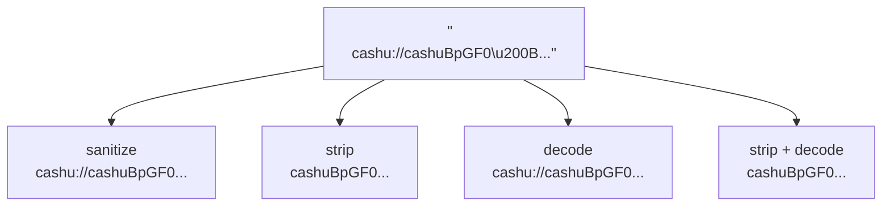

# Normalize

`normalize.ts` — pure string operations that clean input before protocol detection. No protocol-specific logic — that belongs in [detectors](/pipeline/detectors).

## What It Does

Real-world inputs arrive with copy-paste artifacts, URI scheme prefixes, percent-encoding, and invisible characters. Normalization produces a clean set of variants for detectors to test against.



All four variants are tested against every detector — if any matches, the input is recognized.

## Functions

### `sanitizeInput(value)`

Removes zero-width characters and BOM, trims whitespace.

```ts
sanitizeInput('  hello\u200B world\uFEFF  ');
// → 'hello world'
```

Characters removed: `\u200B` (zero-width space), `\u200C` (zero-width non-joiner), `\u200D` (zero-width joiner), `\uFEFF` (BOM / zero-width no-break space).

### `stripPrefixes(value, prefixes)`

Iteratively removes known prefixes (case-insensitive). Handles double-prefixed strings.

```ts
stripPrefixes('lightning:lightning:lnbc1...', LIGHTNING_PREFIXES);
// → 'lnbc1...'

stripPrefixes('cashu://cashuBpGF0...', CASHU_PREFIXES);
// → 'cashuBpGF0...'
```

Prefix sets:

| Function                 | Prefixes stripped                                                |
| ------------------------ | ---------------------------------------------------------------- |
| `stripGenericPrefixes`   | `cashu://`, `cashu:`, `lightning://`, `lightning:`, `lightning=` |
| `stripLightningPrefixes` | `lightning://`, `lightning:`, `lightning=`                       |
| `stripCashuPrefixes`     | `cashu://`, `cashu:`                                             |

### `safeDecodeURIComponent(value)`

Decodes percent-encoded strings. Returns the original on failure (malformed encoding).

```ts
safeDecodeURIComponent('cashuBpGF0%3D%3D');
// → 'cashuBpGF0=='

safeDecodeURIComponent('already%clean');
// → 'already%clean' (decode fails, returns original)
```

### `inputVariants(raw)`

Produces the complete set of detection candidates. Deduplicates automatically (returns a `Set`).

```ts
inputVariants('lightning:lnbc1...');
// Set {
//   'lightning:lnbc1...',   // sanitized
//   'lnbc1...',             // stripped
//   'lightning:lnbc1...',   // decoded (same)
//   'lnbc1...',             // decoded + stripped (same)
// }
// → effectively Set { 'lightning:lnbc1...', 'lnbc1...' }
```

## Why This Exists

Without normalization, a Lightning invoice pasted from a web page might include invisible Unicode characters that break bolt11 decoding. A QR code might emit `cashu://cashuB...` when the detector expects `cashuB...`. A URL-encoded clipboard paste needs decoding before the token can be parsed. Normalization handles all of these before any detector runs, so detectors stay simple.
