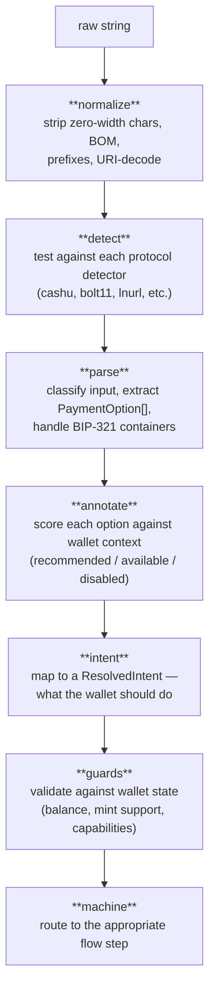

# Pipeline Overview

When the machine receives input (via `scan()` or `execute()`), it passes through a pipeline of pure functions before any side effects happen:

Each stage is a separate file with pure, testable functions. No React, no wallet dependencies.

| Stage                            | File           | Input                              | Output                                  |
| -------------------------------- | -------------- | ---------------------------------- | --------------------------------------- |
| [Normalize](/pipeline/normalize) | `normalize.ts` | Raw string                         | Sanitized string + variants             |
| [Detectors](/pipeline/detectors) | `detectors.ts` | Cleaned string                     | Boolean checks per protocol             |
| [Parse](/pipeline/parse)         | `parse.ts`     | Raw string + detectors             | `ParsedPaymentInput` with typed options |
| [Annotate](/pipeline/annotate)   | `annotate.ts`  | Options + wallet context           | `AnnotatedOption[]` with status/reason  |
| [Intent](/pipeline/intent)       | `intent.ts`    | Parsed input + detectors + context | `ResolvedIntent`                        |
| [Guards](/pipeline/guards)       | `guards.ts`    | Intent + wallet context            | `GuardResult[]` (pass/fail + reason)    |
