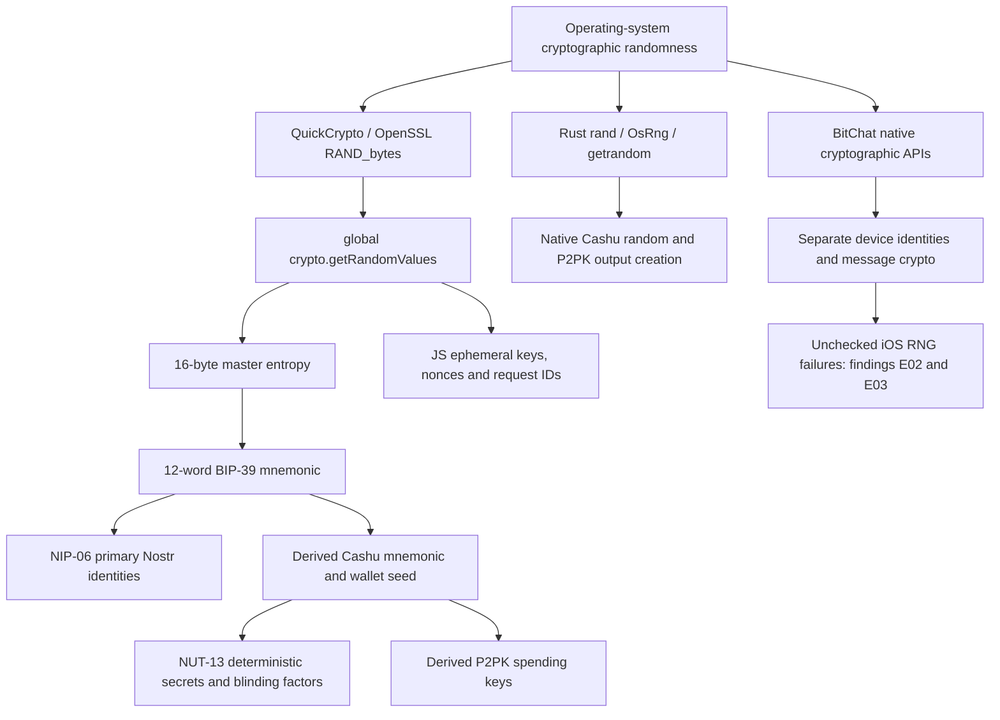

# Sovran entropy audit

**The primary wallet mnemonic and mnemonic-derived Nostr keys use a sound cryptographic entropy path. The broader claim that every entropy path in Sovran fails closed is false.** A reproducible storage-error sequence can replace an existing master mnemonic, and reachable iOS BitChat code ignores random-generator failures when creating a device seed and encryption nonces. Those findings warrant changes before treating the application as having completed its entropy and seed-lifecycle hardening.

No predictable primary-wallet seed, time-seeded wallet PRNG, or reachable `Math.random` fallback in primary-wallet key generation was identified in this snapshot. This is a source, dependency, binary-inspection, and JavaScript-export assessment. It is not a certification of a shipped IPA/APK, device operating system, historical wallet, or every cryptographic primitive.

| Assessment boundary                                     | Result                                                                                                        |
| ------------------------------------------------------- | ------------------------------------------------------------------------------------------------------------- |
| Newly generated master mnemonic                         | Sound design: 128 CSPRNG bits, BIP-39 encoding, native failure propagation                                    |
| Primary Nostr identity                                  | Sound derivation: NIP-06 from the master mnemonic                                                             |
| Preservation of an existing master mnemonic             | **Failed:** two read errors can cause replacement; reproduced against the current implementation              |
| Native iOS BitChat seed and encryption nonce generation | **Failed error handling:** unchecked `SecRandomCopyBytes` results on reachable paths                          |
| Native Cashu output randomness                          | Appropriate upstream CSPRNGs; separate from QuickCrypto; incomplete source-to-binary reproducibility evidence |
| Production JavaScript bootstrap and debug seed gating   | Verified in fresh iOS and Android production exports, with the qualifications below                           |
| Dependency authenticity                                 | Selected npm artifacts and the installed Apple OpenSSL payload match their published artifacts                |
| Absence of all vulnerabilities                          | Not established; the npm advisory scan does not cover the native dependency surface                           |

The assessment baseline is `sovran-app` commit `37065cf1b463dc36d9e3441e232ca33a3c94bd1e`, branch `main`, inspected on 12 September 2026. The tracked working tree was clean before assessment. Application source, lockfiles, installed dependencies, native build declarations, and relevant upstream sources were reviewed. No application code was changed, and no production seed, private key, environment file, wallet database, or live-device storage was inspected.

## 1. Scope and evidence standard

The preliminary audit supplied a useful hypothesis: install QuickCrypto before consumers, generate a 128-bit master mnemonic, derive persistent wallet identities, and reject unavailable randomness. Its source locations and test counts were rechecked rather than accepted as current evidence.

The review also followed entropy beyond JavaScript: BitChat's Swift/Kotlin implementation, the default native Cashu output creator, its Rust dependencies, and the OpenSSL libraries declared by QuickCrypto. A secure JavaScript global does not automatically protect these native paths.

Findings distinguish three kinds of evidence:

- **Reproduced behavior:** execution of current source or emitted JavaScript with controlled, synthetic boundary failures.
- **Confirmed source defect:** an identified reachable path and missing check, with the consequences conditional on the underlying failure occurring.
- **Assurance gap:** evidence needed to support a stronger claim, without an identified exploit.

Statistical-looking output is insufficient evidence of unpredictability. A seeded weak PRNG can pass superficial distribution and uniqueness checks. The main evidence here is the implementation chain, its effective input entropy, error propagation, and the artifacts actually included in exports.

## 2. The actual entropy architecture



### Primary mnemonic and Nostr keys

`secureStorage.ts` allocates a fresh `Uint8Array(16)`, fills it using `crypto.getRandomValues`, and passes it to `entropyToMnemonic`. It does not truncate a timestamp, expand a short random integer, select words using `Math.random`, or recover from a thrown RNG error by choosing a fixed seed. A generation exception reaches `ensureMnemonicExists`, which returns `null` without storing the generated mnemonic.[^1]

The 16 bytes provide **128 bits of input entropy** when the provider behaves correctly. BIP-39 adds four checksum bits to encode that input as 12 words. The checksum contributes error detection, not additional randomness. The subsequent 64-byte PBKDF2 seed is an expansion of the same secret, not 512 independent entropy bits.[^2]

`deriveNostrKeys` derives the path `m/44'/1237'/account'/0/0`. The primary nsec is an encoding of that derived private key; it is not separately generated randomness. This matches NIP-06.[^3] Imported nsecs and restored mnemonics are a different trust boundary: validating their format or checksum cannot establish that the external application originally generated them securely.

### Cashu seed and P2PK derivation

Normal app integration derives its Cashu mnemonic from the master mnemonic using `m/44'/129372'/0'/account'/0/0`, then derives the 64-byte wallet seed. Imported-profile derivation uses the existing alternate path ending in `/1/0`. Re-encoding a derived 32-byte private key as a 24-word Cashu mnemonic does not increase the original master entropy.[^3]

`wallet/src/wallet-seed.ts:67` also exports `generateCashuMnemonic`, whose default requests 128 bits from `@scure/bip39`. However, the app manager's normal seed getter uses an existing Cashu mnemonic or a child of the master mnemonic. The exported generator should not be described as the normal app's independent second root RNG.[^4]

Coco derives P2PK spending keys under `m/129373'/...`. Deterministic NUT-13 output generation depends on seed, keyset, and counter state. It is intentionally deterministic and requires preservation of those inputs. P2PK output nonces and fresh output blinding material are separate from the persistent P2PK spending key and can require new randomness.[^5]

### JavaScript ephemeral keys, nonces, and identifiers

The inspected Nostr, Cashu JavaScript, and Marmot paths use cryptographic providers:

| Consumer                        | Entropy or derivation path                                | Qualification                                                |
| ------------------------------- | --------------------------------------------------------- | ------------------------------------------------------------ |
| NIP-17 giftwrap keys            | `nostr-tools` → Noble curve key generation → random bytes | Fresh ephemeral keys, distinct from the HD-derived main nsec |
| NIP-17 timestamp privacy jitter | `crypto.getRandomValues(Uint32Array(1))`                  | Privacy randomization, not key entropy                       |
| Location privacy jitter         | `crypto.getRandomValues(Uint32Array(2))`                  | Same JavaScript provider                                     |
| NIP-46 pairing/bunker secrets   | `bunkerSecrets.ts` → `crypto.getRandomValues`             | The cited focused tests pass                                 |
| NIP-46 RPC identifiers          | `crypto.randomUUID()`                                     | Native QuickCrypto implementation draws random bytes         |
| App NUT-18 request identifiers  | 16 Noble random bytes, hex encoded with `sov` prefix      | 128 random bits before formatting                            |
| Marmot group/media randomness   | Noble hash/cipher random helpers                          | Includes group IDs, image keys, and nonces                   |
| MLS default RNG                 | `ts-mls` default RNG → `crypto.getRandomValues`           | Other cryptographic operations can use SubtleCrypto          |

These paths were traced through installed code. Their presence does not establish complete NIP, MLS, encryption, or protocol correctness; this report assesses their entropy sources and relevant failure behavior.[^6]

### Native Cashu is a separate provider

The current app defaults to the native output creator when available and when its compatibility self-test passes. `EXPO_PUBLIC_CASHU_NATIVE_CRYPTO='0'` disables it. A nearby comment in `manager.ts` still describes opt-in behavior, but `resolveOutputDataCreator` implements opt-out behavior; the executable condition is authoritative.[^7]

The installed `@cashudevkit/react-native` package is the `crodas/cdk-nitro` dependency, declared at tag `v0.17.3` and resolved in `bun.lock` to `3007137`. Its Rust code delegates random secrets to `cashu::Secret::generate` and blinding to `blind_message`. In published `cashu@0.17.3`, random secrets and NUT-10 nonces use `rand::thread_rng`; scalar generation uses `OsRng`.[^8]

Both installed iOS and Android CDK binaries contain version strings identifying `cashu-0.17.3`, `bitcoin-0.32.102`, `secp256k1-0.29.1`, `rand-0.8.7`, and `rand_core-0.6.4`. The inspected `rand@0.8.7` implementation seeds its cryptographic thread RNG from `OsRng` and panics on initialization or reseeding failure. `rand_core@0.6.4` propagates OS failure through its fallible API and panics through `fill_bytes`. No weak fallback was found in that source chain.[^9]

The iOS CDK archive imports `CCRandomGenerateBytes`; the Android library contains `getrandom` and `/dev/urandom` references. These observations support an OS-backed source. They do **not** prove the complete linked call graph, every transitive version, or reproducibility of the supplied native binaries. The installed bridge package does not contain a Rust `Cargo.lock`, and its build scripts omit `--locked`. The `Cargo.lock` in the separately downloaded Cashu crate is not the lockfile used to build the bridge and must not be substituted for it.

## 3. JavaScript bootstrap and native OpenSSL

### Entry ordering was checked in emitted production JavaScript

`app/index.js` imports `./shim` before the two E2E installers and `expo-router/entry`. The shim first loads text encoding and the app's MessageChannel polyfill, then installs QuickCrypto. It checks encoder availability, checks `getRandomValues`, performs a one-byte draw, and requires a `subtle` object.[^10]

Fresh production exports were generated for **both iOS and Android**, with dotenv loading disabled and synthetic debug-mnemonic sentinels supplied. The compiled entry factory in both exports requires the shim before its remaining dependencies. A fault-injection exercise executed the emitted entry/shim factories with controlled dependencies:

| Platform | Injected native-provider behavior | Observed order and result                                        |
| -------- | --------------------------------- | ---------------------------------------------------------------- |
| iOS      | Successful draw                   | Install → one-byte probe → remaining three entry imports         |
| iOS      | Throw during draw                 | Install → one-byte probe → exception; no remaining entry imports |
| Android  | Successful draw                   | Install → one-byte probe → remaining three entry imports         |
| Android  | Throw during draw                 | Install → one-byte probe → exception; no remaining entry imports |

This proves the emitted entry ordering and exception barrier for these exports. It does not execute the native Nitro implementation on a device.

React Native/Expo initialization modules also execute before the app entry. Therefore, “the shim executes before absolutely every module in the bundle” is too broad. Inspection of their static dependency closure did not identify a Noble/Scure entropy provider or wallet-key generation dependency; the app entry's own ordering was directly verified. A complete dynamic execution trace of every startup module was not collected.

The one-byte draw is an **availability check**, not an entropy-quality test. A malicious or broken provider that successfully returns constant bytes would pass it. The source chain and artifact provenance, rather than this sample size, support the CSPRNG assessment. Likewise, presence of `crypto.subtle` does not prove that every SubtleCrypto operation works.

### QuickCrypto correctly checks OpenSSL failure

QuickCrypto's `install()` unconditionally assigns its implementation to `global.crypto`. Its `getRandomValues` validates the typed array, then calls its synchronous native random-fill boundary. `HybridRandom.cpp:42` calls `RAND_bytes` and throws unless the return value is exactly `1`.[^11]

OpenSSL documents automatic operating-system seeding on supported major platforms, refusal to generate after entropy-source failure, and the requirement to check the return value. QuickCrypto implements that check. No time-based seed, fallback to `Math.random`, or manually supplied weak seed was found in this boundary.[^12]

The precise iOS source differs from the preliminary description. The installed Apple OpenSSL archive imports **`CCRandomGenerateBytes`**, and OpenSSL 3.6.2's Apple branch calls that API and checks `kCCSuccess`. The evidence does not support naming `getentropy` or `SecRandomCopyBytes` as the direct call made by this particular archive. These APIs belong to the platform's cryptographic-randomness facilities, but exact implementation attribution matters.[^13]

For Android, the QuickCrypto Gradle declaration pins `io.github.ronickg:openssl-static:3.6.2-2`. OpenSSL's corresponding Linux/Android source uses the kernel randomness syscall and supports OS random-device paths. The actual Android OpenSSL AAR and a final linked APK were not rebuilt or independently compared in this assessment.

### Apple OpenSSL artifact verification

The QuickCrypto podspec pins the Apple OpenSSL 3.6.2 release ZIP to SHA-256:

```text
a50e3c8473b0526b159ad8d105e97a90d1153a4a230388cc731ee23a7d0ad3a4
```

The downloaded 35,189,569-byte release archive matched this hash. **All 151 compared payload files matched the installed Apple OpenSSL directory**, with no differences or unmatched payload files. This includes the distributed native archives and symbol-prefix header. It verifies equality with the published payload, not an independent reproduction of OpenSSL from source.[^14]

The symbol-prefix design reduces accidental resolution to another library's OpenSSL. It does not establish the absence of every linker or packaging issue in a final app. Also, the podspec skips download and verification when its prefix header already exists. The installed directory was independently compared here; future cached native builds should not assume that the existence check revalidates it.

## 4. Findings

### E01 — Existing master mnemonic can be overwritten after read failures

**Priority: high. Category: seed custody and availability. Status: reproduced.**

`secureGet` catches `SecureStore.getItemAsync` exceptions and returns `null`. `retrieveMnemonic` consequently cannot distinguish a missing entry from a failed read. `ensureMnemonicExistsInner` performs another raw read, but that read uses the same exception-to-null helper. If both reads fail and the subsequent write succeeds, the function generates and stores a replacement master mnemonic.[^1]

The corrupt-blob protection works only when a read returns the existing blob. It does not protect an unreadable existing entry. The single-flight guard prevents concurrent generation races but does not repair this distinction.

An isolated execution of the current TypeScript implementation, transpiled without changing its logic, used a synthetic valid mnemonic in an in-memory SecureStore substitute. Only the storage boundary and unrelated platform/logging dependencies were stubbed. The generator returned controlled test bytes; no user secret or device storage was involved.

| Failures injected into the two mnemonic reads | RNG draws | Master-mnemonic writes | Lifecycle creation marks | Original mnemonic preserved   |
| --------------------------------------------- | --------: | ---------------------: | -----------------------: | ----------------------------- |
| None                                          |         0 |                      0 |                        0 | Yes                           |
| First read only                               |         0 |                      0 |                        0 | Yes; function returned `null` |
| Both reads                                    |         1 |                      1 |                        1 | **No**                        |

The provider contains a normal boot path into this function when no mnemonic was successfully loaded. Reaching that state from a fully initialized app can involve additional preceding reads; the reproduction establishes the unsafe helper behavior once invoked, not the frequency of real-device failures.[^15]

The new mnemonic remains cryptographically random. The failure is replacement of the user's original authority. Derived identity changes and loss of access to funds are possible if the original material is not recoverable elsewhere. No remote trigger or actual user loss was demonstrated.

**Recommended acceptance criterion:** a failed mnemonic read must remain distinguishable from confirmed absence. On any read error, perform zero generation calls, zero lifecycle creation marks, zero mnemonic writes, and zero deletion. Preserve the current corrupt-blob refusal and add regression coverage for one and two read failures, as well as successful reads and confirmed absence.

### E02 — BitChat iOS can persist a failed device-seed draw

**Priority: high conditional impact. Category: native key entropy. Status: confirmed reachable source defect.**

`NostrIdentityBridge.getOrCreateDeviceSeed` allocates a zero-initialized 32-byte `Data`, calls `SecRandomCopyBytes`, discards its status, and then stores and caches the buffer. `deriveIdentity(forGeohash:)` uses that seed in HMAC-based private-key derivation. `BitChatNostrBridge.joinGeohash` calls this method, so this is not merely unused vendor source.[^16]

If the OS call fails without filling the buffer, the code can persist the known all-zero seed. A partial write must also be treated as invalid entropy. The derived geohash identity could then be predictable. This is separate from Sovran's master mnemonic and primary nsec; the JavaScript startup probe does not validate or guard this Swift draw.

The source-level failure handling is unambiguous. A real `SecRandomCopyBytes` failure was not induced on an iPhone, and no attacker-controlled mechanism for causing one was established. Severity reflects the consequence of accepting failed seed generation, not evidence that the OS RNG routinely fails.

**Recommended acceptance criterion:** validate the status before any seed persistence, caching, or derivation. Propagate failure to the caller, and prove with an injected failing provider that no keychain save, cache update, or derived identity is produced. Keychain read errors should also remain distinct from a missing BitChat seed.

### E03 — BitChat iOS can encrypt using a failed nonce draw

**Priority: high conditional impact. Category: encryption nonce uniqueness. Status: confirmed reachable source defect.**

`NostrProtocol.encrypt` allocates a zero-initialized 24-byte nonce, ignores the `SecRandomCopyBytes` result, and passes the buffer to `XChaCha20Poly1305Compat.seal`. The app bridge reaches this through `sendPrivateMessage` → `createPrivateMessage` → the sealing/wrapping code.[^17]

Repeated failures can repeat a nonce under a persistent sender/recipient shared key. Nonce reuse threatens message confidentiality and authentication; it is not merely a cosmetic collision. The exact damage depends on repeated use with the same key and the messages involved. No real-device failure or message compromise was demonstrated.

**Recommended acceptance criterion:** if nonce generation fails, emit no ciphertext and publish no message. Use a shared, status-checked native random-byte helper for the device seed and encryption nonce, with failure-injection tests at their consumers.

Two related native observations require different treatment:

- `NostrEvent.sign` also ignores the result of a 32-byte auxiliary-randomness draw. BIP-340 permits deterministic signing with zero auxiliary input; this is **not equivalent to reusing an ECDSA nonce** and does not by itself prove private-key recovery. It loses intended additional protection and should use explicit, reviewed failure semantics.[^18]
- Five non-test `SecRandomCopyBytes` sites exist in the vendored Swift tree, but only four lie in podspec-selected source areas. The fifth is in excluded `ViewModels/ChatVerificationCoordinator.swift`. The selected `VerificationService.buildMyQRString` site also ignores status, but its app-facing RNG caller was not established; upstream App/ViewModel call sites are outside this pod's selected areas. Do not report five demonstrated reachable failures.[^19]

### E04 — Native Cashu compatibility tests do not establish binary entropy provenance

**Priority: medium assurance work. Category: native supply chain. Status: evidence gap.**

The native creator's four self-test cases compare deterministic outputs, including zero-valued restore splits, against cashu-ts. This is valuable compatibility coverage. It does not exercise random-secret generation, P2PK nonce generation, native RNG failure, or the entropy quality of prebuilt code.[^7]

The installed Rust bridge uses appropriate upstream APIs, and native binary imports/strings support the expected implementation. However, the installed package ships prebuilt `.a`/`.so` artifacts without its build's Cargo lockfile, and no reproducible build-to-binary comparison was completed. A JavaScript bootstrap test cannot close this gap.

**Recommended acceptance criterion:** retain the native build's immutable source revision, Cargo lockfile, target-specific artifact hashes, and reproducible build instructions; build with locked dependencies. Independently test random and P2PK output creation and failure handling on the supported native targets. A crash or rejected operation is preferable to accepting failed entropy, but native panic behavior should also be characterized for application recovery.

### E05 — Coco has a weak fallback with broader identifier use than reported

**Priority: low hardening. Category: identifier entropy. Status: confirmed code; fallback not reached in the reviewed normal bootstrap.**

`@cashu/coco-core@2.0.0`'s `generateSubId` fills 16 bytes using the crypto provider when available and otherwise uses `Math.random`. It does not catch a thrown provider error, so a failing installed provider does not activate the fallback.[^20]

Its name understates its use. Callers include WebSocket subscription IDs, payment-operation IDs, and a default NUT-18 payment-request ID. Sovran's explicit NUT-18 ID helper separately uses 16 Noble random bytes, but the upstream helper is not limited to WebSocket bookkeeping.

No call from this helper to wallet private-key, mnemonic, or blinding-factor generation was found. Current bootstrap prevents ordinary startup without the native provider. Calling it “the same wallet-draining flaw as Ill Bloom” would overstate the demonstrated consequences.

**Recommendation:** remove the weak fallback upstream or via a reviewed dependency change. Document which IDs need unpredictability and which need only collision resistance.

### E06 — Native advisories are outside the clean npm scan

**Priority: medium dependency maintenance. Category: advisory coverage. Status: confirmed version exposure; app exploitability not established.**

The OSV npm query returned no advisories for the 28 selected package/version identities. That is a bounded query result, not evidence that their embedded native libraries have no known issues.

OpenSSL's own advisory index lists issues affecting 3.6.2 and fixed in later 3.6 releases. One example is CVE-2026-75803, an empty-ciphertext authentication problem involving the one-shot `EVP_Cipher` API, fixed in 3.6.4. The inspected QuickCrypto cipher implementation instead uses Update/Final calls, so this example does not establish an exploitable app path. No RNG weakness was identified in the reviewed OpenSSL advisories.[^21]

**Recommendation:** include embedded OpenSSL, Rust crates, and native Swift/Android crypto dependencies in advisory monitoring. Review a QuickCrypto/OpenSSL update separately from this entropy verdict; do not replace a specific reachability assessment with either “zero CVEs” or “every upstream CVE affects the app.”

## 5. Other hardening observations

### Weak randomness that does not generate wallet keys

The first-party application/`wallet`/`nostr` implementation census found three executable `Math.random` sites: poll-option IDs, the in-memory notification-followers cache handoff ID, and NearPay random-peer selection. They do not supply key material. Calling all three “cosmetic” obscures the cache identifier's bookkeeping role, but no cryptographic dependency on it was found.

The installed cashu-ts bundle uses `Math.random` for retry jitter and output shuffling. The shuffle is privacy-related because output order can expose correlations. A CSPRNG-based shuffle would be preferable, but this review did not quantify privacy loss or establish a funds-theft path from the current shuffle.[^22]

Android BitChat generates its eight-byte fragment ID with Kotlin `Random`, and the active fragment manager uses it. This is not a secret or cryptographic nonce. Replacing it with `SecureRandom` can improve unpredictability, but reassembly integrity must not depend on secrecy of an identifier that is transmitted in clear. No key-entropy impact was found.[^23]

`react-native-get-random-values@1.11.0` is present in the production module inventory. Its source contains an insecure remote-debugging fallback. Its installer only fills a missing `global.crypto.getRandomValues`, while Sovran's earlier QuickCrypto installer supplies that function. The reviewed production bootstrap therefore does not select this fallback. Its existence is nevertheless relevant when describing the dependency tree; “no weak fallback exists anywhere” is inaccurate.[^24]

### Noble/Scure versions and fail-closed wording

Both production exports include multiple Noble families. In particular, `@noble/hashes@1.8.0` still arrives through NDK and `bc-ur`, even though the Metro resolver now empties `@nostr-dev-kit/ndk-wallet`. The historical account that attributes the entire 1.x bundle tree to `@cashu/crypto` is incomplete for this snapshot. Installed packages and emitted packages must be distinguished.

Noble hash versions 2.0.1 and 2.3.0 require `getRandomValues` at invocation. Version 1.8.0 captures the crypto object at module scope and also accepts a cryptographic `crypto.randomBytes` method. It therefore does **not** invariably throw merely because `getRandomValues` is missing. This is a secure alternate API path when correctly provided, not a `Math.random` fallback.[^25]

`@noble/curves` is declared as `^2.2.0` in app devDependencies and resolves to 2.3.0 in this installation. Exact-pinning it would make direct upgrades more explicit. The checked-in lockfile already fixes the installed resolution, and multiple versions are not themselves an entropy defect. Avoid forcing an incompatible cross-major override solely to reduce the version count.

### Debug mnemonic and E2E seed export

The debug mnemonic's current call path is protected by the production-default build profile, development-only injection from `DEBUG_MNEMONIC`, runtime `__DEV__` gating, and BIP-39 validation. Production, preview, and default config tests pass.[^26]

Neither production JavaScript export contains the supplied private or public debug-mnemonic sentinel. In the compiled generation function, the debug override resolves to `null`. The log string `nostr.secure.using_debug_mnemonic` still exists in an unreachable conditional branch; its presence alone is not evidence that a debug seed can be used. Conversely, grepping for that string would be a poor release acceptance test.

The current `maybeExportSeedForE2E(value)` call supplies no options, so its release default disables export. The helper permits a test options override, and should not be described as unconditionally removed from all release code. When enabled, it validates a loopback-only HTTP endpoint and a 64-hex-character token. Its focused tests pass. This is not a claim about remote-device or redirect behavior beyond the reviewed current call path.[^27]

There is no committed CI guard identified here that validates the **emitted** entry order and debug sentinel absence. The successful exports in this report close the question for this snapshot; they do not enforce it for future changes. Add the same acceptance checks to the release pipeline.

The application also intentionally supports a shared giveaway P2PK secret through build configuration. That is a separate, deliberately extractable giveaway credential, not the randomly generated user master mnemonic. The absence of a fixed wallet seed must not be generalized into a claim that no shared secret can ever be present in app configuration.[^26]

## 6. Dependency verification results

The comparison covered **33 installed package directories representing 28 unique package/version identities**, including relevant providers discovered in the exported source maps. All **4,167 published regular files** compared byte-for-byte with their npm tarballs, with no missing or differing published files. Each tarball's integrity matched its registry metadata.

| Package                          | Versions compared          |
| -------------------------------- | -------------------------- |
| `react-native-quick-crypto`      | 1.1.7                      |
| `react-native-get-random-values` | 1.11.0                     |
| `@noble/hashes`                  | 1.8.0, 2.0.1, 2.3.0        |
| `@noble/curves`                  | 1.9.7, 2.0.1, 2.3.0        |
| `@noble/ciphers`                 | 2.1.1, 2.3.0               |
| `@scure/base`                    | 1.1.1, 1.2.6, 2.0.0, 2.3.0 |
| `@scure/bip32`                   | 1.7.0, 2.0.1, 2.3.0        |
| `@scure/bip39`                   | 1.6.0, 2.0.1, 2.3.0        |
| `nostr-tools`                    | 2.24.2                     |
| `@cashu/cashu-ts`                | 5.0.0-rc.4                 |
| `@cashu/coco-core`               | 2.0.0                      |
| `@cashu/crypto`                  | 0.3.4                      |
| `@hpke/common`                   | 1.10.1                     |
| `@hpke/core`                     | 1.7.5, 1.9.0               |
| `ts-mls`                         | 2.0.0-rc.7                 |

The comparison checks published-file contents, not all possible extra files in each installation or every package in the monorepo. It does not prove that a published package is benign or that the npm publisher account was uncompromised. No registered patch in the root manifest targets these crypto packages.

OSV returned an empty advisory result for each of these 28 npm identities on the assessment date. OpenSSL and other native dependencies require separate coverage, as finding E06 explains. `crypto-js`, `bip3x`, and the cited Ferrum mnemonic dependency were not identified in the lockfile under those names. Package-name absence is supporting evidence, not a substitute for the traced implementation paths.

## 7. Threat research mapped to the app

| Incident or failure class        | Primary-source account                                                                                                         | Application assessment                                                                                                                                                                        |
| -------------------------------- | ------------------------------------------------------------------------------------------------------------------------------ | --------------------------------------------------------------------------------------------------------------------------------------------------------------------------------------------- |
| Milk Sad / CVE-2023-39910        | Libbitcoin expanded a 32-bit, clock-seeded Mersenne Twister state into apparent wallet entropy.                                | No equivalent short-state generator was found on the primary mnemonic path.[^28]                                                                                                              |
| Trust Wallet / CVE-2023-31290    | The 2022 browser-extension/Wasm generator had only 32 bits of entropy.                                                         | This is distinct from the historical iOS issue; no corresponding Wasm seed path was found here.[^29]                                                                                          |
| Trust Wallet / CVE-2024-23660    | Older iOS integration retained a time-seeded, unsuitable `random32` implementation.                                            | QuickCrypto's checked native boundary avoids that implementation pattern. Native BitChat's unchecked status remains a separate weakness.[^30]                                                 |
| Ill Bloom / CVE-2026-71851       | Researchers identify vulnerable CryptoJS-based mnemonic generation and document 2026 exploitation.                             | No CryptoJS mnemonic-generation dependency was identified; Coco's identifier fallback has a different consequence.[^31]                                                                       |
| COLDCARD July 2026 incident      | The official status/advisory record describes weakened seed generation and fixed firmware; updating does not repair old seeds. | The relevant lesson is to verify the built provider and generated-seed provenance. No COLDCARD component is part of the reviewed seed chain.[^32]                                             |
| Randstorm                        | The discoverer's disclosure concerns vulnerable historical wallet-generation tooling.                                          | Legacy weak browser RNG assumptions must not be imported into a modern CSPRNG assessment; current provider tracing is the relevant evidence.[^33]                                             |
| Android 2013 PRNG initialization | Google's advisory describes improperly initialized OpenSSL-backed randomness and key-regeneration implications.                | Modern API names alone are insufficient evidence; current native implementation and minimum-platform/build assumptions matter.[^34]                                                           |
| Remote entropy-service failure   | A remote RNG or network fallback creates an additional trust and availability boundary.                                        | No network entropy service or HTTP fallback was found on the reviewed wallet-generation path. The preliminary blockchain.info date/mechanism is not relied upon as a verified incident claim. |

The preliminary characterization of the exploit wave as “entirely entropy failures” is broader than the evidence establishes. This report uses specific, sourced incidents as failure models, without making a claim about all recent wallet thefts or importing unverified loss totals into Sovran's verdict.

## 8. Validation and remaining evidence

| Check                                                           | Result                                     | What it establishes                                                              |
| --------------------------------------------------------------- | ------------------------------------------ | -------------------------------------------------------------------------------- |
| Six cited app suites                                            | **53/53 tests passed**                     | Existing bootstrap, storage, debug-config, NIP-17, privacy, and bunker contracts |
| Wallet unit suite                                               | **797/797 tests passed**, 53 files         | Wallet unit behavior; not native RNG operation                                   |
| Additional key-derivation, mnemonic-hash, and E2E-export suites | **13/13 tests passed**, three suites       | Additional derivation/export contracts                                           |
| SecureStore fault injection                                     | Unsafe replacement reproduced              | Finding E01's current helper behavior                                            |
| Production iOS export                                           | Success, 5,709 source-map entries          | Compiled app graph and debug-sentinel checks                                     |
| Production Android export                                       | Success, 5,768 source-map entries          | Compiled app graph and debug-sentinel checks                                     |
| Compiled entry/shim fault cases                                 | **4/4 passed**                             | Shim-first ordering and abort before subsequent entry imports                    |
| Selected npm artifact comparison                                | 4,167 files matched                        | Equality with the selected published package artifacts                           |
| Apple OpenSSL payload comparison                                | 151 files matched; pinned ZIP hash matched | Equality with the pinned native payload                                          |
| Physical-device native RNG failure tests                        | **Not performed**                          | Real Nitro, Swift, Rust, and OS failure behavior remains unverified dynamically  |
| Final IPA/APK reconstruction and linker audit                   | **Not performed**                          | These results must not be presented as a shipped-binary certification            |

The exports used production mode and disabled dotenv loading. They are audit builds with synthetic sentinel values, not the store artifacts or the complete real release configuration. Metro emitted export-resolution warnings for legacy Noble crypto subpaths and `cborg`; exports nevertheless succeeded. The resolved files were included in the source-map inspection and relevant package comparison.

Reproducible identifiers for the generated JavaScript artifacts:

| Platform |      Bytes | SHA-256                                                            |
| -------- | ---------: | ------------------------------------------------------------------ |
| iOS      | 12,930,320 | `6395eaf2a3665d106700e4e383378ab7054eb090ded03de8e83c92957466ca8f` |
| Android  | 13,051,264 | `6c9d23a168202b48fd2c82cbfa0a4d3b05498813154a8838072638798c5360bb` |

The test commands used the repository's existing runners:

```sh
# From sovran-app/app
bun run test -- --runInBand \
  __tests__/shimBootstrap.test.ts \
  __tests__/secureStorageLifecycle.test.ts \
  __tests__/appConfigDebugMnemonic.test.ts \
  __tests__/nip17.test.ts \
  __tests__/locationPrivacy.test.ts \
  __tests__/nip46BunkerSecrets.test.ts

bun run test -- --runInBand \
  __tests__/keyDerivation.test.ts \
  __tests__/e2eSeedExport.test.ts \
  __tests__/secureStorageHashMnemonic.test.ts

# From sovran-app/wallet
bun run test:unit
```

Further evidence should focus on the unresolved boundaries: status-checked BitChat draws with injected failures; storage read-error preservation; the native Cashu build manifest and locked dependency graph; and clean signed release builds tested on supported iOS and Android devices. Repeating large random samples would add less assurance than those checks.

## 9. Recommended disposition

Retain the current primary-wallet CSPRNG and HD derivation design. There is no evidence here justifying replacement of QuickCrypto, additional homemade entropy mixing, or a blanket migration of correctly generated primary-wallet seeds.

Prioritize the mnemonic preservation defect and reachable unchecked BitChat seed/nonce draws. Treat native Cashu provenance and native advisory coverage as explicit release-assurance work. Follow with removal of weak identifier fallbacks, exact dependency pins where useful, and automated checks of emitted bootstrap order and debug-sentinel exclusion.

The defensible release statement is: **the reviewed primary wallet uses a cryptographic, OS-backed source for new mnemonic generation, with no identified predictable-seed path; unresolved storage and native BitChat failure handling prevent an application-wide fail-closed verdict.**

## Sources and source locations

Repository references below apply to the stated commit and installed snapshot. Third-party source and advisory references were accessed on 12 September 2026. Package comparisons used npm's version metadata and tarballs; the advisory query used OSV's `POST /v1/querybatch` endpoint with the exact package/version identities listed above.

[^1]: Sovran, [secureStorage.ts](https://github.com/SovranBitcoin/Sovran/blob/e97612fe211b2dd61238135057982e7b6c06ad5d/app/shared/lib/nostr/secureStorage.ts#L72), especially lines 72–78, 278–286, 300–319, and 342–408. Source of generation, storage-error collapse, corruption refusal, and overwrite behavior.

[^2]: Bitcoin BIPs, [BIP-39: Mnemonic code for generating deterministic keys](https://github.com/bitcoin/bips/blob/master/bip-0039.mediawiki), entropy/checksum table and mnemonic-to-seed algorithm. Entropy-expansion conclusions are cryptographic analysis of the deterministic operations.

[^3]: Sovran, [keyDerivation.ts](https://github.com/SovranBitcoin/Sovran/blob/e97612fe211b2dd61238135057982e7b6c06ad5d/app/shared/lib/nostr/keyDerivation.ts#L30); Nostr protocol, [NIP-06: Basic key derivation from mnemonic seed phrase](https://github.com/nostr-protocol/nips/blob/master/06.md).

[^4]: Sovran, [wallet-seed.ts](https://github.com/SovranBitcoin/Sovran/blob/e97612fe211b2dd61238135057982e7b6c06ad5d/wallet/src/wallet-seed.ts#L67) and [manager.ts](https://github.com/SovranBitcoin/Sovran/blob/e97612fe211b2dd61238135057982e7b6c06ad5d/app/shared/lib/cashu/manager.ts#L447), seed getter and derivation selection.

[^5]: Installed Coco, index.js (`node_modules/@cashu/coco-core/dist/index.js:663`), key-ring derivation; Cashu, [NUT-13: Deterministic secrets](https://cashubtc.github.io/nuts/13/).

[^6]: Sovran, [nip17.ts](https://github.com/SovranBitcoin/Sovran/blob/e97612fe211b2dd61238135057982e7b6c06ad5d/app/shared/lib/nostr/nip17.ts#L44), [locationPrivacy.ts](https://github.com/SovranBitcoin/Sovran/blob/e97612fe211b2dd61238135057982e7b6c06ad5d/app/shared/lib/map/locationPrivacy.ts#L23), [bunkerSecrets.ts](https://github.com/SovranBitcoin/Sovran/blob/e97612fe211b2dd61238135057982e7b6c06ad5d/app/features/nostrSigner/lib/bunkerSecrets.ts#L113), [nip46Engine.ts](https://github.com/SovranBitcoin/Sovran/blob/e97612fe211b2dd61238135057982e7b6c06ad5d/app/features/nostrSigner/lib/nip46Engine.ts#L252), [payment-request-receive.ts](https://github.com/SovranBitcoin/Sovran/blob/e97612fe211b2dd61238135057982e7b6c06ad5d/wallet/src/payment-request-receive.ts#L74), [vendored Marmot group-message.js](https://github.com/SovranBitcoin/Sovran/blob/e97612fe211b2dd61238135057982e7b6c06ad5d/app/vendor/marmot-ts/dist/core/group-message.js#L67), and MLS default rng.js (`node_modules/ts-mls/dist/src/crypto/implementation/default/rng.js:1`).

[^7]: Sovran, [nativeOutputDataCreator.ts](https://github.com/SovranBitcoin/Sovran/blob/e97612fe211b2dd61238135057982e7b6c06ad5d/app/shared/lib/cashu/nativeOutputDataCreator.ts#L82), self-test cases, switching creator, and lines 402–459; [manager.ts](https://github.com/SovranBitcoin/Sovran/blob/e97612fe211b2dd61238135057982e7b6c06ad5d/app/shared/lib/cashu/manager.ts#L530), native creator wiring and stale opt-in comment.

[^8]: Installed bridge, Rust lib.rs (`node_modules/@cashudevkit/react-native/rust/src/lib.rs:105`), Cargo.toml (`node_modules/@cashudevkit/react-native/rust/Cargo.toml:1`), iOS build script (`node_modules/@cashudevkit/react-native/rust/build-ios.sh:19`), and podspec (`node_modules/@cashudevkit/react-native/cashu-dev-kit.podspec:25`). Published source: [cashu 0.17.3 crate](https://static.crates.io/crates/cashu/cashu-0.17.3.crate), `src/secret.rs:50`, `src/nuts/nut01/secret_key.rs:62`, `src/nuts/nut10/mod.rs:78`.

[^9]: Rust Rand project, published [rand 0.8.7](https://static.crates.io/crates/rand/rand-0.8.7.crate), `src/rngs/thread.rs:70` and `src/rngs/adapter/reseeding.rs:241`; [rand_core 0.6.4](https://static.crates.io/crates/rand_core/rand_core-0.6.4.crate), `src/os.rs`. The inspected [getrandom 0.2.17](https://static.crates.io/crates/getrandom/getrandom-0.2.17.crate) Apple implementation checks `CCRandomGenerateBytes`, but this is not a claim that its exact patch version was proved from the installed CDK binary.

[^10]: Sovran, [index.js](https://github.com/SovranBitcoin/Sovran/blob/e97612fe211b2dd61238135057982e7b6c06ad5d/app/index.js#L1), [shim.js](https://github.com/SovranBitcoin/Sovran/blob/e97612fe211b2dd61238135057982e7b6c06ad5d/app/shim.js#L1), and [metro.config.js](https://github.com/SovranBitcoin/Sovran/blob/e97612fe211b2dd61238135057982e7b6c06ad5d/app/metro.config.js#L118). Production export observations and compiled-factory exercises are independent audit results.

[^11]: Installed QuickCrypto, index.ts (`node_modules/react-native-quick-crypto/src/index.ts:73`), random.ts (`node_modules/react-native-quick-crypto/src/random.ts:323`), and HybridRandom.cpp (`node_modules/react-native-quick-crypto/cpp/random/HybridRandom.cpp:35`).

[^12]: OpenSSL Project, [RAND_bytes documentation, OpenSSL 3.6](https://docs.openssl.org/3.6/man3/RAND_bytes/), notes and return values.

[^13]: OpenSSL Project, [OpenSSL 3.6.2 rand_unix.c](https://raw.githubusercontent.com/openssl/openssl/openssl-3.6.2/providers/implementations/rands/seeding/rand_unix.c), `syscall_random`; Apple, [CommonRandom.h](https://github.com/apple-oss-distributions/CommonCrypto/blob/main/include/CommonRandom.h). Installed native import inspection is an audit observation.

[^14]: QuickCrypto, [Apple OpenSSL 3.6.2 release ZIP](https://github.com/margelo/react-native-quick-crypto/releases/download/openssl-apple-3.6.2/QuickCryptoOpenSSL-3.6.2.zip) and installed QuickCrypto.podspec (`node_modules/react-native-quick-crypto/QuickCrypto.podspec:24`).

[^15]: Sovran, [NostrKeysProvider.tsx](https://github.com/SovranBitcoin/Sovran/blob/e97612fe211b2dd61238135057982e7b6c06ad5d/app/shared/providers/NostrKeysProvider.tsx#L274), boot initialization and call at line 293.

[^16]: Vendored BitChat iOS, NostrIdentityBridge.swift (`app/modules/bitchat-module/ios/BitChatVendor/bitchat/Nostr/NostrIdentityBridge.swift:89`), seed creation and HMAC derivation; Sovran, [BitChatNostrBridge.swift](https://github.com/SovranBitcoin/Sovran/blob/e97612fe211b2dd61238135057982e7b6c06ad5d/app/modules/bitchat-module/ios/BitChatNostrBridge.swift#L106). Vendor submodule revision: `3be8fbf1c425337def5eb9b75aa9b563e22cf048`.

[^17]: Vendored BitChat iOS, NostrProtocol.swift (`app/modules/bitchat-module/ios/BitChatVendor/bitchat/Nostr/NostrProtocol.swift:272`), nonce generation and encryption; Sovran, [BitChatNostrBridge.swift](https://github.com/SovranBitcoin/Sovran/blob/e97612fe211b2dd61238135057982e7b6c06ad5d/app/modules/bitchat-module/ios/BitChatNostrBridge.swift#L232), private-message call.

[^18]: Vendored BitChat iOS, NostrProtocol.swift (`app/modules/bitchat-module/ios/BitChatVendor/bitchat/Nostr/NostrProtocol.swift:513`); Bitcoin BIPs, [BIP-340: Schnorr signatures for secp256k1](https://github.com/bitcoin/bips/blob/master/bip-0340.mediawiki), default signing and auxiliary-randomness discussion.

[^19]: Sovran, [BitChatModule.podspec](https://github.com/SovranBitcoin/Sovran/blob/e97612fe211b2dd61238135057982e7b6c06ad5d/app/modules/bitchat-module/ios/BitChatModule.podspec#L38), source inclusion/exclusion; vendored VerificationService.swift (`app/modules/bitchat-module/ios/BitChatVendor/bitchat/Services/VerificationService.swift:74`).

[^20]: Installed Coco, MeltMethodHandler-D3kBkMXU.js (`node_modules/@cashu/coco-core/dist/MeltMethodHandler-D3kBkMXU.js:333`); index.js (`node_modules/@cashu/coco-core/dist/index.js:1500`), with additional callers at lines 1517, 6654, and 9336.

[^21]: OpenSSL Project, [OpenSSL 3.6 vulnerabilities](https://openssl-library.org/news/vulnerabilities-3.6/), including CVE-2026-75803, published 25 August 2026. Installed HybridCipher.cpp (`node_modules/react-native-quick-crypto/cpp/cipher/HybridCipher.cpp:119`) and ChaCha20Poly1305Cipher.cpp (`node_modules/react-native-quick-crypto/cpp/cipher/ChaCha20Poly1305Cipher.cpp:76`) support the limited API-reachability observation.

[^22]: Installed cashu-ts.es.js (`node_modules/@cashu/cashu-ts/lib/cashu-ts.es.js:4451`), output shuffle; retry jitter at line 3274.

[^23]: Vendored Android BitChat, FragmentPayload.kt (`app/modules/bitchat-module/android/BitChatVendor/app/src/main/java/com/bitchat/android/model/FragmentPayload.kt:75`), and FragmentManager.kt (`app/modules/bitchat-module/android/BitChatVendor/app/src/main/java/com/bitchat/android/mesh/FragmentManager.kt:81`). Submodule revision: `4dfec917c822368a90bf0ae046e3cb354fbd6cd6`; generated Android vendor source retains the same random call.

[^24]: Installed react-native-get-random-values/index.js (`node_modules/react-native-get-random-values/index.js:43`), remote-debugging branch and conditional installation at lines 80–85.

[^25]: Installed Noble 1.8.0 utils.js (`node_modules/@cashu/crypto/node_modules/@noble/hashes/esm/utils.js:271`), Noble 2.0.1 utils.js (`node_modules/nostr-tools/node_modules/@noble/hashes/utils.js:232`), and Noble 2.3.0 utils.js (`node_modules/@noble/hashes/utils.js:623`). Equivalent published-version copies were compared at the bundled NDK/bc-ur locations.

[^26]: Sovran, [app.config.js](https://github.com/SovranBitcoin/Sovran/blob/e97612fe211b2dd61238135057982e7b6c06ad5d/app/app.config.js#L5), build-profile selection, debug injection, and giveaway credential; [secureStorage.ts](https://github.com/SovranBitcoin/Sovran/blob/e97612fe211b2dd61238135057982e7b6c06ad5d/app/shared/lib/nostr/secureStorage.ts#L180), debug override validation.

[^27]: Sovran, [e2eSeedExport.ts](https://github.com/SovranBitcoin/Sovran/blob/e97612fe211b2dd61238135057982e7b6c06ad5d/app/shared/lib/nostr/e2eSeedExport.ts#L35), options, default gate, endpoint validation, and authenticated request.

[^28]: Milk Sad researchers, [Libbitcoin technical disclosure](https://milksad.info/disclosure.html), 2023, generator implementation and effective state size.

[^29]: Ledger Donjon, [Trust Wallet browser-extension vulnerability](https://www.ledger.com/blog/funds-of-every-wallet-created-with-the-trust-wallet-browser-extension-could-have-been-stolen), 25 April 2023.

[^30]: SECBIT Labs, [Trust Wallet's Fomo3D Summer](https://secbit.io/blog/en/2024/01/19/trust-wallets-fomo3d-summer-vuln/), 19 January 2024, subsequently updated; original iOS implementation and CVE-2024-23660 attribution.

[^31]: Ill Bloom researchers, [Technical disclosure: the CryptoJS randomness vulnerability](https://illbloom.org/articles/cryptojs-vulnerability/) and [project disclosure](https://illbloom.org/), 2026.

[^32]: Coinkite, [Current COLDCARD security status](https://coldcard.com/security/status), living advisory and remediation record, accessed 12 September 2026. No aggregate loss amount is relied on here.

[^33]: Unciphered, [Why disclose Randstorm now?](https://www.unciphered.com/responsible-rescue/), 14 November 2023, and [vulnerable wallet-library disclosure](https://www.unciphered.com/cyber-firm-cracks-onekey-crypto-wallets-raises-broader-questions-of-hardware-security/), 10 October 2023.

[^34]: Android Developers, [Some SecureRandom Thoughts](https://android-developers.googleblog.com/2013/08/some-securerandom-thoughts.html), 14 August 2013.
