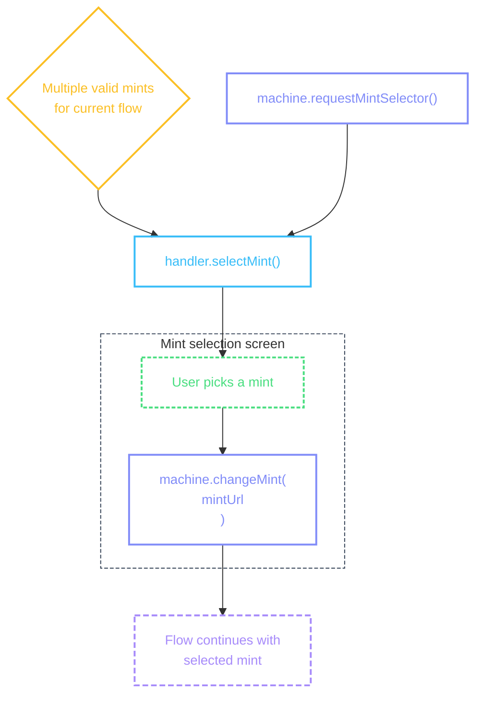
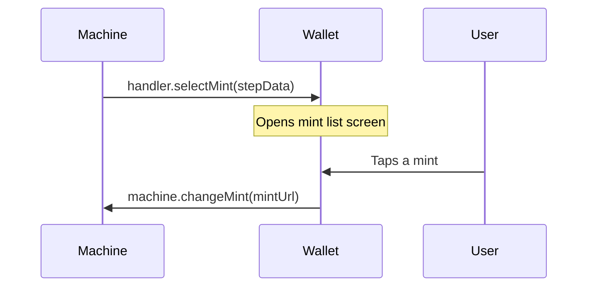

# Mint Selector

Choosing a mint: when multiple mints qualify for the current flow, the machine presents a pre-built list and the user picks one.

## Flow



::: details Diagram legend

- **Purple** — `machine.method()` — wallet calls these to drive the flow
- **Blue** — `handler.method()` — machine calls these; wallet implements them on the [provider](/guide/getting-started#provider)
- **Purple dashed** — flow continuation
- **Yellow** — internal machine decisions
- **Green dashed** — user actions on screen
  :::

### When mint selection occurs

The machine triggers `handler.selectMint()` in these flows:

- [**Cashu Send**](/flows/cashu-send) — after amount entry, when multiple mints have sufficient balance
- [**Lightning Send**](/flows/lightning-send) — after amount entry (or immediately for invoices with amounts), when multiple mints have sufficient balance
- [**Lightning Receive**](/flows/lightning-receive) — after amount entry, when multiple trusted mints exist (no balance requirement)
- [**Payment Requests**](/flows/lightning-send#payment-requests) — after amount entry, constrained to the mints the receiver allows

When only one mint qualifies, or the [preferred mint](/guide/architecture#mint-persistence) qualifies, the machine auto-selects and skips this handler.

### handler.selectMint()

The machine calls this handler with a pre-built list of all trusted mints. Each [`MintListItem`](#mintlistitem) carries balance, availability status, offline capability, and trust scores — the mint screen needs no data fetching.



The machine passes this step data to the handler:

```ts
{
  mintListItems: [
    {
      mintUrl: 'https://mint.example.com',
      displayName: 'Example Mint',
      balance: 4200,
      unit: 'sat',
      status: 'available',
      reason: null,
      isPreferred: true,
      worksOffline: true,
      kymScore: 4.2,
      auditScore: 5,
      auditState: 'OK',
    },
    {
      mintUrl: 'https://mint-b.example.com',
      displayName: 'Mint B',
      balance: 800,
      unit: 'sat',
      status: 'disabled',
      reason: { code: 'INSUFFICIENT_BALANCE', message: 'Insufficient balance' },
      isPreferred: false,
      worksOffline: false,
      kymScore: null,
      auditScore: null,
      auditState: null,
    },
  ],
  scope: 'selected',
  amount: 1000,
  unit: 'sat',
  destination: 'sendEcash',
  supportedMintUrls: undefined,
}
```

| Field               | What it means                                                                                                                                                                                                     |
| ------------------- | ----------------------------------------------------------------------------------------------------------------------------------------------------------------------------------------------------------------- |
| `mintListItems`     | Pre-built [`MintListItem[]`](#mintlistitem) — balance, status, [`reason`](/methods/localization#localizedreason), [`worksOffline`](/flows/cashu-send#handler-chooseproofs), trust scores. No data fetching needed |
| `scope`             | What the selection means: `'selected'` saves as [preferred mint](/guide/architecture#mint-persistence), `'npc'` saves as [NPC mint](/guide/architecture#mint-persistence)                                         |
| `amount`            | The amount already entered by the user                                                                                                                                                                            |
| `unit`              | The unit for this flow                                                                                                                                                                                            |
| `destination`       | Which flow triggered selection — [`'sendEcash'`](/flows/cashu-send), [`'meltQuote'`](/flows/lightning-send), [`'mintQuote'`](/flows/lightning-receive), or `'paymentRequest'`                                     |
| `supportedMintUrls` | Restricts which mints are valid (from a payment request). `undefined` when any trusted mint is allowed                                                                                                            |

```tsx
<ColadaProvider
  handlers={(machine, refs) => ({
    // ...
    selectMint: ({ mintListItems, scope, destination, unit }) => {
      const entry = {
        items: mintListItems ?? [],
        scope: scope ?? 'selected',
        destination,
        unit,
      };
      router.push({
        pathname: '/(send-flow)/mintSelect',
        params: { mintSelectorEntry: JSON.stringify(entry) },
      });
    },
    // ...
  })}
/>
```

## Mint Selection Screen

The entry from [`useScreenActions`](/guide/architecture#thin-screens) contains the pre-built mint list items, scope, and destination. Action availability is derived from `destination` — when absent (management/persist flow), `getInfo` and `addMint` are available. When `destination` is set (payment flow), only `select` is available.

```tsx
import { View, Text, Pressable, ScrollView } from 'react-native';

function MintSelectionScreen({ mintSelectorEntry }) {
  const walletContext = useWalletContext();
  usePaymentFlowMachine({ walletContext });

  const { entry, actions } = useScreenActions('mintSelector', mintSelectorEntry);

  if (!entry) return <ActivityIndicator />;

  const items = entry.items ?? [];

  return (
    <ScrollView>
      {items.map((item) => (
        <Pressable
          key={item.mintUrl}
          onPress={() => actions.select.execute({ mintUrl: item.mintUrl })}
          disabled={item.status === 'disabled'}>
          <Text>{item.displayName}</Text>
          <Text>
            {item.balance} {item.unit}
          </Text>
          {item.isPreferred && <Text>Preferred</Text>}
          {item.worksOffline && <Text>Offline</Text>}
          {item.reason && <Text>{item.reason.message}</Text>}
          {actions.getInfo.available && (
            <Pressable onPress={() => actions.getInfo.execute({ mintUrl: item.mintUrl })}>
              <Text>...</Text>
            </Pressable>
          )}
        </Pressable>
      ))}
    </ScrollView>
  );
}
```

::: info Mint selection screen UI

- Each mint as a row with its name, balance, and an icon/avatar
- Disabled mints (`status: 'disabled'`) greyed out with [`reason.message`](/methods/localization#localizedreason) displayed (e.g., "Insufficient balance")
- Preferred mint (`isPreferred: true`) highlighted or badged — consider a home icon or star badge to indicate the default mint
- Offline indicator (airplane icon or similar) when `worksOffline` is true — tells the user which mints can send without internet
- Trust indicators for `kymScore` and `auditScore` when present (star rating, percentage, etc.)
- Display the mint's short description (from NUT-06 `description` field) as a subtitle under the mint name when available — helps users distinguish between mints with similar names
- Sort mints by relevance: preferred mint first, then by balance (highest to lowest), then disabled mints last
- If the wallet integrates a mint directory (e.g., bitcoinmints.com), consider showing community ratings from the user's web of trust — Nostr-connected users can see ratings from people they follow
- Show the `motd` (message of the day) as an inline notification on a mint row when it has important announcements
- When displaying NUT support, translate NUT numbers into feature descriptions (e.g., "Offline sends" instead of "NUT-11") — skip mandatory NUTs 01-06 since all Cashu mints implement them
  :::

### Actions

| Action    | Available when                    | What it does                                                                       |
| --------- | --------------------------------- | ---------------------------------------------------------------------------------- |
| `select`  | Items exist                       | Call `machine.changeMint(mintUrl, { scope })` to continue the flow                 |
| `getInfo` | No `destination` (management flow) | Navigate to the [Mint Info](/flows/cashu-receive#mint-review-screen) screen       |
| `addMint` | No `destination` (management flow) | Navigate to the mint adder screen                                                 |

Availability is derived from the entry's `destination` field. Payment flows set a destination (`sendEcash`, `meltQuote`, `mintQuote`, `paymentRequest`) — in that context, the user just picks a mint and continues. Management flows (e.g., home screen "Select Mint") omit `destination`, which enables `getInfo` (3-dots on each row) and `addMint` (header "+" button).

### Action handlers

```tsx
<ColadaProvider
  callbacks={{
    actions: {
      mintSelector: {
        select: async (ctx) => {
          const mintUrl = ctx.mintUrl;
          const scope = ctx.entry.scope ?? 'selected';
          await ctx.paymentMachine?.changeMint?.(mintUrl, { scope });
        },
        getInfo: async (ctx) => {
          const mintUrl = ctx.mintUrl;
          const info = await loadMintReviewInfo(ctx.manager, mintUrl);
          router.navigate({
            pathname: '/(mint-flow)/info',
            params: { mintInfoEntry: JSON.stringify(info) },
          });
        },
        addMint: async (ctx) => {
          router.push('/(mint-flow)/add');
        },
      },
    },
  }}
/>
```

::: info getInfo loads mint data
The `getInfo` handler fetches full mint metadata (name, icon, trust status, audit scores) before navigating — the mint info screen receives a complete entry via route params, no data fetching needed on the target screen. This is the same pattern as `operations.buildMintReviewInfo` used by the machine's `reviewMint` and `openMint` steps.
:::

### Live updates

The mint selector entry updates reactively when audit or review data arrives after the initial load. The wallet subscribes to audit and KYM store changes via [`callbacks.screenActionsBridge.onEntryUpdate`](/guide/architecture#live-updates) — when scores update, each item in the entry's `items` array is enriched with the latest `kymScore`, `auditScore`, `auditState`, and related fields. No screen-side data fetching needed.

```tsx
<ColadaProvider
  callbacks={{
    screenActionsBridge: {
      onEntryUpdate: (screenType, callback) => {
        if (screenType === 'mintSelector') {
          const unsubs = [
            auditStore.subscribe(() => callback({ _mintItemsEnrichment: true })),
            kymStore.subscribe(() => callback({ _mintItemsEnrichment: true })),
          ];
          return () => unsubs.forEach((u) => u());
        }
        // ...
      },
      mergeEntryUpdate: (current, updated) => {
        if (updated._mintItemsEnrichment && Array.isArray(current?.items)) {
          const items = current.items.map((item) => ({
            ...item,
            ...getEnrichment(item.mintUrl),
          }));
          return { ...current, items };
        }
        return defaultMerge(current, updated);
      },
    },
  }}
/>
```

The same pattern applies to the [Mint Info](/flows/cashu-receive#mint-review-screen) screen — audit and KYM data arriving after page load is merged into the entry via `_mintEnrichment` updates, keeping scores, success rates, and swap counts fresh.

### MintListItem

Each item in the `mintListItems` array:

```ts
interface MintListItem {
  mintUrl: string;
  displayName: string;
  iconUrl?: string;
  balance: number;
  unit: string;
  status: 'available' | 'disabled';
  reason: LocalizedReason | null;
  isPreferred: boolean;
  kymScore?: number;
  auditScore?: number;
  auditState?: string;
  worksOffline?: boolean;
}
```

| Field          | What it means                                                                                                         |
| -------------- | --------------------------------------------------------------------------------------------------------------------- |
| `mintUrl`      | The mint's URL                                                                                                        |
| `displayName`  | Human-readable mint name                                                                                              |
| `iconUrl`      | Optional avatar/icon URL                                                                                              |
| `balance`      | User's balance on this mint in the flow's unit                                                                        |
| `unit`         | The unit for this flow                                                                                                |
| `status`       | `'available'` if selectable, `'disabled'` if not                                                                      |
| `reason`       | [`LocalizedReason`](/methods/localization#localizedreason) explaining why the mint is disabled, `null` when available |
| `isPreferred`  | Whether this is the user's preferred mint                                                                             |
| `kymScore`     | Community trust score from Nostr events                                                                               |
| `auditScore`   | Auditor swap success score (0-5 scale)                                                                                |
| `auditState`   | Auditor state string (e.g., `'OK'`, `'ERROR'`)                                                                        |
| `worksOffline` | Whether this mint can compose the exact amount offline                                                                |

## Availability per destination

The machine computes `status` and `reason` differently depending on which flow triggered the selection:

| Destination                             | Balance required?                        | Which mints?                                      |
| --------------------------------------- | ---------------------------------------- | ------------------------------------------------- |
| [`sendEcash`](/flows/cashu-send)        | Yes — must cover the send amount         | All trusted mints                                 |
| [`meltQuote`](/flows/lightning-send)    | Yes — must cover the send amount         | All trusted mints                                 |
| [`mintQuote`](/flows/lightning-receive) | No — all trusted mints are `'available'` | All trusted mints                                 |
| `paymentRequest`                        | Yes — must cover the send amount         | Only mints in the payment request's `mints` array |

When a payment request constrains mints, any trusted mint not in the `supportedMintUrls` list gets `status: 'disabled'` with reason [`NOT_IN_PAYMENT_REQUEST`](/methods/localization#mint-availability).

## machine.requestMintSelector()

Opens the mint selector outside the normal flow — for example, from the [proof selector](/flows/cashu-send#handler-chooseproofs) "Change Mint" button or the [receive hub](/flows/cashu-receive#receive-hub) "Change Mint" action.

```tsx
await machine.requestMintSelector();

await machine.requestMintSelector({ scope: 'npc' });

await machine.requestMintSelector({ reset: true });
```

| Option         | What it does                                                                                                                     |
| -------------- | -------------------------------------------------------------------------------------------------------------------------------- |
| `scope: 'npc'` | Selection updates the [NPC mint](/guide/architecture#mint-persistence) (Lightning address routing) instead of the preferred mint |
| `reset: true`  | Clears stale flow context before opening — use when calling from outside a flow (e.g., home screen)                              |

::: tip Scope
When `scope` is `'selected'` (the default), changing the mint updates the user's preferred mint and continues the current flow. When `scope` is `'npc'`, it only updates which mint handles incoming Lightning payments via [npub.cash](https://npub.cash).
:::
