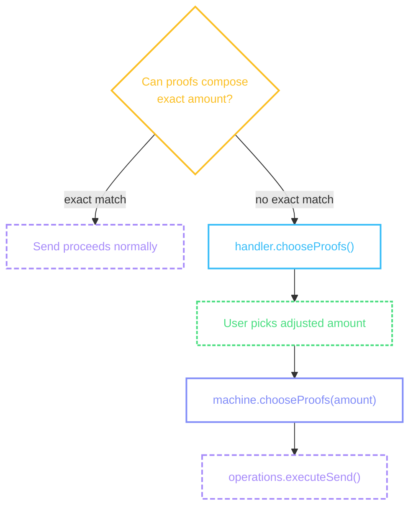
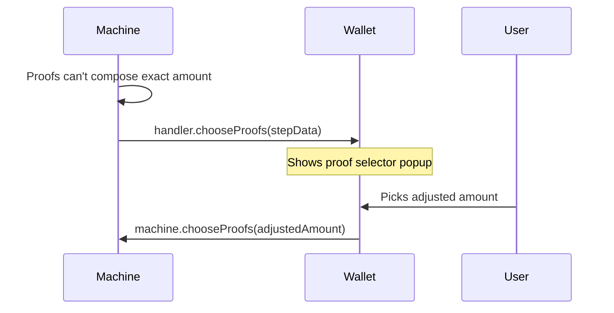
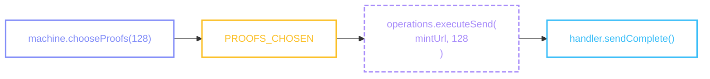

# Proof Selection

Offline proof composition: when an ecash send can't compose the exact amount from available proofs, the machine offers round-down and round-up alternatives.

## When it appears

The machine enters `chooseProofs` when:

- The user is **offline** and proofs can't compose the exact amount
- An **online send fails** and the machine falls back to offline proof composition
- The amount entry explicitly passes `offline: true`

Most sends go through without the user noticing. The popup only fires when proofs genuinely can't compose the exact amount without a mint swap.



::: details Diagram legend

- **Purple** — `machine.method()` — wallet calls these to drive the flow
- **Blue** — `handler.method()` — machine calls these; wallet implements them on the [provider](/guide/getting-started#provider)
- **Purple dashed** — `operations.method()` — async operations on the [provider](/guide/getting-started#provider)
- **Yellow** — internal machine decisions
- **Green dashed** — user actions on screen
  :::

### handler.chooseProofs()

The machine calls this handler with the original amount, available proof denominations, and round-down/round-up suggestions.



The machine passes this step data to the handler:

```ts
{
  mintUrl: 'https://mint.example.com',
  amount: 150,
  unit: 'sat',
  proofAmounts: [1, 2, 4, 8, 16, 64, 128, 256, 512],
  suggestions: {
    roundDown: { amount: 128 },
    roundUp: { amount: 256 },
  },
}
```

| Field                   | What it means                                                                                         |
| ----------------------- | ----------------------------------------------------------------------------------------------------- |
| `mintUrl`               | The mint selected for this send                                                                       |
| `amount`                | The original amount the user wanted to send                                                           |
| `unit`                  | The unit for this flow                                                                                |
| `proofAmounts`          | Raw proof denominations available on this mint — for advanced wallets that want a custom proof picker |
| `suggestions.roundDown` | Nearest composable amount below the target, or `null` if none exists                                  |
| `suggestions.roundUp`   | Nearest composable amount above the target, or `null` if none exists                                  |

```tsx
<ColadaProvider
  handlers={(machine, refs) => ({
    // ...
    chooseProofs: (stepData) => {
      proofSelectorPopup({ ...stepData, machine });
    },
    // ...
  })}
/>
```

```tsx
import { View, Text, Pressable } from 'react-native';

function ProofSelectorPopup({ stepData, machine }) {
  const { isExecuting } = useExecutionState(machine);

  return (
    <View>
      <Text>
        Can't send exactly {stepData.amount} {stepData.unit} offline
      </Text>

      {stepData.suggestions?.roundDown && (
        <Pressable
          onPress={() => machine.chooseProofs(stepData.suggestions.roundDown.amount)}
          disabled={isExecuting}>
          <Text>
            Send {stepData.suggestions.roundDown.amount} {stepData.unit} instead
          </Text>
        </Pressable>
      )}

      {stepData.suggestions?.roundUp && (
        <Pressable
          onPress={() => machine.chooseProofs(stepData.suggestions.roundUp.amount)}
          disabled={isExecuting}>
          <Text>
            Send {stepData.suggestions.roundUp.amount} {stepData.unit} instead
          </Text>
        </Pressable>
      )}

      <Pressable onPress={() => machine.requestMintSelector()} disabled={isExecuting}>
        <Text>Change Mint</Text>
      </Pressable>
    </View>
  );
}
```

::: info Proof selector UI

- Present as a bottom sheet or popup overlay, not a full screen — this is a quick decision, not a new flow step
- Show the original amount the user wanted prominently (e.g., "Can't send exactly 150 sats offline")
- Two clearly labeled options: "Send 128 sats" (round down) and "Send 256 sats" (round up) — show the difference from the original so the user understands the trade-off
- Either suggestion can be `null` — hide the button when it is
- "Change Mint" as a tertiary option — a different mint might have proofs that compose the exact amount (the mint list shows [`worksOffline`](/flows/mint-selector#mintlistitem) per mint so the user can see at a glance which mints would work)
- Disable all buttons while [`isExecuting`](/guide/architecture#execution-state) is true to prevent double-taps
- When the user enters a fiat amount, the library automatically checks all sat values that round to the same displayed price — if any of them are composable, the send succeeds without showing this popup
  :::

### After selection

`machine.chooseProofs(amount)` sends a `PROOFS_CHOSEN` event. The machine retries the send with the adjusted amount:



If [`operations.executeSend`](/guide/getting-started#handlers-operations-notifications) is provided, the machine handles this internally. The handler for [`sendComplete`](/flows/cashu-send#execution) fires once the send succeeds.

### Change Mint

The popup also offers "Change Mint" via [`machine.requestMintSelector()`](/flows/mint-selector#machine-requestmintselector). This navigates to the [Mint Selector](/flows/mint-selector), where a different mint might have proofs that compose the exact original amount — shown via the [`worksOffline`](/flows/mint-selector#mintlistitem) flag on each `MintListItem`.
