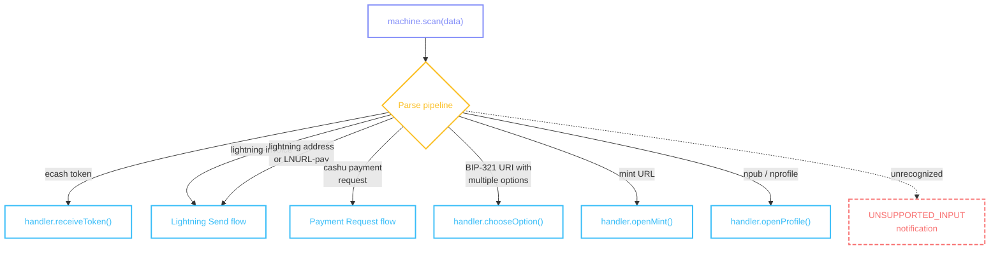

# Scanning

Input scanning: the machine accepts data from QR codes, clipboard, gallery images, and more, routing each through the [parse pipeline](/pipeline/overview) to start the appropriate flow.

## machine.scan()

Three call signatures, one function:

```tsx
const machine = usePaymentFlowMachine({ walletContext, unit });

await machine.scan(qrData, { source: 'qr' });

await machine.scan(undefined, { source: 'clipboard' });

await machine.scan(undefined, { source: 'gallery' });

// From outside a flow (e.g., deep link handler) — clear stale state first:
await machine.scan(deepLinkData, { reset: true });
```

| Call                                               | What it does                                                      |
| -------------------------------------------------- | ----------------------------------------------------------------- |
| `machine.scan(data, { source: 'qr' })`             | Parse string data directly                                        |
| `machine.scan(undefined, { source: 'clipboard' })` | Read from clipboard via [`scanSources.clipboard`](#configuration) |
| `machine.scan(undefined, { source: 'gallery' })`   | Read from image via [`scanSources.gallery`](#configuration)       |
| `machine.scan(data, { reset: true })`               | Clear stale flow state before parsing — use from outside a flow   |

The `source` parameter is a hint — when data is provided, it's parsed directly regardless of source. When data is omitted, `source` determines which [`ScanSources`](#configuration) function to call. Pass `{ reset: true }` to clear stale flow context before processing — use this when calling from outside a flow (e.g., deep link handlers, notification taps).

## machine.execute()

Shorthand for scanning when you already have a string and don't need source resolution or UR assembly:

```tsx
await machine.execute(inputString);

// From outside a flow — clear stale state first:
await machine.execute(inputString, { reset: true });
```

Equivalent to `machine.scan(data)` but always synchronous with respect to source fetching — it parses the string directly. Pass `{ reset: true }` when calling from outside a flow to clear stale context.

## Routing

After parsing, the machine resolves an intent and routes to the appropriate flow:



::: details Diagram legend

- **Purple** — `machine.method()` — wallet calls these to drive the flow
- **Blue** — `handler.method()` — machine calls these; wallet implements them on the [provider](/guide/getting-started#provider)
- **Yellow** — internal machine decisions
- **Red dashed** — error / notification states
  :::

| Input type                        | Resolved intent        | Routed to                                                           |
| --------------------------------- | ---------------------- | ------------------------------------------------------------------- |
| Ecash token (`cashuB...`)         | `receiveToken`         | [Cashu Receive](/flows/cashu-receive)                               |
| Lightning invoice (`lnbc...`)     | `meltLightningInvoice` | [Lightning Send](/flows/lightning-send)                             |
| Lightning address (`user@domain`) | `meltLightningAddress` | [Lightning Send](/flows/lightning-send)                             |
| LNURL-pay                         | `meltLnurlp`           | [Lightning Send](/flows/lightning-send)                             |
| Payment request (`creq...`)       | `sendPaymentRequest`   | [Payment Requests](/flows/lightning-send#payment-requests)          |
| BIP-321 URI with multiple options | `chooseOption`         | [handler.chooseOption()](/flows/cashu-receive#handler-chooseoption) |
| Mint URL                          | `openMint`             | `handler.openMint()`                                                |
| Nostr npub / nprofile             | `openProfile`          | `handler.openProfile()`                                             |
| Unrecognized                      | —                      | [`UNSUPPORTED_INPUT`](/methods/localization#errors) notification    |

## Sources

### QR code data

Camera-scanned QR data is passed directly to `machine.scan(data)`. The machine also supports animated QR codes (UR encoding) — when a [`createURDecoder`](/guide/getting-started#provider) factory is provided, partial frames are assembled automatically.

```tsx
const onQRScanned = (data: string) => {
  machine.scan(data, { source: 'qr' });
};
```

### Clipboard

When `machine.scan(undefined, { source: 'clipboard' })` is called, the machine reads from the clipboard source. The wallet provides this via [`scanSources.clipboard`](#configuration).

```tsx
const onPaste = () => {
  machine.scan(undefined, { source: 'clipboard' });
};
```

### Gallery

When `machine.scan(undefined, { source: 'gallery' })` is called, the machine reads from the gallery source. The wallet provides this via [`scanSources.gallery`](#configuration), which typically opens an image picker and decodes the QR code from the selected image.

```tsx
const onGallery = () => {
  machine.scan(undefined, { source: 'gallery' });
};
```

## Configuration

Clipboard and gallery sources are injected via [`platform.scanSources`](/guide/getting-started#provider) on the provider. Each source returns a [`ScanSourceResult`](#scansourceresult):

```tsx
<ColadaProvider
  platform={{
    scanSources: {
      clipboard: async () => {
        const text = await Clipboard.getStringAsync();
        if (!text) return { empty: true };
        return { data: text };
      },
      gallery: async () => {
        const result = await ImagePicker.launchImageLibraryAsync();
        if (result.canceled) return { canceled: true };
        const decoded = await decodeQRFromImage(result.assets[0].uri);
        if (!decoded) return { empty: true };
        return { data: decoded };
      },
    },
  }}
/>
```

### ScanSourceResult

```ts
type ScanSourceResult = { data: string } | { canceled: true } | { empty: true } | { error: Error };
```

| Variant              | What it means                                                                                                |
| -------------------- | ------------------------------------------------------------------------------------------------------------ |
| `{ data: string }`   | Source returned data — machine parses it                                                                     |
| `{ canceled: true }` | User canceled (e.g., dismissed image picker) — machine does nothing                                          |
| `{ empty: true }`    | Source was empty (e.g., clipboard has no text) — machine calls [`notifications.onScanEmpty`](#notifications) |
| `{ error: Error }`   | Source threw — machine calls [`notifications.onScanError`](#notifications)                                   |

## Notifications

The machine dispatches scan-related notifications for the wallet to present however it chooses:

```tsx
<ColadaProvider
  callbacks={{
    notifications: {
      onScanEmpty: (source) => {
        toast.info(`Nothing found from ${source}`);
      },
      onScanError: (source, err) => {
        toast.error(`Scan failed: ${err.message}`);
      },
    },
  }}
/>
```

| Notification  | When                                 | Arguments                                                                       |
| ------------- | ------------------------------------ | ------------------------------------------------------------------------------- |
| `onScanEmpty` | Source returned `{ empty: true }`    | `source` — `'clipboard'`, `'gallery'`, or the string passed to `options.source` |
| `onScanError` | Source returned `{ error }` or threw | `source`, `err` — the Error object                                              |

::: tip Animated QR codes
For UR-encoded animated QR codes (common in hardware wallet communication and large ecash tokens via NUT-16), provide a [`platform.createURDecoder`](/guide/getting-started#provider) factory. The machine assembles frames incrementally — `scan()` returns `{ urInProgress: true, progress: 0.5 }` for partial frames and processes the final result when assembly is complete.
:::

::: info Animated QR scanning UI

- Show a progress indicator during animated QR scanning — e.g., a progress bar or "Scanning: 50%" label so the user knows to keep the QR in frame
- The scanner must capture each frame in sequence — hold the camera steady until progress reaches 100%
- If the QR cycles too fast for the camera, show a "Hold steady" hint
- Once assembly is complete, the pipeline processes the full payload and routes to the correct flow — the transition should feel seamless from the user's perspective
- For displaying animated QR codes (outbound), see [QR Display](/guide/qr-display#animated-qr-nut-16)
  :::
