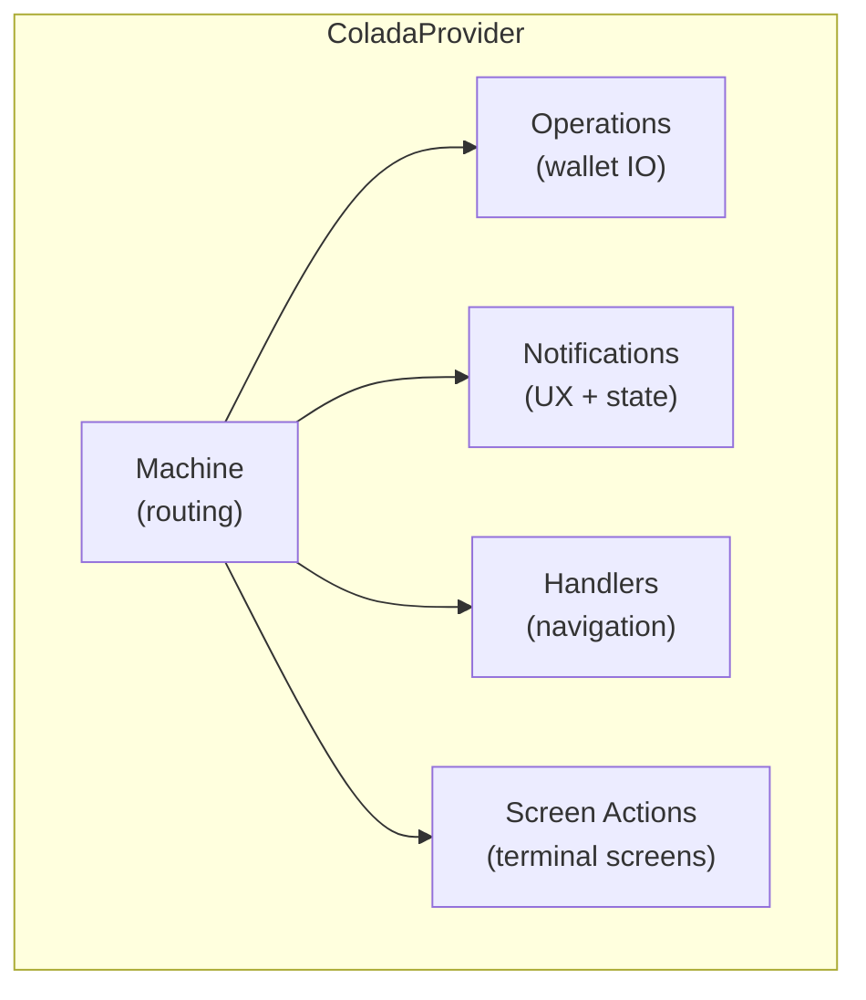

# Architecture

## Two-Layer Design

```
┌─────────────────────────────────────────────────────────┐
│  Layer 2: ColadaProvider (React)                 │
│  ┌───────────────────────────────────────────────────┐  │
│  │  handlers (navigation)                            │  │
│  │  callbacks.notifications (UI + state)             │  │
│  │  callbacks.screenActionsBridge (subscriptions)    │  │
│  │  callbacks.actions, platform.deepLinks/navigation │  │
│  └───────────────────────────────────────────────────┘  │
├─────────────────────────────────────────────────────────┤
│  Layer 1: createColada (TypeScript core)         │
│  ┌───────────────────────────────────────────────────┐  │
│  │  WalletContextTracker (Manager event → context)   │  │
│  │  Built-in operations (send, melt, receive, ...)   │  │
│  │  LNURL resolution                                 │  │
│  │  Enrichment callbacks                             │  │
│  └───────────────────────────────────────────────────┘  │
├─────────────────────────────────────────────────────────┤
│  coco-cashu-core Manager                                │
└─────────────────────────────────────────────────────────┘
```

Layer 1 is framework-agnostic. It accepts a Manager and returns an instance with operations and wallet context tracking. Layer 2 is a thin React wrapper that creates the PaymentMachine and wires in app-specific concerns.

## Separation of Concerns



The **machine** drives multi-step flows (scan → amount → mint → execute). Once the flow lands on a terminal screen, **screen actions** take over — discrete buttons with per-action availability and loading.

These two systems are intentionally separate. A terminal screen doesn't need to know about the flow that created its entry. The flow machine doesn't need to know what buttons a detail screen shows.

## Thin Screens

A screen's job is to call one hook and render:

```tsx
function MeltQuoteScreen({ meltHistoryEntry }) {
  const { entry, error, actions, mintUrl, source } = useScreenActions('meltQuote', meltHistoryEntry);

  if (error) return <ErrorState message={error} />;
  if (!entry) return <LoadingState />;

  return (
    <>
      <MeltDetails entry={entry} />
      <Button
        title="Pay"
        onPress={() => actions.pay.execute()}
        disabled={!actions.pay.available}
        loading={actions.pay.loading}
      />
      <Button title="Cancel" onPress={() => actions.cancel.execute()} />
    </>
  );
}
```

Availability rules live in `src/screen-actions/availability.ts`. Loading state is tracked per-action inside the manager. The screen never computes "can I pay?" — it reads `actions.pay.available`.

The `mintUrl` field is derived from the raw entry (`entry.mintUrl` or `entry.selectedMintUrl`) before decoration converts strings to [`FormattedString`](/methods/formatting#formattedstring). Use this when you need the raw mint URL string — for example, to override wallet context or fetch mint-specific data.

## Execution State

`useExecutionState(machine)` provides reactive loading state for flow screens.

```tsx
const machine = usePaymentFlowMachine({ walletContext, unit });
const { isExecuting } = useExecutionState(machine);

<MintRow disabled={isExecuting} onPress={() => machine.changeMint(item.mintUrl)} />;
```

**`isExecuting = true`** during async operations: `executeSend`, `executeMintQuote`, `buildMintListItems`.

**`isExecuting = false`** during input steps: `enterAmount`, `selectMint`, `chooseOption`, `chooseProofs`.

## Mint Persistence

Mint selection is persisted via notifications. The machine emits `onPreferredMintChanged` or `onNpcMintChanged` at the right time; the wallet decides how to persist:

```ts
// In your notification handlers:
onPreferredMintChanged: ({ mintUrl }) => {
  mintStore.setSelectedMint(pubkey, mintUrl);
},
onNpcMintChanged: async ({ mintUrl }) => {
  await npcMintStore.updateServerMint(mintUrl, privateKey);
},

// Mint selection events carry scope metadata:
machine.changeMint(mintUrl, { scope: 'selected' });  // → onPreferredMintChanged
machine.changeMint(mintUrl, { scope: 'npc' });        // → onNpcMintChanged
```

## What Stays in the Wallet App

| Concern | Why |
|---|---|
| Step handlers (navigation routing) | App-specific router paths |
| Notification UI (popups/toasts) | App-specific UI presentation |
| Notification state updates (zustand stores) | App-specific persistence layer |
| Screen action overrides (NFC writer, emoji picker) | Platform-specific features |
| ScreenActionsBridge (NPC, audit/KYM enrichment) | App-specific store subscriptions |
| Deep link config (schemes, ignored hosts) | App-specific routing |
| Scan sources (emoji decode, camera) | Platform-specific implementations |
