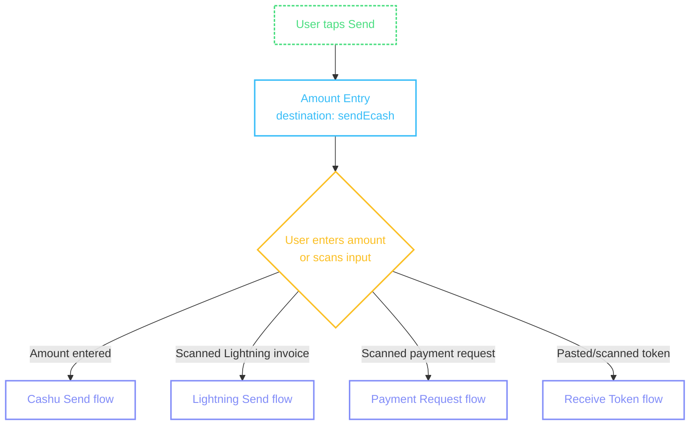
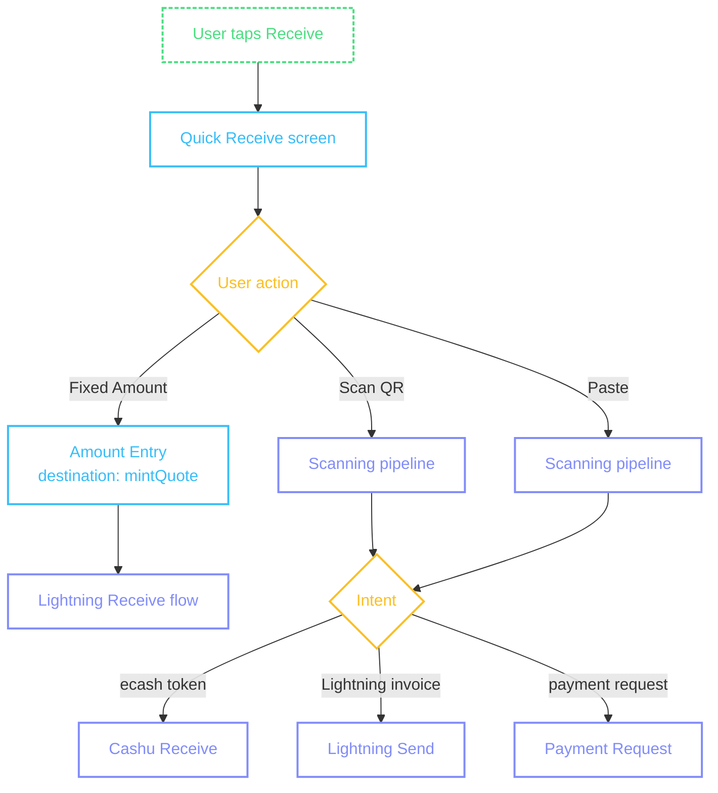
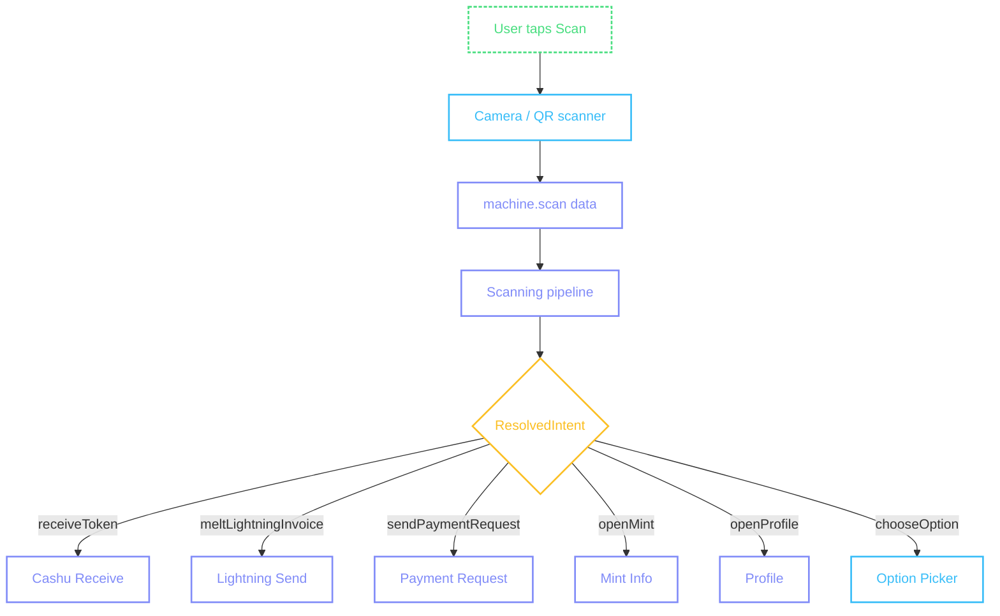

# Navigation Patterns

How Colada routes users through payment flows — and how this differs from other Cashu wallets.

## Intent-based navigation

Most Cashu wallets (eNuts, Minibits) present explicit options when the user taps Send or Receive:

**eNuts Send options (bottom sheet):**

- Send Ecash
- Pay Lightning Invoice
- NFC Payment

**eNuts Receive options (bottom sheet):**

- Paste Token
- Create Lightning Invoice

The user picks a protocol first, then enters the flow. This works well when users understand the distinction between ecash and Lightning.

**Colada takes a different approach.** Instead of asking the user to choose a protocol upfront, the library infers the correct flow from context:

```
User taps Receive → Quick Receive screen
  → User taps "Fixed Amount" → amount entry with `mintQuote` destination → Lightning Receive
  → User pastes a token → scanning pipeline → Cashu Receive
  → User scans a QR code → scanning pipeline → routes to correct flow

User taps Send → amount entry with `sendEcash` destination → Cashu Send
  → User scans a Lightning invoice → scanning pipeline → Lightning Send
```

The [scanning pipeline](/pipeline/overview) handles routing: normalize → detect → parse → annotate → intent → guards. The output is a [`ResolvedIntent`](/pipeline/intent) that tells the machine which flow to enter.

::: info Intent-based navigation design

- The user never sees protocol labels like "Lightning" or "Cashu" in primary navigation — the wallet figures it out
- Entry points are actions ("Send", "Receive", "Scan") not protocols
- When the input is ambiguous (e.g., a BIP-321 URI with both ecash and Lightning options), the machine calls `handler.chooseOption()` to present choices — but this is the exception, not the default path
- The amount entry screen adapts its behavior based on `destination` — it shows offline sendability for `sendEcash` but not for `mintQuote`
  :::

## Entry points

### Send



The Send entry point starts with amount entry for ecash. But if the user scans or pastes Lightning data instead, the pipeline redirects to the correct flow.

### Receive



The Receive entry point shows the Quick Receive screen with the user's NPC address and P2PK key. The user can share these for incoming payments, or tap "Fixed Amount" to create a Lightning invoice.

### Scan



Scan is the universal entry point. Any QR code or pasted string goes through the pipeline and routes to the correct flow.

## Compared to dropdown navigation

| Aspect             | Dropdown (eNuts, Minibits)        | Intent-based (Colada)            |
| ------------------ | --------------------------------- | ----------------------------------------- |
| Protocol selection | User chooses explicitly           | Library infers from input                 |
| Learning curve     | User must know Cashu vs Lightning | User just sends/receives                  |
| Entry points       | Send → {Ecash, Lightning, NFC}    | Send → amount entry or scan               |
| Flexibility        | Fixed options per direction       | Pipeline routes any input from any screen |
| Ambiguous input    | N/A (user already chose)          | `chooseOption()` handler presents options |
| Scan behavior      | Separate QR scanner screen        | Scan available on every input screen      |

::: info When to show protocol choices

- The intent-based model works best when the wallet can determine the protocol from context
- For power users or wallets that support multiple protocols with different UX requirements, consider adding a "More options" affordance that reveals protocol-specific entry points
- The `chooseOption()` handler is the escape hatch — when the pipeline detects multiple valid options (e.g., BIP-321 with cashu + Lightning), it presents them as an explicit choice
- Quick-send suggestion pills on amount entry give the user agency over offline amounts without requiring protocol knowledge
  :::

## Scan as a first-class action

In Sovran, Scan sits alongside Send and Receive as a primary action on the dashboard — not nested inside Send or Receive. This reflects how users interact in practice: they receive a QR code and need to act on it without knowing whether it's ecash, Lightning, or something else.

::: info Dashboard action layout

- Three primary actions: Send, Scan, Receive — equal visual weight
- Scan is the center action (most common real-world entry point)
- Send and Receive are the flanking actions
- Each action opens its own flow — no bottom sheet intermediary for the primary path
  :::
